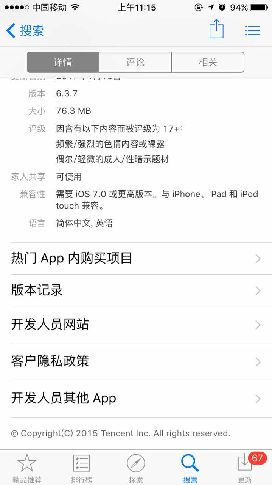
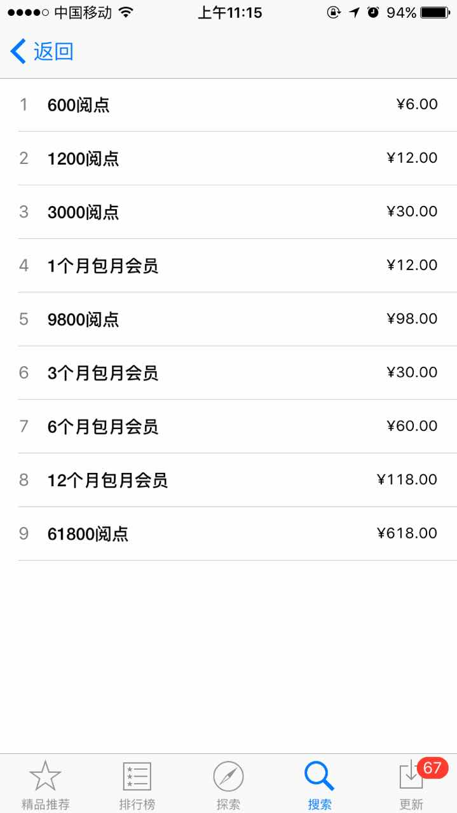

iOS In-App Purchase
------------

A simple introduction to IAP functionality for iOS developer and PM.

> **前言**   
“让天下没有容易做的生意” 
—— Apple

####目录
1. 简介  
1.1 什么是应用内购买    
1.2 购买流程  
1.3 为什么要使用应用内购买

2. 开发准备工作   
2.1 协议、税务和银行业务  
2.2 开发者证书设置    
2.3 设计内购商品   
2.4 添加沙箱测试员   
3. 技术实现
4. 别人踩过的坑
5. 总结
6. 参考资料
7. Q&A

####1.简介
######1.1 什么是应用内购买（In-App Purchase，以下简称 IAP）

- **概念**：应用内购买是应用于 iPhone、iPod、iPod touch 以及 Mac 平台上的 app 中的一项技术，能让用户购买 app 内的内容和服务，比如订阅电子期刊、游戏金币、游戏关卡、电子书等等。

- **可以买什么**：
  - **内容**：你可以直接使用的数字化产品，比如电子期刊、电子书、图片、艺术品等等；你所购买的内容也可以是被应用本身使用的——比如，一个游戏 app 中的人物、级别，一个相机 app 中的滤镜。
  - **功能**：解锁一些功能，以及对已有功能的扩展，比如通过 IAP 来开启一个免费游戏中的多人模式，通过一次性付费来去除一个免费天气 app 中的广告。
  - **服务**：一次性服务（比如语音抄录功能），持续服务（比如 VPN 服务）。
- **不可以买什么**：
  - **真实世界的商品和服务**：IAP 只能用来购买 app 中的虚拟商品和服务，如果是在 app 中购买一些真实（real-world）的商品和服务，那就只能通过其他途径来支付了，比如第三方支付（支付宝、微信）、Apple Pay。
  - **不适合的内容**：不适合的内容(unsuitable content)也就是 [App Review Guidelines](https://developer.apple.com/app-store/review/)中明文规定不允许的内容，比如，色情，仇视言论，诽谤污蔑内容。

> To Developers：关于 IAP 支持的购买内容的详细要求，推荐阅读 [license agreement and the App Review Guidelines](https://developer.apple.com/app-store/review/)。在开始 coding 之前，最好仔细阅读一下相关的 guidelines，否则提交审核时的 rejection 会让你抓狂的，想想怎么面对的你的老板吧。

- **跟支付宝的对比**：   
**共同点**：都是用来做在线支付的。   
**不同点**：

| 方式 | 支付宝 | IAP |
| ------------ | ------------- | ------------ |
|  |  | |
| Content Cell | Content Cell  | Content Cell |

**小结**：提供应用内购买的 app，可以看做是应用提供方在 app 中开了一个店铺，用户可以过 IAP 去购买一些只能在 app 中使用的内容、功能和服务，但是这些商品往往只能是 app 内的虚拟商品。

######1.2 购买流程

图1.Remote store fetch

图2.Stages of the purchase process

总的来看，在 IAP 交易过程中，用户、app 和 App Store 之间的交互可以分为三个阶段（图2）。    
> - 获取商品信息：首先，用户在 app 中进入“店铺”，相应地，该 app 中会展示要出售的商品。
> - 请求支付：然后，用户选择了一件要购买的商品，紧接着，该 app 就会从 App Store 中请求支付。
> - 交付商品：最后，App Store 处理了刚才提交的支付请求，该 app 会确认支付结果，并交付商品给用户。

######1.3 为什么要使用应用内购买？

既然有了支付宝、微信、银联和 Apple Pay 等移动支付手段，为什么还要用 IAP 呢？ 而且从用户体验上来讲，IAP 的流程比支付宝要复杂得多。

####2. 开发准备工作
在给应用添加 IAP 功能之前，有几个准备工作需要去做，主要包括： 
   
 - 财务文件的填写 
 - 开发者账号中的针对 IAP 的证书设置
 - 在 iTunes Connect 创建 IAP 商品和测试账号

######2.1 协议、税务和银行业务（Agreements, Tax, and Banking Information）

IAP 涉及到财务的环节，按照 Apple 的规定，我们需要和 Apple 签订一份支付应用合同（Paid Application contract），其中必须要提供的信息包括**联系人信息**、**银行信息**和**税务信息**（见图1），更多信息见 [Managing Agreements, Tax, and Banking](https://developer.apple.com/library/ios/documentation/LanguagesUtilities/Conceptual/iTunesConnect_Guide/Chapters/ManagingContractsandBanking.html#//apple_ref/doc/uid/TP40011225-CH21-SW1)。

2.1.1 Request Contracts
首先，登录 iTunes Connect，打开首页，点击“协议、税务和银行业务”， 然后在 “Request Contracts” 部分可以看到有一栏 “Contract Type”，找到有填写 iOS Paid Application 的 contract，点击最右侧的 “Request” 按钮，请求成功后，我们会看到页面出现了 Contracts In Process 模块。

2.1.2 Contact Info
我们在申请加入 Apple Developer Program 时，提供了一个 legal entity name，也就是我们的 app 在 App Store 中显示的“销售者”（见图1）。 

2.1.3 Bank Info

2.1.4 Tax Info

######2.2 开发者证书设置（Certificates, Identifiers & Profiles）
######2.3 设计内购商品（Create and Configure Products）
######2.4 添加沙箱测试员（Test Your In-App Purchase Products）
 

####3. 技术实现
####4. 别人踩过的坑
####5. 总结
####6. Q&A
Q：我的开发者账号是 company/organization 类型的，不同类型的开发者账号使用 IAP 时有什么不同的要求吗？   
A：

Q：我在加入 Apple Developer Program 时填写的公司是注册在国外的，那么在填写 IAP 相关资料（协议、税务和银行业务）时有什么要注意的吗？    
A：
####7. 参考资料

- [【Doc】About in-app purchases](https://support.apple.com/en-us/HT202023)

- [【Doc】In-App Purchase for Developers](https://developer.apple.com/in-app-purchase/)

- [【Doc】Adding In-App Purchase to your Applications](https://developer.apple.com/library/content/technotes/tn2259/_index.html#//apple_ref/doc/uid/DTS40009578)

- [【Doc】In-App Purchase Programming Guide](https://developer.apple.com/library/content/documentation/NetworkingInternet/Conceptual/StoreKitGuide/Introduction.html#//apple_ref/doc/uid/TP40008267-CH1-SW1)

- [【Doc】App Store Review Guidelines](https://developer.apple.com/app-store/review/guidelines/)

- [【Doc】In-App Purchase Configuration Guide for iTunes Connect](https://developer.apple.com/library/content/documentation/LanguagesUtilities/Conceptual/iTunesConnectInAppPurchase_Guide/Chapters/Introduction.html#//apple_ref/doc/uid/TP40013727)

- [【Doc】Receipt Validation Programming Guide](https://developer.apple.com/library/content/releasenotes/General/ValidateAppStoreReceipt/Chapters/ValidateRemotely.html#//apple_ref/doc/uid/TP40010573-CH104-SW1)

- [【Doc】In-App Purchase FAQ](https://developer.apple.com/library/content/technotes/tn2413/_index.html#//apple_ref/doc/uid/DTS40016228)

- [【Doc】iOS Human Interface Guidelines](https://developer.apple.com/ios/human-interface-guidelines/technologies/in-app-purchase/)

- [【Blog】iOS开发内购全套图文教程](http://allluckly.cn/ios支付/iOS开发2015年最新内购教程)

- [【Blog】iOS应用内支付(IAP)的那些坑](http://blog.devtang.com/2013/04/07/tricks-in-iap/)

- [【Open Source】saturngod/IAPHelper](https://github.com/saturngod/IAPHelper)

- [【Apple Sample Code】StoreKitSuite](https://developer.apple.com/library/prerelease/content/samplecode/sc1991/Introduction/Intro.html#)

- [【FAQ】iOS App提交指南-协议、税务和银行业务中填写税务信息，需填写税务W-8BEN-E，请问怎么填写?](https://www.zhihu.com/question/38799083)

- [【FAQ】iOS 开发者中的公司账号与个人账号之间有什么区别？](https://www.zhihu.com/question/20308474)

