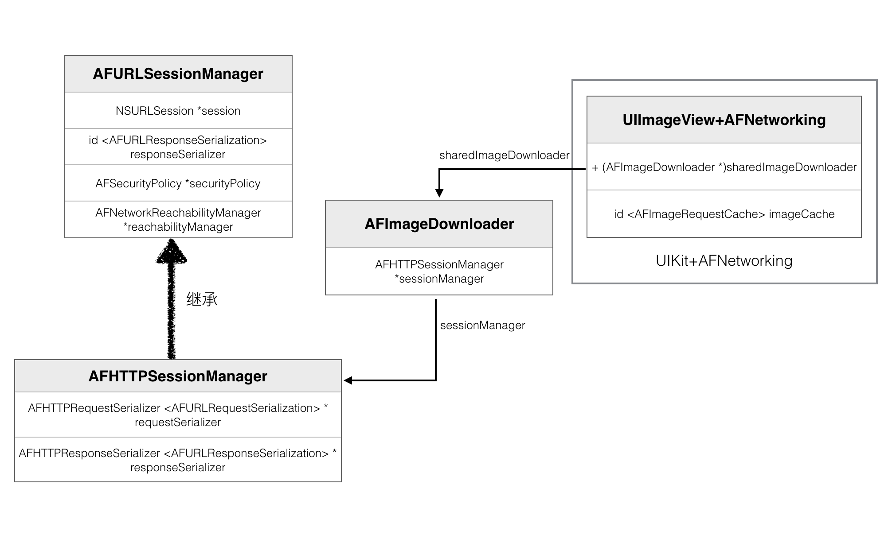
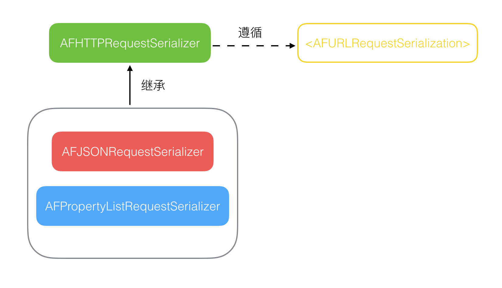
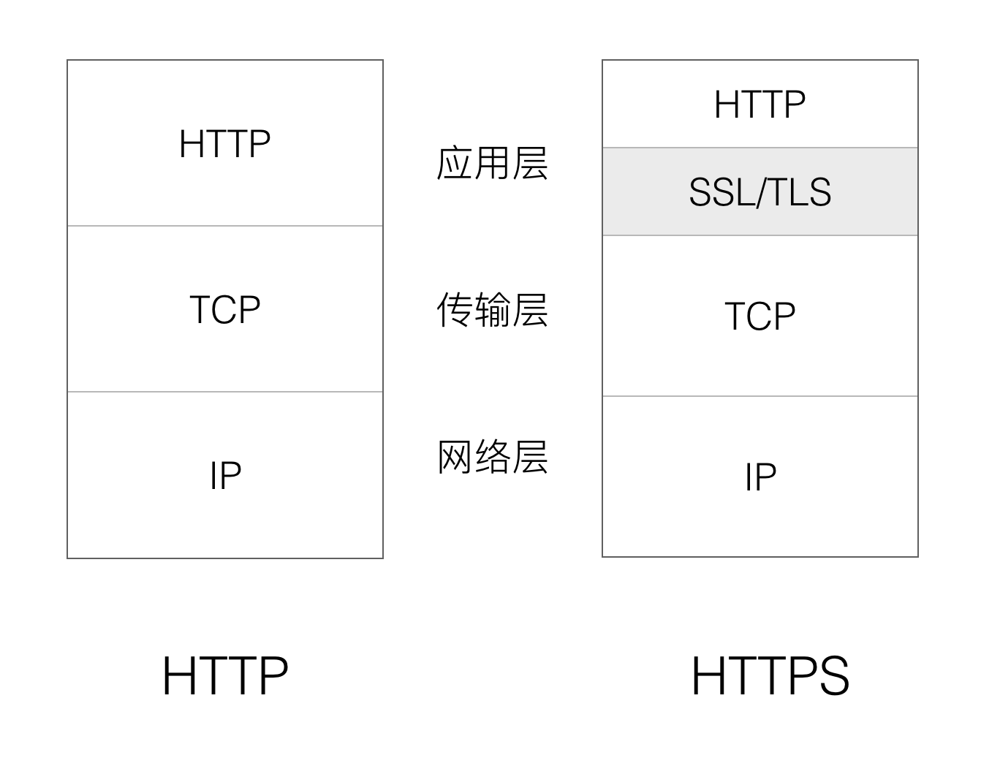
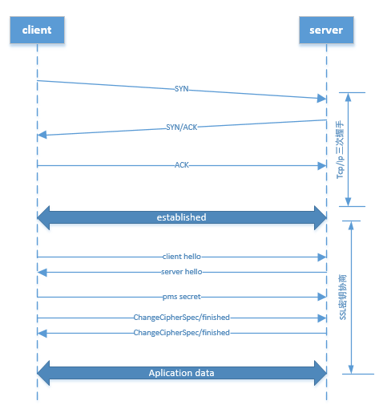

# [AFNetworking](https://github.com/AFNetworking/AFNetworking)(v3.1.0) 源码解析

AFNetworking 作为我们最基础的网络框架，目前在 GitHub 上 Objective-C 语言类排名第一，几乎每个涉及到网络请求的 APP 都会用到，其重要性可见一斑。再者，作为 iOS 开发领域最受欢迎的开源项目，其中凝聚了众多大神的智慧，无论是在技术点上，还是架构设计上、问题处理方式上，都具有很高的学习价值。

这两天正好趁着假期有空，可以跟着前人总结的一些精华，仔细研读一下这个优秀的网络框架的实现。站在巨人的肩膀上，才能看得远。

这篇文章先从整体架构开始，再从实际使用案例入手，梳理一下核心逻辑，然后再依次了解下各个具体模块的实现，最后再回顾一下 2.x 版本的实现，总结一下 AFNetworking 的价值。

> 注：这篇文章不会逐行分析源码，具体的代码注释见 [这里](https://github.com/ShannonChenCHN/iOSLevelingUp/tree/master/ReadingSourceCode/AFNetworkingNotes/AFNetworking-3.1.0)。

### 一、架构
AFNetworking 一共分为 5 个模块，2 个核心模块和 3 个辅助模块：

- Core
	- NSURLSession（网络通信模块）
		- AFURLSessionManager（封装 NSURLSession）
		- AFHTTPSessionManager（继承自 AFURLSessionManager，实现了 HTTP 请求相关的配置）
	- Serialization
		- AFURLRequestSerialization（请求参数序列化）
			- AFHTTPRequestSerializer
			- AFJSONRequestSerializer
			- AFPropertyListRequestSerializer
		- AFURLResponseSerialization（验证返回数据和反序列化）
			- AFHTTPResponseSerializer
			- AFJSONResponseSerializer
			- AFXMLParserResponseSerializer
			- AFXMLDocumentResponseSerializer (Mac OS X)
			- AFPropertyListResponseSerializer
			- AFImageResponseSerializer
			- AFCompoundResponseSerializer
- Additional Functionality
	- Security（网络通信安全策略模块）
	- Reachability（网络状态监听模块）
	- UIKit（对 iOS 系统 UI 控件的扩展）

	

<div align="center">图 1 AFNetworking 整体架构</div>

### 二、核心逻辑

先来看一下如何使用 AFNetworking 发送一个 GET 请求：

``` Objective-C
NSURL *url = [[NSURL alloc] initWithString:@"https://news-at.zhihu.com"];
AFHTTPSessionManager *manager = [[AFHTTPSessionManager alloc] initWithBaseURL:url];
[manager GET:@"api/4/news/latest" parameters:nil progress:nil
    success:^(NSURLSessionDataTask * _Nonnull task, id  _Nullable responseObject) {
        NSLog(@"%@" ,responseObject);
    } failure:^(NSURLSessionDataTask * _Nullable task, NSError * _Nonnull error) {
        NSLog(@"%@", error);
    }];
```


首先使用一个 URL，通过调用 `-initWithBaseURL:` 方法创建了一个 AFHTTPSessionManager 的实例，然后再调用 `-GET:parameters:progress:success:failure:` 方法发起请求。

#### `-initWithBaseURL:` 方法的调用栈如下：


```
- [AFHTTPSessionManager initWithBaseURL:]
	- [AFHTTPSessionManager initWithBaseURL:sessionConfiguration:]
		- [AFURLSessionManager initWithSessionConfiguration:]
			- [NSURLSession sessionWithConfiguration:delegate:delegateQueue:]
			- [AFJSONResponseSerializer serializer] // 负责序列化响应
			- [AFSecurityPolicy defaultPolicy] // 负责身份认证
			- [AFNetworkReachabilityManager sharedManager] // 查看网络连接情况
			- [AFHTTPRequestSerializer serializer] // 负责序列化请求
			- [AFJSONResponseSerializer serializer] // 负责序列化响应
```
AFURLSessionManager 是 AFHTTPSessionManager 的父类，
AFURLSessionManager 负责创建和管理 NSURLSession 的实例，管理 AFSecurityPolicy 和初始化 AFNetworkReachabilityManager，来保证请求的安全和查看网络连接情况，它有一个 AFJSONResponseSerializer 的实例来序列化 HTTP 响应。

AFHTTPSessionManager 有着自己的 AFHTTPRequestSerializer 和 AFJSONResponseSerializer 来管理请求和响应的序列化，同时依赖父类实现发出 HTTP 请求、管理 Session 这一核心功能。


#### `-GET:parameters:progress:success:failure:` 方法的调用栈：


```
 - [AFHTTPSessionManager GET:parameters:process:success:failure:]
	- [AFHTTPSessionManager dataTaskWithHTTPMethod:parameters:uploadProgress:downloadProgress:success:failure:] // 返回一个 NSURLSessionDataTask 对象
		- [AFHTTPRequestSerializer requestWithMethod:URLString:parameters:error:] // 返回 NSMutableURLRequest
		- [AFURLSessionManager dataTaskWithRequest:uploadProgress:downloadProgress:completionHandler:] 返回一个 NSURLSessionDataTask 对象
			- [NSURLSession dataTaskWithRequest:] 返回一个 NSURLSessionDataTask 对象
			- [AFURLSessionManager addDelegateForDataTask:uploadProgress:downloadProgress:completionHandler:]
				- [AFURLSessionManagerTaskDelegate init]
				- [AFURLSessionManager setDelegate:forTask:] // 为每个 task 创建一个对应的 delegate
	- [NSURLSessionDataTask resume]
```

发送请求的核心在于创建和启动一个 data task，AFHTTPSessionManager 只是提供了 HTTP 请求的接口，内部最终还是调用了父类 AFURLSessionManager 来创建 data task（其实也就是通过 NSURLSession 创建的 task），AFURLSessionManager 中会为每个 task 创建一个对应的 AFURLSessionManagerTaskDelegate 对象，用来处理回调。

在请求发起时有一个序列化的工具类 AFHTTPRequestSerializer 来处理请求参数。

#### 请求回调时的方法调用栈：

```
- [AFURLSessionManager  URLSession:task:didCompleteWithError:]
  - [AFURLSessionManagerTaskDelegate URLSession:task:didCompleteWithError:]
    - [AFJSONResponseSerializer responseObjectForResponse:data:error:]  // 解析 JSON 数据
      - [AFHTTPResponseSerializer validateResponse:data:]  // 验证数据
    - [AFURLSessionManagerTaskDelegate URLSession:task:didCompleteWithError:]_block_invoke_2.150
      - [AFHTTPSessionManager dataTaskWithHTTPMethod:URLString:parameters:uploadProgress:downloadProgress:success:failure:]_block_invoke
```

AFURLSessionManager 在代理方法中收到服务器返回数据的后，会交给 AFURLSessionManagerTaskDelegate 去处理，接着就是用 AFJSONResponseSerializer 去验证和解析 JSON 数据，最后再通过 block 回调的方式返回最终结果。

### 三、AFURLSessionManager

AFURLSessionManager 是 AFHTTPSessionManager 的父类，主要有以下几个功能：

- 负责创建和管理 NSURLSession
- 管理 NSURLSessionTask
- 实现 NSURLSessionDelegate 等协议中的代理方法
- 使用 AFURLSessionManagerTaskDelegate 管理上传、下载进度，以及请求完成的回调
- 将整个请求流程相关的组件串联起来
- 负责整个请求过程的线程调度
- 使用 AFSecurityPolicy 验证 HTTPS 请求的证书

#### 1. 线程

一般调用 AFNetworking 的请求 API 时，都是在主线程，也是主队列。然后直到调用 NSURLSession 的 `-resume` 方法，一直都是在主线程。

在 AFURLSessionManager 的初始化方法中，设置了 NSURLSession 代理回调线程的最大并发数为 1，因为就像 NSURLSession 的 `-sessionWithConfiguration:delegate:delegateQueue:` 方法的官方文档中所说的那样，所有的代理方法回调都应该在一个串行队列中，因为只有这样才能保证代理方法的回调顺序。

NSURLSession 代理方法回调是异步的，所以收到回调时的线程模式是“异步+串行队列”，这个时候可以理解为处于回调线程。

```Objective-C
- (instancetype)initWithSessionConfiguration:(NSURLSessionConfiguration *)configuration {
    ...
    self.operationQueue = [[NSOperationQueue alloc] init];
    self.operationQueue.maxConcurrentOperationCount = 1;  // 代理回调线程最大并发数为 1

    // 初始化 NSURLSession 对象
    self.session = [NSURLSession sessionWithConfiguration:self.sessionConfiguration delegate:self delegateQueue:self.operationQueue];
    
    ...
    return self;
}
```

收到代理回调后，接着在 AFURLSessionManagerTaskDelegate 的 `-URLSession:task:didCompleteWithError:` 方法中，异步切换到 processing queue 进行数据解析，数据解析完成后再异步回到主队列或者自定义队列。

```
- (void)URLSession:(__unused NSURLSession *)session
              task:(NSURLSessionTask *)task
didCompleteWithError:(NSError *)error
{
    
    ...
    
    // 如果请求成功，则在一个 AF 的并行 queue 中，去做数据解析等后续操作
    dispatch_async(url_session_manager_processing_queue(), ^{
        NSError *serializationError = nil;
        responseObject = [manager.responseSerializer responseObjectForResponse:task.response data:data error:&serializationError];
        
        ...
        
        dispatch_group_async(manager.completionGroup ?: url_session_manager_completion_group(), manager.completionQueue ?: dispatch_get_main_queue(), ^{
            if (self.completionHandler) {
                self.completionHandler(task.response, responseObject, serializationError);
            }
            ...
        });
    });
    
    ...
}

```

> **问题：**        
> 有个让我感到困惑的地方是，这里最后回调时为什么要用 `dispatch_group_async` 将任务放到队列组中去执行，搜了一下也没看到这个组中的任务执行完了要做什么，难道是要留给外面的调用方用的？ 


<div align="center">图 2 AFNetworking 中的线程调度</div>


#### 2. AFURLSessionManagerTaskDelegate


AFURLSessionManager 中几乎实现了所有的 NSURLSession 相关的协议方法：

- NSURLSessionDelegate
- NSURLSessionTaskDelegate
- NSURLSessionDataDelegate
- NSURLSessionDownloadDelegate

但是AFURLSessionManager 中实现的这些代理方法都只是做一些非核心逻辑的处理，每个代理方法中都回调了一个自定义逻辑的 block，如果 block 被赋值了，那么就调用它。

AFURLSessionManager 把最核心的代理回调处理交给 AFURLSessionManagerTaskDelegate 类去实现了，AFURLSessionManagerTaskDelegate 可以根据对应的 task 去进行上传、下载进度回调和请求完成的回调处理：

```
- URLSession:task:didCompleteWithError:
- URLSession:dataTask:didReceiveData:
- URLSession:downloadTask:didFinishDownloadingToURL:
```

AFURLSessionManager 通过属性 `mutableTaskDelegatesKeyedByTaskIdentifier` （一个 NSDictionary 对象）来存储并管理每一个 NSURLSessionTask 所对应的 AFURLSessionManagerTaskDelegate，它以 taskIdentifier 为键存储 task。在请求最终完成后，又将 AFURLSessionManagerTaskDelegate 移除。


<div align="center">图 3 AFNetworking 中的代理回调逻辑</div>

#### 3. NSProgress

AFURLSessionManagerTaskDelegate 借助了 NSProgress 这个类来实现进度的管理，NSProgress 是 iOS 7 引进的一个用来管理任务进度的类，可以表示一个任务的进度信息，我们还可以对其进行开始
暂停、取消等操作，完整的对应了 task 的各种状态。

AFURLSessionManagerTaskDelegate 通过 KVO 监听 task 的进度更新，来同步更新 NSProgress 的进度数据。同时，还用 KVO 监听了 NSProgress 的 fractionCompleted 属性的变化，用来更新最外面的进度回调 block，回调时将这个 NSProgress 对象作为参数带过去。

另一方面，AFURLSessionManagerTaskDelegate  中还分别对下载和上传的 NSProgress 对象设置了开始、暂停、取消等操作的 handler，将 task 跟 NSProgress 的状态关联起来。这样一来，就可以通过控制 NSProgress 对象的这些操作就可以控制 task 的状态。

> **延伸阅读：**
> 
> - [Best Practices for Progress Reporting - WWDC 2015](http://asciiwwdc.com/2015/sessions/232)
> - [NSProgress - Class Reference](https://developer.apple.com/documentation/foundation/nsprogress?language=objc)
> - [NSProgress - Ole Begemann](https://oleb.net/blog/2014/03/nsprogress/)


#### 4. NSSecureCoding

AFNetworking 的大多数类都支持归档解档，但实现的是 NSSecureCoding 协议，而不是 NSCoding 协议，这两个协议的区别在于 NSSecureCoding 协议中定义的解码的方法是 `-decodeObjectOfClass:forKey:` 方法，而不是 `-decodeObjectForKey:`，这就要求解数据时要指定 Class。在 [bang 的文章](http://blog.cnbang.net/tech/2320/)中看到说是这样做更安全，因为序列化后的数据有可能被篡改，若不指定 Class，decode 出来的对象可能不是原来的对象，有潜在风险。（不过暂时还是没能理解。）

#### 5. _AFURLSessionTaskSwizzling

_AFURLSessionTaskSwizzling 的唯一作用就是将 NSURLSessionTask 的 `-resume` 和 `-suspend` 方法实现替换成自己的实现，_AFURLSessionTaskSwizzling 中这两个方法的实现是先调用原方法，然后再发出一个通知。

_AFURLSessionTaskSwizzling 是通过在 `+load` 方法中进行 Method Swizzling 来实现方法交换的，由于 NSURLSessionTask 的实现是类簇，不能直接通过调用 `+class` 来获取真正的类，而且在 iOS 7 和 iOS 8 下的实现不同，所以这里的 swizzling 实现起来有点复杂。具体原因见 [GitHub 上的讨论](https://github.com/AFNetworking/AFNetworking/pull/2702)。

> **问题：**    
> 有点不明白的是，NSURLSessionTask 有三个子类：NSURLSessionDataTask、NSURLSessionDownloadTask 和 NSURLSessionUploadTask，为什么不用考虑这三个子类自己也实现了自己的 `-resume` 和 `-suspend` 方法的情况呢？

### 四、AFURLRequestSerialization

AFURLRequestSerialization 是一个抽象的协议，用于构建一个规范的 NSURLRequest。基于 AFURLRequestSerialization 协议，AFNetworking 提供了 3 中不同数据形式的序列化工具（当然你也可以自定义其他数据格式的序列化类）：

- AFHTTPRequestSerializer：普通的 HTTP 请求，默认数据格式是 `application/x-www-form-urlencoded`，也就是 key-value 形式的 url 编码字符串
- AFJSONRequestSerializer：参数格式是 json
- AFPropertyListRequestSerializer：参数格式是苹果的 plist 格式


<div align="center">图 4 AFURLRequestSerialization 类图</div>

AFHTTPRequestSerializer 主要实现了两个功能：     

- 构建普通请求：格式化请求参数，生成 HTTP Header。
- 构建 multipart 请求，上传数据时会用到。

#### 1. 构建普通请求

AFHTTPRequestSerializer 在构建普通请求时，做了以下几件事：

- 创建 NSURLRequest
- 设置 NSURLRequest 相关属性
- 设置 HTTP Method
- 设置 HTTP Header
- 序列化请求参数


```
- (NSMutableURLRequest *)requestWithMethod:(NSString *)method
                                 URLString:(NSString *)URLString
                                parameters:(id)parameters
                                     error:(NSError *__autoreleasing *)error
{
    NSParameterAssert(method);
    NSParameterAssert(URLString);

    NSURL *url = [NSURL URLWithString:URLString];

    NSParameterAssert(url);

    // 创建请求
    NSMutableURLRequest *mutableRequest = [[NSMutableURLRequest alloc] initWithURL:url];
    mutableRequest.HTTPMethod = method; // 设置 Method

    // 这里本来是直接把 self 的一些属性值直接传给 request 的，但是因为初始默认情况下，
    // 当前类中与 NSURLRequest 相关的那些属性值为 0，而导致外面业务方使用 NSURLSessionConfiguration 设置属性时失效，
    // 所以通过对这些属性添加了 KVO 监听判断是否有值来解决这个传值的有效性问题
    // 详见 https://github.com/AFNetworking/AFNetworking/commit/49f2f8c9a907977ec1b3afb182404ae0a6bce883
    for (NSString *keyPath in AFHTTPRequestSerializerObservedKeyPaths()) {
        if ([self.mutableObservedChangedKeyPaths containsObject:keyPath]) {
            [mutableRequest setValue:[self valueForKeyPath:keyPath] forKey:keyPath];
        }
    }

    // 设置 HTTP header；请求参数序列化，再添加到 query string 或者 body 中
    mutableRequest = [[self requestBySerializingRequest:mutableRequest withParameters:parameters error:error] mutableCopy];

	return mutableRequest;
}
```
在设置 NSURLRequest 相关属性时，有点绕，本来可以直接将 AFHTTPRequestSerializer 自己的属性值传给 NSURLRequest 对象的，但是后来改成了 KVO 的形式，主要是因为  NSURLRequest 对象有些属性是纯量数据类型（比如 timeoutInterval），在 AFHTTPRequestSerializer 初始化后，这些跟 NSURLRequest 相关的属性值初始默认值是 0，所以是不知道外面有没有设置过值，如果将 AFHTTPRequestSerializer 的值都传给 NSURLRequest 对象的话，很有可能会导致 NSURLSessionConfiguration 中设置的相同属性失效。


AFNetworking 帮我们组装好了一些 HTTP 请求头，包括：

- `Content-Type`，请求参数类型
- `Accept-Language`，根据 `[NSLocale preferredLanguages]` 方法读取本地语言，告诉服务端自己能接受的语言。
- `User-Agent`
- `Authorization`，提供 Basic Auth 认证接口，帮我们把用户名密码做 base64 编码后放入 HTTP 请求头。

一般我们请求都会按 `key=value` 的方式带上各种参数，GET 方法参数直接拼在 URL 后面，POST 方法放在 body 上，NSURLRequest 没有封装好这个参数的序列化，只能我们自己拼好字符串。AFHTTPRequestSerializer 提供了接口，让参数可以是 NSDictionary, NSArray, NSSet 这些类型，再由内部解析成字符串后赋给 NSURLRequest。

参数序列化流程大概是这样的：

- 用户传进来的数据，支持包含 NSArray，NSDictionary，NSSet 这三种数据结构。
- 先将每组 key-value 转成 AFQueryStringPair 对象的形式，保存到数组中（这样做的目的是因为最后可以根据不同的字符串编码生成对应的 key=value 字符串）
- 然后取出数组中的 AFQueryStringPair 对象，转成一个个 NSString 对象再保存到新数组中
- 最后再将这些 `key=value` 的字符串用 `&` 符号拼接起来

```
@{
     @"name"    : @"steve",
     @"phone"   : @{@"mobile": @"xx", @"home": @"xx"},
     @"families": @[@"father", @"mother"],
     @"nums"    : [NSSet setWithObjects:@"1", @"2", nil]
}
					||
					\/
@[
     field: @"name",          value: @"steve",
     field: @"phone[mobile]", value: @"xx",
     field: @"phone[home]",   value: @"xx",
     field: @"families[]",    value: @"father",
     field: @"families[]",    value: @"mother",
     field: @"nums",          value: @"1",
     field: @"nums",          value: @"2",
]
					||
					\/
					
@[
	@"name=steve", 		  // 注：实际代码中这里的 “=” 会被编码
	@"phone[mobile]=xx",
	@"phone[home]=xx",
	@"families[]=father",
	@"families[]=mother",
	@"nums=1",
	@"nums=2"
]
					||
					\/
					
@"name=steve&phone[mobile]=xx&phone[home]=xx&families[]=father&families[]=mother&nums=1&nums=2"

```


请求参数序列化完成后，再根据不同的 HTTP 请求方法分别处理，对于 GET/HEAD/DELETE 方法，把参数直接加到 URL 后面，对于其他如 POST/PUT 等方法，把数据加到 body 上，并设好 HTTP 头中的 `Content-Type` 为 `application/x-www-form-urlencoded`，告诉服务端字符串的编码是什么。 

#### 2. 构建 multipart 请求

这部分有点复杂，暂时还没看。

### 五、AFURLResponseSerialization

AFURLResponseSerialization 模块负责解析网络返回数据，检查数据是否合法，把服务器返回的 NSData 数据转成相应的对象。
AFURLResponseSerialization 模块包括一个协议、一个基类和多个解析特定格式数据的子类，用户可以很方便地继承基类 AFHTTPResponseSerializer 去解析更多的数据格式：

- AFURLResponseSerialization 协议，定义了解析响应数据的接口
- AFHTTPResponseSerializer， HTTP 请求响应数据解析器的基类
- AFJSONResponseSerializer，专门解析 JSON 数据的解析器
- 其他数据格式（XML、image、plist等）的响应解析器
- AFCompoundResponseSerializer，组合解析器，可以将多个解析器组合起来，以同时支持多种格式的数据解析


<div align="center">图 5 AFURLResponseSerialization 类图</div>
<br>

AFURLResponseSerialization 模块响应解析机制主要涉及到两个核心方法：

- AFHTTPResponseSerializer 中定义、实现的 `-validateResponse:data:error:` 方法
- AFURLResponseSerialization 协议定义的 `-responseObjectForResponse:data:error:` 方法

#### 1. `-validateResponse:data:error:` 方法

AFHTTPResponseSerializer 作为解析器基类，提供了 `acceptableContentTypes` 和 `acceptableStatusCodes` 两个属性，并提供了 `acceptableStatusCodes` 的默认值，子类可以通过设置这两个属性的值来进行自定义配置。AFHTTPResponseSerializer 中的 `-validateResponse:data:error:` 方法会根据这两个属性值来判断响应的文件类型 `MIMEType` 和状态码 `statusCode` 是否合法。

比如 AFJSONResponseSerializer 中设置了 `acceptableContentTypes` 的值为 `[NSSet setWithObjects:@"application/json", @"text/json", @"text/javascript", nil]`，如果服务器返回的 `Content-Type` 不是这三者之一，`-validateResponse:data:error:` 方法就会返回解析失败的错误信息。

> 案例：在网上看到有开发者就曾经遇到过[相关的问题](http://www.isaced.com/post-254.html)
——服务器返回的数据是 JSON 数据，但是 `Content-Type` 却不符合要求，结果导致解析失败。

#### 2. `-responseObjectForResponse:data:error:` 方法

AFJSONResponseSerializer 等子类中实现的 `-responseObjectForResponse:data:error:` 方法会先调用 `-validateResponse:data:error:` 方法验证数据是否合法，拿到验证结果后，接着这里有个补充判断条件——如果是 content type 的错误就直接返回 nil，因为数据类型不符合要求，就没必要再继续解析数据了，如果是 status code 的错误就继续解析，因为数据本身没问题，而错误信息有可能就在返回的数据中，所以这种情况下会将 status code 产生的错误信息和解析后的数据一起“打包”返回。

AFJSONResponseSerializer 在解析数据后还提供了移除 NSNull 的功能，主要是为了防止服务端返回 null 时导致解析后的数据中有了脆弱的 NSNull，这样很容易导致崩溃（但是之前一直没发现这个功能[捂脸]）。

``` Objective-C
- (id)responseObjectForResponse:(NSURLResponse *)response
                           data:(NSData *)data
                          error:(NSError *__autoreleasing *)error
{
    if (![self validateResponse:(NSHTTPURLResponse *)response data:data error:error]) {
        
        // 如果是 content type 的错误就直接返回，因为数据类型不符合要求
        // 如果是 status code 的错误就继续解析，因为错误信息有可能就在返回的数据中
        if (!error || AFErrorOrUnderlyingErrorHasCodeInDomain(*error, NSURLErrorCannotDecodeContentData, AFURLResponseSerializationErrorDomain)) {
            return nil;
        }
    }

    NSError *serializationError = nil;
    id responseObject = [NSJSONSerialization JSONObjectWithData:data options:self.readingOptions error:&serializationError];

    ...

    // 移除 NSNull（如果需要的话），默认是 NO
    if (self.removesKeysWithNullValues && responseObject) {
        responseObject = AFJSONObjectByRemovingKeysWithNullValues(responseObject, self.readingOptions);
    }
    
    ...

    return responseObject;
}
```

### 六、AFSecurityPolicy

几个关键字：HTTPS，TSL，SSL，SSL Pinning，非对称加密算法

#### 1. 预备知识点

#### 1.1 为什么要使用 HTTPS
因为直接使用 HTTP 请求，就会有可能遇到以下几个安全问题：

- 传输数据被窃听：HTTP 报文使用明文方式发送，而且 HTTP 本身不具备加密的功能，而互联网是由联通世界各个地方的网络设施组成，所有发送和接收经过某些设备的数据都可能被截获或窥视。
- 认证问题：
  - 无法确认你发送到的服务器就是真正的目标服务器(可能服务器是伪装的)
  - 无法确定返回的客户端是否是按照真实意图接收的客户端(可能是伪装的客户端)
  - 无法确定正在通信的对方是否具备访问权限,Web 服务器上某些重要的信息，只想发给特定用户
- 传输内容可能被篡改：请求或响应在传输途中，可能会被攻击者拦截并篡改内容，也就是所谓的中间人攻击（Man-in-the-Middle attack，MITM）。 


#### 1.2 HTTPS 的出现
HTTPS，也称作 HTTP over TLS，HTTPS 就是基于 TLS 的 HTTP 请求。TLS 是一种基于 TCP 的加密协议，它主要做了两件事：传输的两端可以互相验证对方的身份，以及验证后加密所传输的数据。

HTTPS 通过验证和加密两种手段的结合解决了上面 HTTP 所面临的 3 个安全问题。

#### 1.3 SSL/TLS 协议

SSL（Secure Sockets Layer）：SSL 协议是一种数据加密协议，为了保证网络数据传输的安全性，网景公司设计了 SSL 协议用于对 HTTP 协议传输的数据进行加密，从而就诞生了 HTTPS。

TLS（Transport Layer Security）：TLS 协议是 SSL 协议的升级版。1999年，互联网标准化组织 ISOC 接替 NetScape 公司，发布了 SSL 的升级版 TLS 1.0版。

#### 1.4 HTTPS 与 HTTP 的区别是什么？

` ` |   HTTP                 |   HTTPS
----|------------------------|--------
URL | `http://` 开头，并且默认使用端口 80 | `https://` 开头，并且默认使用端口 443
数据隐私性 | 明文传输，不加密传输数据 | 基于 TLS 的加密传输
身份认证 | 不认证 | 正式传输数据前会进行证书认证，第三方无法伪造服务端(客户端)身份
数据完整性| 没有完整性校验过程 | 内容传输经过完整性校验

HTTP协议和安全协议（SSL/TLS）同属于应用层（OSI模型的最高层），具体来讲，安全协议（SSL/TLS）工作在 HTTP 之下，传输层之上：安全协议向运行 HTTP 的进程提供一个类似于 TCP 的套接字，供进程向其中注入报文，安全协议将报文加密并注入传输层套接字；或是从运输层获取加密报文，解密后交给对应的进程。严格地讲，HTTPS 并不是一个单独的协议，而是对工作在一加密连接（TLS或SSL）上的常规 HTTP 协议的称呼。


<div align="center">图 6 协议层</div>

HTTPS 报文中的任何东西都被加密，包括所有报头和荷载（payload）。除了可能的选择密文攻击之外，一个攻击者所能知道的只有在两者之间有一连接这件事。

#### 1.5 HTTPS 连接的建立过程

HTTPS在传输数据之前需要客户端与服务端之间进行一次握手，在握手过程中将确立双方加密传输数据的密码信息。（握手过程采用的非对称加密，正式传输数据时采用的是对称加密）

HTTPS 的认证有单向认证和双向认证，这里简单梳理一下客户端单向认证时的握手流程：

（1）客户端发起一个请求，服务端响应后返回一个证书，证书中包含一些基本信息和公钥。   
（2）客户端里存有各个受信任的证书机构根证书，用这些根证书对服务端返回的证书进行验证，如果不可信任，则请求终止。    
（3）如果证书受信任，或者是用户接受了不受信的证书，客户端会生成一串随机数的密码 random key，并用证书中提供的公钥加密，再返回给服务器。    
（4）服务器拿到加密后的随机数，利用私钥解密，然后再用解密后的随机数 random key，对需要返回的数据加密，加密完成后将数据返回给客户端。   
（5）最后用户拿到被加密过的数据，用客户端一开始生成的那个随机数 random key，进行数据解密。整个 TLS/SSL 握手过程完成。   


<div align="center">图 7 TLS/SSL 握手过程（单向认证）</div>


完整的 HTTPS 连接的建立过程，包括下面三个步骤：

（1）TCP 协议的三次握手；   
（2）TLS/SSL 协议的握手、密钥协商；       
（3）使用共同约定的密钥开始通信。        


<div align="center">图 8 完整的 HTTPS 连接的建立过程</div>


#### 1.6 HTTPS 传输时是如何验证证书的？怎样应对中间人伪造证书？

先来看看维基百科上对对称加密和非对称加密的解释：
> 对称密钥加密（英语：Symmetric-key algorithm）又称为对称加密、私钥加密、共享密钥加密，是密码学中的一类加密算法。<u>这类算法在加密和解密时使用相同的密钥，或是使用两个可以简单地相互推算的密钥</u>。实务上，这组密钥成为在两个或多个成员间的共同秘密，以便维持专属的通讯联系。与公开密钥加密相比，要求双方取得相同的密钥是对称密钥加密的主要缺点之一。


> 公开密钥加密（英语：public-key cryptography，又译为公开密钥加密），也称为非对称加密（asymmetric cryptography），一种密码学算法类型，在这种密码学方法中，需要一对密钥(其实这里密钥说法不好，就是“钥”)，一个是私人密钥，另一个则是公开密钥。<u>这两个密钥是数学相关，用某用户密钥加密后所得的信息，只能用该用户的解密密钥才能解密。如果知道了其中一个，并不能计算出另外一个。因此如果公开了一对密钥中的一个，并不会危害到另外一个的秘密性质</u>。称公开的密钥为公钥；不公开的密钥为私钥。

从上面可以看出非对称加密的特点：非对称加密有一对公钥私钥，用公钥加密的数据只能通过对应的私钥解密，用私钥加密的数据只能通过对应的公钥解密。这种加密是单向的。

**（1）HTTPS 传输时是如何验证证书的呢？**

我们以最简单的为例：一个证书颁发机构(CA)，颁发了一个证书 Cer，服务器用这个证书建立 HTTPS 连接，同时客户端在信任列表里有这个 CA 机构的根证书。

CA 机构颁发的证书 Cer 里包含有证书内容 Content，以及证书加密内容 Crypted Content（数字签名），这个加密内容 Crypted Content 就是用这个证书机构的私钥对内容 Content 加密的结果。

```
+-------------------+
|      Content      |
+-------------------+
|   Crypted Content |
+-------------------+
     证书 Cer

```
建立 HTTPS 连接时，服务端会把证书 Cer 返回给客户端，客户端系统里的 CA 机构根证书有这个 CA 机构的公钥，用这个公钥对证书 Cer 的加密内容 Crypted Content 解密得到 Content，跟证书 Cer 里的内容 Content 对比，若相等就通过验证。大概的流程如下：

```
       +-----------------------------------------------------+
       |           crypt with private key                    |
       |  Content ------------------------> Crypted Content  |
Server |                                                     |
       |                     证书 Cer                  　     |
       +-----------------------------------------------------+

						  ||		
						  ||
						  \/
						
       +-----------------------------------------------------+
       |                                                     |
       |               Content  &  Crypted Content           |
Client |                  |               |                  |
       |                  |  证书 Cer    　|            　    |
       +------------------|---------------|------------------+ 
		　　　　　　　　　　　 |　　　　　　　　　| 
		　　　　　　　　　　　 |　　　　　　　　　| derypt with public key 　　
		　　　　　　　　　　　 |　　　　　　　　　| 
		　　　　　　　　　　　 \/　　　　相等？  \/
		　　　　　　　　　Content　－－－－－－ Decrypted Content　　
		　　　　　　　　　
		　　　　　　　　　            　　　　　　
```

**（2）怎样应对中间人伪造证书？**

因为中间人不会有 CA 机构的私钥，即便伪造了一张证书，但是私钥不对，加密出来的内容也就不对，客户端也就无法通过 CA 公钥解密，所以伪造的证书肯定无法通过验证。


#### 1.7 Certificate Pinning 是什么？

如果一个客户端通过 TLS 和服务器建立连接，操作系统会验证服务器证书的有效性（一般是按照 [X.509](https://en.wikipedia.org/wiki/X.509) 标准）。当然，有很多手段可以绕开这个校验，最直接的是在 iOS 设备上安装证书并且将其设置为可信的。这种情况下，实施中间人攻击也不是什么难事。不过通过 Certificate Pinning 可以解决这个问题。

>  A client that does key pinning adds an extra step beyond the normal X.509 certificate validation.
> 
> —— Wikipedia：Certificate Pinning

[Certificate Pinning](https://en.wikipedia.org/wiki/Transport_Layer_Security#Certificate_pinning) ，可以理解为证书绑定，有时候又叫 SSL Pinning，其实更准确的叫法应该是 Public Key Pinning（公钥绑定）。证书绑定是一种检测和防止“中间人攻击”的方式，客户端直接保存服务端的证书，当建立 TLS 连接后，应立即检查服务器的证书，<u>不仅要验证证书的有效性，还需要确定证书是不是跟客户端本地的证书相匹配</u>。考虑到应用和服务器需要同时升级证书的要求，这种方式比较适合应用在访问自家服务器的情况下。

**为什么直接对比就能保证证书没问题？**

如果中间人从客户端取出证书，再伪装成服务端跟其他客户端通信，它发送给客户端的这个证书不就能通过验证吗？确实可以通过验证，但后续的流程走不下去，因为下一步客户端会用证书里的公钥加密，中间人没有这个证书的私钥就解不出内容，也就截获不到数据，这个证书的私钥只有真正的服务端有，中间人伪造证书主要伪造的是公钥。

**什么情况下需要使用 Certificate Pinning？**

- 就像前面所说的，常规的验证方式并不能避免遭遇中间人攻击，因为如果所访问网站的证书是自制的，而且在客户端上通过手动安装根证书信任了，此时就很容易被恶意攻击了（还记得你访问 12306 时收到的证书验证提醒吗）。
- 如果服务端的证书是从受信任的的 CA 机构颁发的，验证是没问题的，但 CA 机构颁发证书比较昂贵，小企业或个人用户可能会选择自己颁发证书，这样就无法通过系统受信任的 CA 机构列表验证这个证书的真伪了。


#### 2. AFSecurityPolicy 的实现


#### 2.1 AFSecurityPolicy 的作用

NSURLConnection 和 NSURLSession 已经封装了 HTTPS 连接的建立、数据的加密解密功能，我们直接使用 NSURLConnection 或者 NSURLSession 也是可以访问 HTTPS 网站的，但 NSURLConnection 和 NSURLSession 并没有验证证书是否合法，无法避免中间人攻击。要做到真正安全通讯，需要我们手动去验证服务端返回的证书（系统提供了 `SecTrustEvaluate`函数供我们验证证书使用）。

AFSecurityPolicy 帮我们封装了证书验证的逻辑，让用户可以轻易使用，除了去系统信任 CA 机构列表验证，还支持SSL Pinning方式的验证。


#### 2.2 AFSecurityPolicy 做了什么


#### 2.3 Tips 

- 宏、do-while

[宏定义的黑魔法 - 宏菜鸟起飞手册](https://onevcat.com/2014/01/black-magic-in-macro/)

- Core Foundation


> **延伸阅读：**
>      
> - 关于 HTTPS 请求流程
>    - HTTPS 那些事[（一）](http://www.guokr.com/post/114121/)[（二）](http://www.guokr.com/post/116169/)[（三）](http://www.guokr.com/blog/148613/)    
>    - [一文完全理解HTTPS](https://juejin.im/entry/5a644a61f265da3e4c07e334)    
>    - [详解 HTTPS、TLS、SSL、HTTP区别和关系](https://www.wosign.com/info/https_tls_ssl_http.htm)
>    - [超文本传输安全协议（HTTPS） - 维基百科](https://zh.wikipedia.org/wiki/%E8%B6%85%E6%96%87%E6%9C%AC%E4%BC%A0%E8%BE%93%E5%AE%89%E5%85%A8%E5%8D%8F%E8%AE%AE) 
> - TLS/SSL
>    - [SSL/TLS协议运行机制的概述](http://www.ruanyifeng.com/blog/2014/02/ssl_tls.html)  
>    - [图解SSL/TLS协议](http://www.ruanyifeng.com/blog/2014/09/illustration-ssl.html) 
>    - [SSL/TLS原理详解](https://segmentfault.com/a/1190000002554673)
> - 关于数字证书
>    - [浅析数字证书](http://www.cnblogs.com/hyddd/archive/2009/01/07/1371292.html)        
> - 加密算法
>    - [白话解释 对称加密算法 VS 非对称加密算法](https://segmentfault.com/a/1190000004461428)       
>    - 关于非对称加密算法的原理：RSA算法原理[（一）](http://www.ruanyifeng.com/blog/2013/06/rsa_algorithm_part_one.html) [（二）](http://www.ruanyifeng.com/blog/2013/07/rsa_algorithm_part_two.html)  
> - 认证流程 
>    - [Https单向认证和双向认证](http://blog.csdn.net/duanbokan/article/details/50847612)      
>    - [AFNetworking 3.0与服务端 自签名证书 https双向认证](https://www.jianshu.com/p/9e573607be13#)  
> 
> 


### 七、AFNetworkReachabilityManager

暂时还没看

### 八、UIKit 扩展

暂时还没看

### 九、AFNetworking 2.x 


### 十、AFNetworking 的价值

#### 1. 请求调度：NSURLConnection + NSOperation

在 NSURLConnection 时代，AFNetworking 1.x 的最核心的作用在于**多线程下的请求调度**——将 NSURLConnection 和 NSOperation 结合，AFURLConnectionOperation 作为 NSOperation 的子类，遵循 NSURLConnectionDelegate 的方法，可以从头到尾监听请求的状态，并储存请求、响应、响应数据等中间状态。


#### 2. 更高层次的抽象
显然，在 NSURLSession 出现之后，AFNetworking 的意义似乎不如以前那么重要了。实际上，虽然它们有一些重叠，AFNetworking 还是可以提供更高层次的抽象。

AFNetworking 帮我们完成了很多繁琐的工作，这使得我们在业务层的网络请求变得非常轻松：

- 请求参数和返回数据的序列化，支持多种不同格式的数据解析
- multipart 请求拼接数据
- 验证 HTTPS 请求的证书
- 请求成功和失败的回调处理，下载、上传进度的回调处理

#### 3. block
AFNetworking 将 NSURLSession 散乱的代理回调方法都转成了 block 形式的 API，除此之外，还提供了一些用于自定义配置的 block，比如发起 multipart 请求时，提供 constructingBody 的 block 接口来拼接数据。


#### 4. 模块化
AFNetworking 在架构上采用了模块化的设计，各模块的职责是明确的、功能是独立的，我们可以根据自己的需要，选择合适的模块组合使用：

- 创建请求
- 序列化 query string 参数
- 确定响应解析行为
- 管理 Session
- HTTPS 认证
- 监视网络状态
- UIKit 扩展

   
### 十一、问题：
1.AFNetworking 的作用是什么？不用 AFNetworking 直接用系统的 NSURLSession 不可以吗？AFNetworking 为什么要对 NSURLConnection/NSURLSession 进行封装？它是如何封装的？

2.AFNetworking 框架的设计思路和原理是什么？

3.AFNetworking 和 MKNetworkKit 以及 ASIHttpRequest 有什么不同?

4.AFNetworking 2.x 和 AFNetworking 3.x 的区别是什么？

### 十二、收获

- 开源项目、专业素养、规范
- 完善的注释、文档 
- 忽略一些特定的clang的编译警告
- nullable
- 规范，通过断言检测参数的合法性
- 逻辑严谨、完善，扩展性好，比如针对用户可能需要的各种自定义处理提供了 block 回调，基于协议的 serialization 设计
- 万物皆对象，比如请求 url 参数的解析时，使用了 AFQueryStringPair 对象来表征一个 Query 参数；还有 NSProgress 的使用
- 面向协议编程，提高程序的可扩展性
- 多线程编程时，脑海中要有清晰的线程调度图
- Unit Test，看到 GitHub 上有个 pr 的讨论中多次提到了 Unit Test，原来 Unit Test 对于保证修改后的代码功能有很大用处，另外就是，有些使用的示例也可以从 test case 中找到

### 延伸阅读
- [AFNetworking到底做了什么？（一）](https://www.jianshu.com/p/856f0e26279d)（系列文章，写的非常详细，非常推荐）
- bang：AFNetworking2.0 源码解析[（一）](http://blog.cnbang.net/tech/2320/)[（二）](http://blog.cnbang.net/tech/2371/)[（三）](http://blog.cnbang.net/tech/2416/)[（四）](http://blog.cnbang.net/tech/2456/)
- Draveness ：AFNetworking 源码解析[（一）](https://github.com/Draveness/Analyze/tree/master/contents/AFNetworking)
- [NSHipster: AFNetworking 2.0](http://nshipster.cn/afnetworking-2/)
- [四种常见的 POST 提交数据方式](https://imququ.com/post/four-ways-to-post-data-in-http.html)
- [IP，TCP 和 HTTP](https://www.objccn.io/issue-10-6/)
