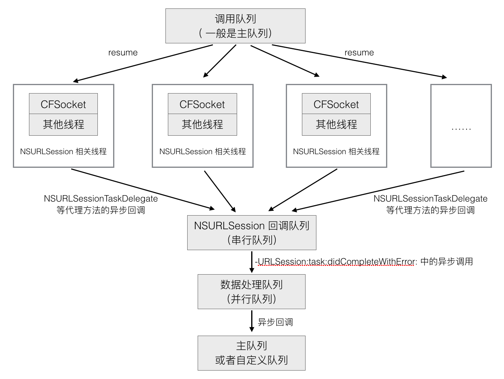
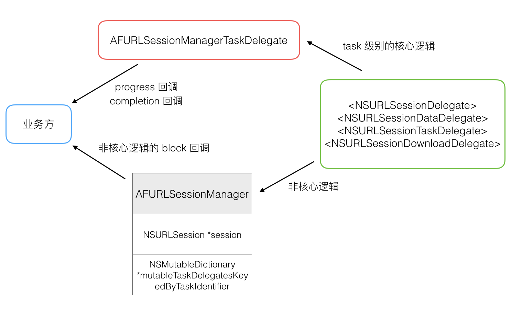

# [AFNetworking](https://github.com/AFNetworking/AFNetworking)(v3.1.0) 源码解析

AFNetworking 作为我们最基础的网络框架，目前在 GitHub 上 Objective-C 语言类排名第一，几乎每个涉及到网络请求的 APP 都会用到，其重要性可见一斑。再者，作为 iOS 开发领域最受欢迎的开源项目，其中凝聚了众多大神的智慧，无论是在技术点上，还是架构设计上、问题处理方式上，都具有很高的学习价值。

这两天正好趁着假期有空，可以跟着前人总结的一些精华，仔细研读一下这个优秀的网络框架的实现。站在巨人的肩膀上，才能看得远。

这篇文章先从整体架构开始，再从实际使用案例入手，梳理一下核心逻辑，然后再依次了解下各个具体模块的实现，最后再回顾一下 2.x 版本的实现，总结一下 AFNetworking 的价值。

> 注：这篇文章不会逐行分析源码，具体的代码注释见 [这里](https://github.com/ShannonChenCHN/iOSLevelingUp/tree/master/ReadingSourceCode/AFNetworkingNotes/AFNetworking-3.1.0)。

### 一、架构
AFNetworking 一共分为 5 个模块，2 个核心模块和 3 个辅助模块：

- Core
	- NSURLSession（网络通信模块）
		- AFURLSessionManager（封装 NSURLSession）
		- AFHTTPSessionManager（继承自 AFURLSessionManager，实现了 HTTP 请求相关的配置）
	- Serialization
		- AFURLRequestSerialization（请求参数序列化）
			- AFHTTPRequestSerializer
			- AFJSONRequestSerializer
			- AFPropertyListRequestSerializer
		- AFURLResponseSerialization（验证返回数据和反序列化）
			- AFHTTPResponseSerializer
			- AFJSONResponseSerializer
			- AFXMLParserResponseSerializer
			- AFXMLDocumentResponseSerializer (Mac OS X)
			- AFPropertyListResponseSerializer
			- AFImageResponseSerializer
			- AFCompoundResponseSerializer
- Additional Functionality
	- Security（网络通信安全策略模块）
	- Reachability（网络状态监听模块）
	- UIKit（对 iOS 系统 UI 控件的扩展）

### 二、核心逻辑

先来看一下如何使用 AFNetworking 发送一个 GET 请求：

``` Objective-C
NSURL *url = [[NSURL alloc] initWithString:@"https://news-at.zhihu.com"];
AFHTTPSessionManager *manager = [[AFHTTPSessionManager alloc] initWithBaseURL:url];
[manager GET:@"api/4/news/latest" parameters:nil progress:nil
    success:^(NSURLSessionDataTask * _Nonnull task, id  _Nullable responseObject) {
        NSLog(@"%@" ,responseObject);
    } failure:^(NSURLSessionDataTask * _Nullable task, NSError * _Nonnull error) {
        NSLog(@"%@", error);
    }];
```


首先使用一个 URL，通过调用 `-initWithBaseURL:` 方法创建了一个 AFHTTPSessionManager 的实例，然后再调用 `-GET:parameters:progress:success:failure:` 方法发起请求。

#### `-initWithBaseURL:` 方法的调用栈如下：


```
- [AFHTTPSessionManager initWithBaseURL:]
	- [AFHTTPSessionManager initWithBaseURL:sessionConfiguration:]
		- [AFURLSessionManager initWithSessionConfiguration:]
			- [NSURLSession sessionWithConfiguration:delegate:delegateQueue:]
			- [AFJSONResponseSerializer serializer] // 负责序列化响应
			- [AFSecurityPolicy defaultPolicy] // 负责身份认证
			- [AFNetworkReachabilityManager sharedManager] // 查看网络连接情况
			- [AFHTTPRequestSerializer serializer] // 负责序列化请求
			- [AFJSONResponseSerializer serializer] // 负责序列化响应
```
AFURLSessionManager 是 AFHTTPSessionManager 的父类，
AFURLSessionManager 负责创建和管理 NSURLSession 的实例，管理 AFSecurityPolicy 和初始化 AFNetworkReachabilityManager，来保证请求的安全和查看网络连接情况，它有一个 AFJSONResponseSerializer 的实例来序列化 HTTP 响应。

AFHTTPSessionManager 有着自己的 AFHTTPRequestSerializer 和 AFJSONResponseSerializer 来管理请求和响应的序列化，同时依赖父类实现发出 HTTP 请求、管理 Session 这一核心功能。


#### `-GET:parameters:progress:success:failure:` 方法的调用栈：


```
 - [AFHTTPSessionManager GET:parameters:process:success:failure:]
	- [AFHTTPSessionManager dataTaskWithHTTPMethod:parameters:uploadProgress:downloadProgress:success:failure:] // 返回一个 NSURLSessionDataTask 对象
		- [AFHTTPRequestSerializer requestWithMethod:URLString:parameters:error:] // 返回 NSMutableURLRequest
		- [AFURLSessionManager dataTaskWithRequest:uploadProgress:downloadProgress:completionHandler:] 返回一个 NSURLSessionDataTask 对象
			- [NSURLSession dataTaskWithRequest:] 返回一个 NSURLSessionDataTask 对象
			- [AFURLSessionManager addDelegateForDataTask:uploadProgress:downloadProgress:completionHandler:]
				- [AFURLSessionManagerTaskDelegate init]
				- [AFURLSessionManager setDelegate:forTask:] // 为每个 task 创建一个对应的 delegate
	- [NSURLSessionDataTask resume]
```

发送请求的核心在于创建和启动一个 data task，AFHTTPSessionManager 只是提供了 HTTP 请求的接口，内部最终还是调用了父类 AFURLSessionManager 来创建 data task（其实也就是通过 NSURLSession 创建的 task），AFURLSessionManager 中会为每个 task 创建一个对应的 AFURLSessionManagerTaskDelegate 对象，用来处理回调。

在请求发起时有一个序列化的工具类 AFHTTPRequestSerializer 来处理请求参数。

#### 请求回调时的方法调用栈：

```
- [AFURLSessionManager  URLSession:task:didCompleteWithError:]
  - [AFURLSessionManagerTaskDelegate URLSession:task:didCompleteWithError:]
    - [AFJSONResponseSerializer responseObjectForResponse:data:error:]  // 解析 JSON 数据
      - [AFHTTPResponseSerializer validateResponse:data:]  // 验证数据
    - [AFURLSessionManagerTaskDelegate URLSession:task:didCompleteWithError:]_block_invoke_2.150
      - [AFHTTPSessionManager dataTaskWithHTTPMethod:URLString:parameters:uploadProgress:downloadProgress:success:failure:]_block_invoke
```

AFURLSessionManager 在代理方法中收到服务器返回数据的后，会交给 AFURLSessionManagerTaskDelegate 去处理，接着就是用 AFJSONResponseSerializer 去验证和解析 JSON 数据，最后再通过 block 回调的方式返回最终结果。

### 三、AFURLSessionManager

AFURLSessionManager 是 AFHTTPSessionManager 的父类，主要有以下几个功能：

- 负责创建和管理 NSURLSession
- 管理 NSURLSessionTask
- 实现 NSURLSessionDelegate 等协议中的代理方法
- 使用 AFURLSessionManagerTaskDelegate 管理上传、下载进度，以及请求完成的回调
- 将整个请求流程相关的组件串联起来
- 负责整个请求过程的线程调度
- 使用 AFSecurityPolicy 验证 HTTPS 请求的证书

#### 1. 线程

一般调用 AFNetworking 的请求 API 时，都是在主线程，也是主队列。然后直到调用 NSURLSession 的 `-resume` 方法，一直都是在主线程。

在 AFURLSessionManager 的初始化方法中，设置了 NSURLSession 代理回调线程的最大并发数为 1，因为就像 NSURLSession 的 `-sessionWithConfiguration:delegate:delegateQueue:` 方法的官方文档中所说的那样，所有的代理方法回调都应该在一个串行队列中，因为只有这样才能保证代理方法的回调顺序。

NSURLSession 代理方法回调是异步的，所以收到回调时的线程模式是“异步+串行队列”，这个时候可以理解为处于回调线程。

```Objective-C
- (instancetype)initWithSessionConfiguration:(NSURLSessionConfiguration *)configuration {
    ...
    self.operationQueue = [[NSOperationQueue alloc] init];
    self.operationQueue.maxConcurrentOperationCount = 1;  // 代理回调线程最大并发数为 1

    // 初始化 NSURLSession 对象
    self.session = [NSURLSession sessionWithConfiguration:self.sessionConfiguration delegate:self delegateQueue:self.operationQueue];
    
    ...
    return self;
}
```

收到代理回调后，接着在 AFURLSessionManagerTaskDelegate 的 `-URLSession:task:didCompleteWithError:` 方法中，异步切换到 processing queue 进行数据解析，数据解析完成后再异步回到主队列或者自定义队列。

```
- (void)URLSession:(__unused NSURLSession *)session
              task:(NSURLSessionTask *)task
didCompleteWithError:(NSError *)error
{
    
    ...
    
    // 如果请求成功，则在一个 AF 的并行 queue 中，去做数据解析等后续操作
    dispatch_async(url_session_manager_processing_queue(), ^{
        NSError *serializationError = nil;
        responseObject = [manager.responseSerializer responseObjectForResponse:task.response data:data error:&serializationError];
        
        ...
        
        dispatch_group_async(manager.completionGroup ?: url_session_manager_completion_group(), manager.completionQueue ?: dispatch_get_main_queue(), ^{
            if (self.completionHandler) {
                self.completionHandler(task.response, responseObject, serializationError);
            }
            ...
        });
    });
    
    ...
}

```

> **问题：**        
> 有个让我感到困惑的地方是，这里最后回调时为什么要用 `dispatch_group_async` 将任务放到队列组中去执行，搜了一下也没看到这个组中的任务执行完了要做什么，难道是要留给外面的调用方用的？ 



<div align="center">图 1 AFNetworking 中的线程调度</div>


#### 2. AFURLSessionManagerTaskDelegate


<div align="center">图 2 AFNetworking 中的代理回调逻辑</div>

AFURLSessionManager 中几乎实现了所有的 NSURLSession 相关的协议方法：

- NSURLSessionDelegate
- NSURLSessionTaskDelegate
- NSURLSessionDataDelegate
- NSURLSessionDownloadDelegate

但是AFURLSessionManager 中实现的这些代理方法都只是做一些非核心逻辑的处理，每个代理方法中都回调了一个自定义逻辑的 block，如果 block 被赋值了，那么就调用它。

AFURLSessionManager 把最核心的代理回调处理交给 AFURLSessionManagerTaskDelegate 类去实现了，AFURLSessionManagerTaskDelegate 可以根据对应的 task 去进行上传、下载进度回调和请求完成的回调处理：

```
- URLSession:task:didCompleteWithError:
- URLSession:dataTask:didReceiveData:
- URLSession:downloadTask:didFinishDownloadingToURL:
```

AFURLSessionManager 通过属性 `mutableTaskDelegatesKeyedByTaskIdentifier` （一个 NSDictionary 对象）来存储并管理每一个 NSURLSessionTask 所对应的 AFURLSessionManagerTaskDelegate，它以 taskIdentifier 为键存储 task。在请求最终完成后，又将 AFURLSessionManagerTaskDelegate 移除。

#### 3. NSProgress

AFURLSessionManagerTaskDelegate 借助了 NSProgress 这个类来实现进度的管理，NSProgress 是 iOS 7 引进的一个用来管理任务进度的类，可以表示一个任务的进度信息，我们还可以对其进行开始
暂停、取消等操作，完整的对应了 task 的各种状态。

AFURLSessionManagerTaskDelegate 通过 KVO 监听 task 的进度更新，来同步更新 NSProgress 的进度数据。同时，还用 KVO 监听了 NSProgress 的 fractionCompleted 属性的变化，用来更新最外面的进度回调 block，回调时将这个 NSProgress 对象作为参数带过去。

另一方面，AFURLSessionManagerTaskDelegate  中还分别对下载和上传的 NSProgress 对象设置了开始、暂停、取消等操作的 handler，将 task 跟 NSProgress 的状态关联起来。这样一来，就可以通过控制 NSProgress 对象的这些操作就可以控制 task 的状态。

> **延伸阅读：**
> 
> - [Best Practices for Progress Reporting - WWDC 2015](http://asciiwwdc.com/2015/sessions/232)
> - [NSProgress - Class Reference](https://developer.apple.com/documentation/foundation/nsprogress?language=objc)
> - [NSProgress - Ole Begemann](https://oleb.net/blog/2014/03/nsprogress/)


#### 4. NSSecureCoding

AFNetworking 的大多数类都支持归档解档，但实现的是 NSSecureCoding 协议，而不是 NSCoding 协议，这两个协议的区别在于 NSSecureCoding 协议中定义的解码的方法是 `-decodeObjectOfClass:forKey:` 方法，而不是 `-decodeObjectForKey:`，这就要求解数据时要指定 Class。在 [bang 的文章](http://blog.cnbang.net/tech/2320/)中看到说是这样做更安全，因为序列化后的数据有可能被篡改，若不指定 Class，decode 出来的对象可能不是原来的对象，有潜在风险。（不过暂时还是没能理解。）

#### 5. _AFURLSessionTaskSwizzling

_AFURLSessionTaskSwizzling 的唯一作用就是将 NSURLSessionTask 的 `-resume` 和 `-suspend` 方法实现替换成自己的实现，_AFURLSessionTaskSwizzling 中这两个方法的实现是先调用原方法，然后再发出一个通知。

_AFURLSessionTaskSwizzling 是通过在 `+load` 方法中进行 Method Swizzling 来实现方法交换的，由于 NSURLSessionTask 的实现是类簇，不能直接通过调用 `+class` 来获取真正的类，而且在 iOS 7 和 iOS 8 下的实现不同，所以这里的 swizzling 实现起来有点复杂。具体原因见 [GitHub 上的讨论](https://github.com/AFNetworking/AFNetworking/pull/2702)。

> **问题：**    
> 有点不明白的是，NSURLSessionTask 有三个子类：NSURLSessionDataTask、NSURLSessionDownloadTask 和 NSURLSessionUploadTask，为什么不用考虑这三个子类自己也实现了自己的 `-resume` 和 `-suspend` 方法的情况呢？

### 四、AFURLRequestSerialization

AFURLRequestSerialization 是一个抽象的协议，用于构建一个规范的 NSURLRequest。基于 AFURLRequestSerialization 协议，AFNetworking 提供了 3 中不同数据形式的序列化工具（当然你也可以自定义其他数据格式的序列化类）：

- AFHTTPRequestSerializer：普通的 HTTP 请求，默认数据格式是 `application/x-www-form-urlencoded`，也就是 key-value 形式的 url 编码字符串
- AFJSONRequestSerializer：参数格式是 json
- AFPropertyListRequestSerializer：参数格式是苹果的 plist 格式


AFHTTPRequestSerializer 主要实现了两个功能：     

- 构建普通请求：格式化请求参数，生成 HTTP Header。
- 构建 multipart 请求，上传数据时会用到。

#### 1. 构建普通请求

AFHTTPRequestSerializer 在构建普通请求时，做了以下几件事：

- 创建 NSURLRequest
- 设置 NSURLRequest 相关属性
- 设置 HTTP Method
- 设置 HTTP Header
- 序列化请求参数


```
- (NSMutableURLRequest *)requestWithMethod:(NSString *)method
                                 URLString:(NSString *)URLString
                                parameters:(id)parameters
                                     error:(NSError *__autoreleasing *)error
{
    NSParameterAssert(method);
    NSParameterAssert(URLString);

    NSURL *url = [NSURL URLWithString:URLString];

    NSParameterAssert(url);

    // 创建请求
    NSMutableURLRequest *mutableRequest = [[NSMutableURLRequest alloc] initWithURL:url];
    mutableRequest.HTTPMethod = method; // 设置 Method

    // 这里本来是直接把 self 的一些属性值直接传给 request 的，但是因为初始默认情况下，
    // 当前类中与 NSURLRequest 相关的那些属性值为 0，而导致外面业务方使用 NSURLSessionConfiguration 设置属性时失效，
    // 所以通过对这些属性添加了 KVO 监听判断是否有值来解决这个传值的有效性问题
    // 详见 https://github.com/AFNetworking/AFNetworking/commit/49f2f8c9a907977ec1b3afb182404ae0a6bce883
    for (NSString *keyPath in AFHTTPRequestSerializerObservedKeyPaths()) {
        if ([self.mutableObservedChangedKeyPaths containsObject:keyPath]) {
            [mutableRequest setValue:[self valueForKeyPath:keyPath] forKey:keyPath];
        }
    }

    // 设置 HTTP header；请求参数序列化，再添加到 query string 或者 body 中
    mutableRequest = [[self requestBySerializingRequest:mutableRequest withParameters:parameters error:error] mutableCopy];

	return mutableRequest;
}
```
在设置 NSURLRequest 相关属性时，有点绕，本来可以直接将 AFHTTPRequestSerializer 自己的属性值传给 NSURLRequest 对象的，但是后来改成了 KVO 的形式，主要是因为  NSURLRequest 对象有些属性是纯量数据类型（比如 timeoutInterval），在 AFHTTPRequestSerializer 初始化后，这些跟 NSURLRequest 相关的属性值初始默认值是 0，所以是不知道外面有没有设置过值，如果将 AFHTTPRequestSerializer 的值都传给 NSURLRequest 对象的话，很有可能会导致 NSURLSessionConfiguration 中设置的相同属性失效。


AFNetworking 帮我们组装好了一些 HTTP 请求头，包括：

- `Content-Type`，请求参数类型
- `Accept-Language`，根据 `[NSLocale preferredLanguages]` 方法读取本地语言，告诉服务端自己能接受的语言。
- `User-Agent`
- `Authorization`，提供 Basic Auth 认证接口，帮我们把用户名密码做 base64 编码后放入 HTTP 请求头。

一般我们请求都会按 `key=value` 的方式带上各种参数，GET 方法参数直接拼在 URL 后面，POST 方法放在 body 上，NSURLRequest 没有封装好这个参数的序列化，只能我们自己拼好字符串。AFHTTPRequestSerializer 提供了接口，让参数可以是 NSDictionary, NSArray, NSSet 这些类型，再由内部解析成字符串后赋给 NSURLRequest。

参数序列化流程大概是这样的：

- 用户传进来的数据，支持包含 NSArray，NSDictionary，NSSet 这三种数据结构。
- 先将每组 key-value 转成 AFQueryStringPair 对象的形式，保存到数组中（这样做的目的是因为最后可以根据不同的字符串编码生成对应的 key=value 字符串）
- 然后取出数组中的 AFQueryStringPair 对象，转成一个个 NSString 对象再保存到新数组中
- 最后再将这些 `key=value` 的字符串用 `&` 符号拼接起来

请求参数序列化完成后，再根据不同的 HTTP 请求方法分别处理，对于 GET/HEAD/DELETE 方法，把参数直接加到 URL 后面，对于其他如 POST/PUT 等方法，把数据加到 body 上，并设好 HTTP 头中的 `Content-Type` 为 `application/x-www-form-urlencoded`，告诉服务端字符串的编码是什么。 

#### 2. 构建 multipart 请求

这部分有点复杂，暂时还没看。

### 五、AFURLResponseSerialization

### 六、AFSecurityPolicy

### 七、UIKit 扩展


### 八、AFNetworking 2.x 


### 九、AFNetworking 的价值

#### 1. 请求调度：NSURLConnection + NSOperation

在 NSURLConnection 时代，AFNetworking 1.x 的最核心的作用在于**多线程下的请求调度**——将 NSURLConnection 和 NSOperation 结合，AFURLConnectionOperation 作为 NSOperation 的子类，遵循 NSURLConnectionDelegate 的方法，可以从头到尾监听请求的状态，并储存请求、响应、响应数据等中间状态。


#### 2. 更高层次的抽象
显然，在 NSURLSession 出现之后，AFNetworking 的意义似乎不如以前那么重要了。实际上，虽然它们有一些重叠，AFNetworking 还是可以提供更高层次的抽象。

AFNetworking 帮我们完成了很多繁琐的工作，这使得我们在业务层的网络请求变得非常轻松：

- 请求参数和返回数据的序列化，支持多种不同格式的数据解析
- multipart 请求拼接数据
- 验证 HTTPS 请求的证书
- 请求成功和失败的回调处理，下载、上传进度的回调处理

#### 3. block
AFNetworking 将 NSURLSession 散乱的代理回调方法都转成了 block 形式的 API，除此之外，还提供了一些用于自定义配置的 block，比如发起 multipart 请求时，提供 constructingBody 的 block 接口来拼接数据。


#### 4. 模块化
AFNetworking 在架构上采用了模块化的设计，各模块的职责是明确的、功能是独立的，我们可以根据自己的需要，选择合适的模块组合使用：

- 创建请求
- 序列化 query string 参数
- 确定响应解析行为
- 管理 Session
- HTTPS 认证
- 监视网络状态
- UIKit 扩展

   
### 十、问题：
1.AFNetworking 的作用是什么？不用 AFNetworking 直接用系统的 NSURLSession 不可以吗？AFNetworking 为什么要对 NSURLConnection/NSURLSession 进行封装？它是如何封装的？

2.AFNetworking 框架的设计思路和原理是什么？

3.AFNetworking 和 MKNetworkKit 以及 ASIHttpRequest 有什么不同?

4.AFNetworking 2.x 和 AFNetworking 3.x 的区别是什么？

### 十一、收获

- 开源项目、专业素养、规范
- 完善的注释、文档 
- 忽略一些特定的clang的编译警告
- nullable
- 规范，通过断言检测参数的合法性
- 逻辑严谨、完善，扩展性好，比如针对用户可能需要的各种自定义处理提供了 block 回调，基于协议的 serialization 设计
- 万物皆对象，比如请求 url 参数的解析时，使用了 AFQueryStringPair 对象来表征一个 Query 参数；还有 NSProgress 的使用
- 多线程编程时，脑海中要有清晰的线程调度图

### 延伸阅读
- [AFNetworking到底做了什么？（一）](https://www.jianshu.com/p/856f0e26279d)（系列文章，写的非常详细，非常推荐）
- [bang：AFNetworking2.0 源码解析（一）](http://blog.cnbang.net/tech/2320/)（系列文章，bang 神出品，非常推荐）
- [Draveness ：AFNetworking 源码解析（一）](https://github.com/Draveness/Analyze/tree/master/contents/AFNetworking)（系列文章）
- [NSHipster: AFNetworking 2.0](http://nshipster.cn/afnetworking-2/)
- [HTTP Content-type 与 AFNetworking](http://www.isaced.com/post-254.html)
- [AFNetworking 源码阅读系列](http://www.cnblogs.com/polobymulberry/category/785705.html)
- [四种常见的 POST 提交数据方式](https://imququ.com/post/four-ways-to-post-data-in-http.html)
