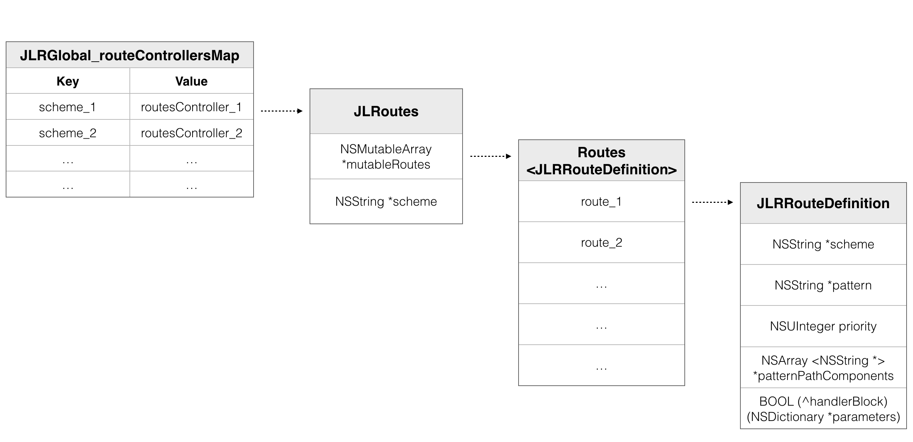
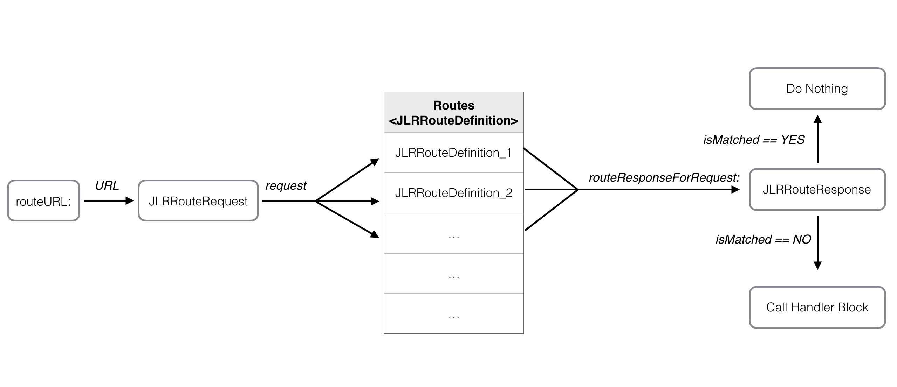

# JLRoutes


### 一、简介

#### 1. 使用场景

- deep link：通过 Custom URL Scheme 由外部跳转到 app，比如推送跳转，app 间跳转。
- app 内部路由跳转：使用中介者模式对 controller 进行解耦。

#### 2. 使用方法

在 APP 启动时注册 URL：

```
- (BOOL)application:(UIApplication *)application didFinishLaunchingWithOptions:(NSDictionary *)launchOptions
{
  JLRoutes *routes = [JLRoutes globalRoutes];

  [routes addRoute:@"/user/view/:userID" handler:^BOOL(NSDictionary *parameters) {
    NSString *userID = parameters[@"userID"]; // defined in the route by specifying ":userID"

    // present UI for viewing user with ID 'userID'

    return YES; // return YES to say we have handled the route
  }];

  return YES;
}


```

打开 URL：

```
NSURL *viewUserURL = [NSURL URLWithString:@"myapp://user/view/joeldev"];
[JLRoutes routeURL:viewUserURL];
```

详见该项目的 [README](https://github.com/joeldev/JLRoutes)。

### 二、主要原理

#### 1.注册流程

调用 `addRoute:handler:` 方法注册 url scheme，保存/取出每个 scheme 对应的 routes controller 对象（以 key-value 形式保存的）；注册 url pattern，按优先级将每个 pattern 对应的 JLRRouteDefinition（封装 pattern、priority、回调 block 等数据）通过*插入排序*的方式保存到数组中，这里一个 pattern 可能对应一个或者多个 JLRRouteDefinition。


<div align = "center">图 1. 注册 URL 流程</div>

#### 2. 解析 URL 流程

调用 `routeURL:` 方法唤起 URL时，取出 scheme 对应的 routes controller，生成  JLRRouteRequest，然后遍历所有注册过的 JLRRouteDefinition，遍历时每个 JLRRouteDefinition 会根据 request 进行匹配并生成一个  `JLRRouteResponse` 对象，如果匹配上了，就回调 block，并回传参数。



<div align = "center">图 2. 解析 URL 流程</div>

#### 3. 主要的类

类名      | 作用
----------|------
JLRoutes | 作为 JLRoutes 框架的入口，负责注册 URL，管理路由以及分配路由。
JLRRouteDefinition | 用来封装注册 URL 的路由信息，包括 URL scheme, route pattern, and priority，并且可以根据 request 提供相应的 response。可以通过继承该类来实现自定义的匹配方式。
JLRRouteRequest | 用来封装一个 URL 的路由请求信息，包括 URL、解析后的 path components 和 query parameters。
JLRRouteResponse | 根据 URL 匹配路由信息时的 response，包含 isMatch、parameters 等信息。如果 JLRRouteDefinition 匹配 URL 成功时，就会设置属性  isMatch 为 YES，同时将解析 URL 后的参数和 默认参数、附加参数组合返回。
JLRRouteHandler 和 JLRRouteHandlerTarget | 自定义路由 handler，也就是将回调参数处理的逻辑交给自定义类去处理。（ps：暂时还没有想到这样的好处是什么，给作者提了 issue）
JLRParsingUtilities | 解析 URL 参数的工具类。

### 三、JLRoutes 的优缺点

#### 1. 优点：

- 能匹配多种不同规则的 URL，可以定义自定义的匹配规则、匹配逻辑
- 可以指定每个路由的优先级

#### 2. 缺点：

- 当注册的 URL 比较多时，匹配效率比较低。

### 四、 技术点

- 设计框架时附带了 log 功能，方便追踪调试
- NSURLComponent，NSScanner
- URL ，Request，Response，Definition 的路由模型、模块化设计
- 容错机制（fallback、unmatchedURLHandler）

### 五、问题

1. 一个 APP 中的页面有很多，当越来越多的时候，需要注册的 URL 也就越多，这样的话，注册 URL 的文件不是会变得越来越大吗？

2. 为什么要在 APP 启动时注册？


### 参考：

- [joeldev/JLRoutes](https://github.com/joeldev/JLRoutes)
- [iOS——Scheme是什么、怎么自定义Scheme、JLRoutes的使用](http://zhoulingyu.com/2016/01/03/iOS%E2%80%94%E2%80%94Scheme%E6%98%AF%E4%BB%80%E4%B9%88%E3%80%81%E6%80%8E%E4%B9%88%E8%87%AA%E5%AE%9A%E4%B9%89Scheme%E3%80%81JLRoutes%E7%9A%84%E4%BD%BF%E7%94%A8/)
- [JLRoutes源码分析](https://www.gfzj.us/series/读源代码学习ios开发/2015/07/14/JLRoutes.html)
- [组件化初探 - JLRoutes源码分析](https://www.jianshu.com/p/d24e9a7c8d4e)
