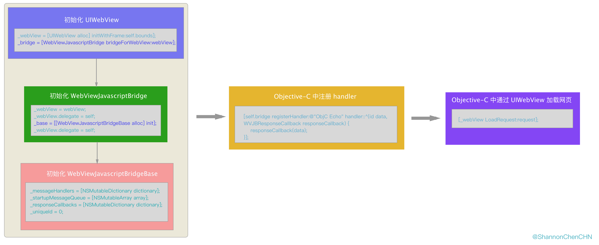
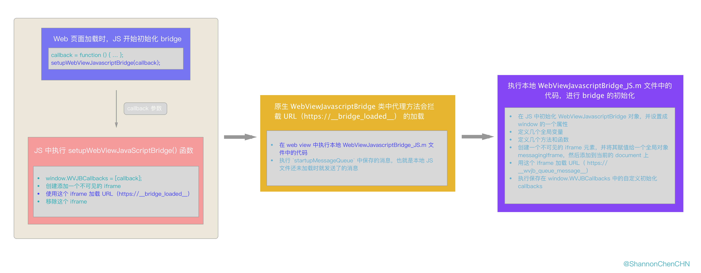
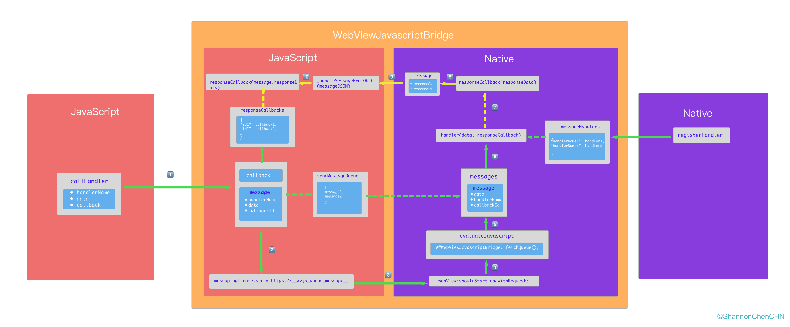
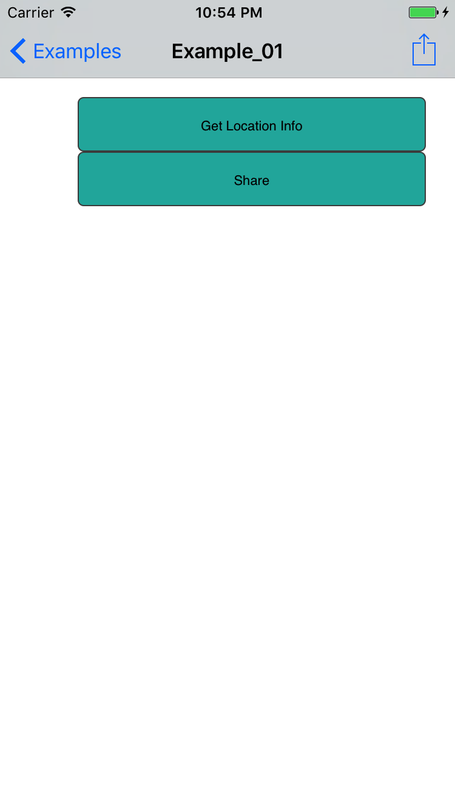
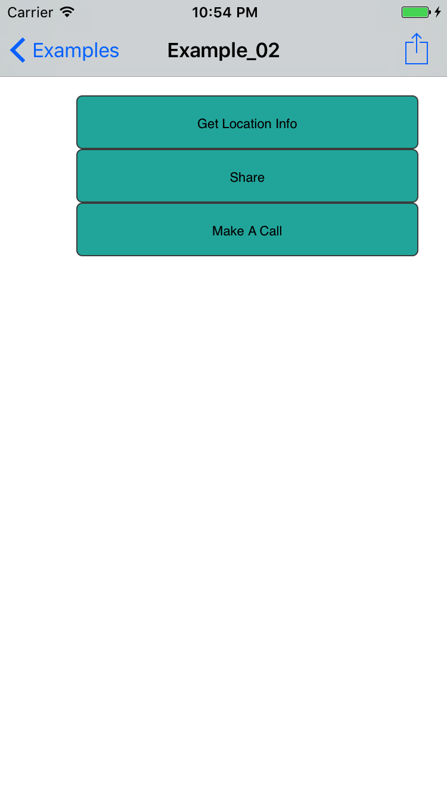

> **前言**：iOS 开发中，h5 和原生实现通信有[多种方式]()， JSBridge 就是最常用的一种，各 JSBridge 类库的实现原理大同小异，这篇文章主要是针对当前使用最为广泛的 [WebViewJavascriptBridge（v6.0.2）](https://github.com/marcuswestin/WebViewJavascriptBridge/tree/v6.0.2)，从功能 API、实现原理到源码解读、最佳实践，做一个简单介绍。

### 目录
- 一、简介
  - 1.设计目的
  - 2.特点
  - 3.安装、导入
  - 4.API
- 二、实现原理
  - 1.目录结构
  - 2.主要流程
     - 2.1 初始化
     - 2.2 JS 调用原生
     - 2.3 原生调用 JS
     - 2.4 小结
- 三、源码解读
- 四、最佳实践
  - 1.JS 端的优化
  - 2.Objective-C 端的优化
- 五、问题与讨论
- 六、延伸阅读

> **长文警告**：由于文章篇幅较长，如果你不需要了解太多细节的话，可以忽略掉第三部分『源码解读』，通过阅读第二部分『实现原理』（含流程图）就基本可以了解到整个核心流程了。

### 一、简介
#### 1. 设计目的
我们平时使用 `UIWebView` 时，原生和 JavaScript 的交互一般是通过以下两种方式实现的：
- Native to JavaScript：原生通过 `-stringByEvaluatingJavaScriptFromString:` 方法执行一段 JavaScript
- JavaScript to Native：在网页中加载一个 Custom URL Scheme 的链接（直接设置 window.location 或者新建一个 iframe 去加载这个 URL），原生中拦截 `UIWebView` 的代理方法 `- webView:shouldStartLoadWithRequest:navigationType: `，然后根据约定好的协议做相应的处理

这两种方式的弊端在于代码过于松散，长而久之，`- webView:shouldStartLoadWithRequest:navigationType: ` 方法变得越来越臃肿杂乱，就像下面这样：
``` Objective-C
- (BOOL)webView:(UIWebView*)webView shouldStartLoadWithRequest:(NSURLRequest*)request navigationType:(UIWebViewNavigationType)navigationType {
    NSString *urlString = request.URL.absoluteString;
    NSDictionary *params = [[NSDictionary alloc] init];
    
    if (request.URL.query.length > 0) {
        params = [request.URL.query sc_URLParamKeyValues];
    }

    if ([urlString rangeOfString:@"app://share"].location != NSNotFound) {
           
          // 处理分享逻辑的代码
          return NO;
    } else if ([urlString rangeOfString:@"app://getLocation"].location != NSNotFound) {
           // 获取地理位置的代码...
           // 回调 JS
           [webView stringByEvaluatingJavaScriptFromString:[NSString stringWithFormat:"setLocation('%@')", locationString]];
          return NO;

    }   else if  ...  
       // 几十个 else if
      else {
          return YES;
    }
          return YES;
}


```

`WebViewJavascriptBridge` 框架提供了一种更优雅的方式，用来在 `WKWebView`、`UIWebView`（iOS） 以及 `WebView`（OSX）中，建立一个 Objective-C 和 JavaScript 之间互相“发送消息”的机制，让我们可以在 JS 中像直接调 JS 方法那样发消息给 Objective-C，同时可以在 Objective-C 中像直接调 Objective-C 方法那样发消息给 JS。

#### 2. 特点
- Objective-C 中发送消息给 web view 中的 JavaScript
- web view 中的 JavaScript 发送消息给 Objective-C
- 不论是原生还是 JavaScript，发送消息的过程就像平时调用同一语言/环境的方法一样简单
- 发送消息时不仅可以带参数，还可以传 callback 用于回调

#### 3. 安装

3.1 使用 pod 安装
直接在 podfile 中加入下面这行代码，并执行 `pod install` 命令：
``` Ruby
pod 'WebViewJavascriptBridge', '~> 6.0'
```

3.2 手动导入
在 WebViewJavascriptBridge 的 [GitHub repository](https://github.com/marcuswestin/WebViewJavascriptBridge) 上下载源码后，从下载好的文件中将 `WebViewJavascriptBridge` 文件夹直接拖入你的工程中。

#### 4. API

#### 4.1 Objective-C API

``` Objective-C
// 为指定的 web view （WKWebView/UIWebView/WebView）创建一个 JavaScript Bridge 
+ (instancetype)bridgeForWebView:(id)webView;
```

``` Objective-C
// 注册一个名称为 handlerName 的 handler 给 JavaScript 调用
// 当在 JavaScript  中调用 WebViewJavascriptBridge.callHandler("handlerName")  时，该方法的 WVJBHandler 参数会收到回调
- (void)registerHandler:(NSString*)handlerName handler:(WVJBHandler)handler;
```

``` Objective-C
// 调用 JavaScript 中注册过的 handler
// data 参数为调用 handler 时要传递给 JavaScript 的参数，responseCallback 传给 JavaScript 用来回调
- (void)callHandler:(NSString*)handlerName;
- (void)callHandler:(NSString*)handlerName data:(id)data;
- (void)callHandler:(NSString*)handlerName data:(id)data responseCallback:(WVJBResponseCallback)responseCallback;
```

``` Objective-C
// 如果你需要监听 web view 的代理方法的回调，可以通过该方法设置你的 delegate
- (void)setWebViewDelegate:(id)webViewDelegate;
```

#### 4.2 JavaScript API
``` JavaScript
// 注册一个  handler 给 Objective-C 调用
registerHandler(handlerName: String, handler: function);
```

``` JavaScript
// 调用 Objective-C 中注册过的 handler
callHandler(handlerName: String);
callHandler(handlerName: String, data: undefined);
callHandler(handlerName: String, data: undefined, responseCallback: function);
```

#### 5. 基本用法

5.1 导入头文件，声明一个 `WebViewJavascriptBridge` 属性：
``` Objective-C
#import "WebViewJavascriptBridge.h"

...

@property WebViewJavascriptBridge* bridge;
```

5.2 为你的 `WKWebView`、`UIWebView` (iOS)或者`WebView` (OSX) 创建一个 `WebViewJavascriptBridge ` 对象：
``` Objective-C
self.bridge = [WebViewJavascriptBridge bridgeForWebView:webView];
```

5.3 在 Objective-C 中注册 handler 和调用 JavaScript 中的 handler：
``` Objective-C
[self.bridge registerHandler:@"ObjC Echo" handler:^(id data, WVJBResponseCallback responseCallback) {
	NSLog(@"ObjC Echo called with: %@", data);
	responseCallback(data);
}];
[self.bridge callHandler:@"JS Echo" data:nil responseCallback:^(id responseData) {
	NSLog(@"ObjC received response: %@", responseData);
}];
```

5.4 复制下面的 `setupWebViewJavascriptBridge` 函数到你的 JavaScript 代码中：
``` JavaScript
function setupWebViewJavascriptBridge(callback) {
	if (window.WebViewJavascriptBridge) { return callback(WebViewJavascriptBridge); }
	if (window.WVJBCallbacks) { return window.WVJBCallbacks.push(callback); }
	window.WVJBCallbacks = [callback];
	var WVJBIframe = document.createElement('iframe');
	WVJBIframe.style.display = 'none';
	WVJBIframe.src = 'https://__bridge_loaded__';
	document.documentElement.appendChild(WVJBIframe);
	setTimeout(function() { document.documentElement.removeChild(WVJBIframe) }, 0)
}
```

5.5 调用 `setupWebViewJavascriptBridge` 函数，使用 `bridge` 来注册 handler 和调用 Objective-C 中的 handler：
``` Javascript
setupWebViewJavascriptBridge(function(bridge) {
	
	/* 在这里做一些初始化操作 */

	bridge.registerHandler('JS Echo', function(data, responseCallback) {
		console.log("JS Echo called with:", data)
		responseCallback(data)
	})
	bridge.callHandler('ObjC Echo', {'key':'value'}, function responseCallback(responseData) {
		console.log("JS received response:", responseData)
	})
})
```

### 二、实现原理

#### 1. 目录结构

类名|功能|
----|---|
`WebViewJavascriptBridgeBase`|① 用来进行 bridge 初始化和消息处理的核心类；<br> ② 这个类是在支持 `WKWebView` 后从  `WebViewJavascriptBridge` 中独立出来的逻辑，专门用来处理 bridge 相关的逻辑，不再与具体的 Web View 相关联了|
`WebViewJavascriptBridge`|① 桥接的入口，针对不同类型的 Web View （`UIWebView`、`WKWebView`、`WebView`）进行分发；<br> ② 针对 `UIWebView` 和 `WebView` 做的一层封装，主要用来执行 JS 代码，以及实现 `UIWebView` 和 `WebView`的代理方法，并通过拦截 URL 来通知 `WebViewJavascriptBridgeBase` 做相应操作|
`WKWebViewJavascriptBridge`|针对 `WKWebView` 做的一层封装，主要用来执行 JS 代码，以及实现 `WKWebView` 的代理方法，并通过拦截 URL 来通知 `WebViewJavascriptBridgeBase` 做相应操作|
`WebViewJavascriptBridge_JS`| JS 端负责“收发消息”的代码|

#### 2. 主要流程
> **说明**：`WebViewJavascriptBridge` 中虽然对不同类型的 Web View 做了不同的处理，但是核心逻辑还是一样的，为了简单说明，这里只讨论 `UIWebView` 情况下的逻辑。

`WebViewJavascriptBridge` 参与交互的流程包括三个部分：初始化、JS 调用原生、原生调用 JS。

#### 2.1 初始化

WebViewJavascriptBridge 的初始化分为两部分，一部分是 Objective-C 中的 `WebViewJavascriptBridge` 对象的初始化，另一部分是 JavaScript 中的 `window.WebViewJavascriptBridge` 的初始化。
最终的目标是， Objective-C 和 JavaScript 两边各有一个 `WebViewJavascriptBridge` 对象，有了这两个对象，两边都可以收发“消息”，同时两边还各自维护一个管理响应事件的 messageHandlers 容器、一个管理回调的 callbackId 容器。
所以，我们这里讨论的初始化，不单单是一个对象的初始化，而是一个完整的准备过程，如下图所示。





**（1）**  Objective-C 中的初始化
- 初始化 UIWebView
- 初始化 WebViewJavascriptBridge，设置 web view 代理
- 初始化 WebViewJavascriptBridgeBase，初始化相关的属性

**（2）** 注册 handler 供 JS 调用——把注册过的 handler 保存起来

```
[self.bridge registerHandler:@"share" handler:^(id data, WVJBResponseCallback responseCallback) {
        NSString *shareContent = [NSString stringWithFormat:@"标题：%@\n 内容：%@ \n url：%@",
                                  data[@"title"],
                                  data[@"content"],
                                  data[@"url"]];
		 responseCallback(@"分享成功");
    }];
```

**（3）** Objective-C 中通过调用 `UIWebView` 的 `loadRequest:` 方法加载 URL

**（4）** 网页一加载就会执行 web 页中的 bridge 初始化代码，也就是调用上面提到的 `setupWebViewJavascriptBridge(bridge)`函数
- 保存要执行的自定义初始化函数，比如注册 JS 中的 handler
- 通过添加一个 iframe 加载初始化链接 `https://__bridge_loaded__`

**（5）** 原生 WebViewJavascriptBridge 类中代理方法会拦截 `https://__bridge_loaded__` 的加载
- 在 web view 中执行本地 WebViewJavascriptBridge_JS.m 文件中的代码，初始化 `window.WebViewJavascriptBridge` 对象：
  - 在 JS 中创建一个 `WebViewJavascriptBridge` 对象，并设置成 `window` 的一个属性
  - 定义几个用于管理消息的全局变量
  - 给 `WebViewJavascriptBridge` 对象定义几个处理消息的方法和函数
- 执行原生端 `startupMessageQueue` 中保存的消息，也就是本地 JS 文件还未加载时就发送了的消息

**（6）** 初始化完毕

#### 2.2 JS 调用原生



实际上，相比 原生调用 JS，JS 调用原生的逻辑更婉转，对照上面的示意图，我们可以把JS 调用原生的逻辑简化成以下五个环节：
- JS 中调用 `callHandler()` 方法，发消息给原生
- 在 JS 中将参数和回调包装成一个 message
- JS 通知原生到它那边去取 message
- 原生处理 message 中的数据
- 原生回调 JS

**（1）JS 中调用 `callHandler()` 方法，发消息给原生**
```  Objective-C
WebViewJavascriptBridge.callHandler(@"share",
									{title: "标题"},
								    function (response) {
									   console.log(response);
                                    });
```
**（2）在 JS 中将参数和回调包装成一个 message** 
把要调用的 `handlerName`、要传给 native 的数据 data 以及原生回调 JS 的 `responseCallback` 对应的 id 包装成一个 message，然后再保存到一个全局的数组 `sendMessageQueue` 里面。

值得注意的是，那个用于处理原生回调的 `responseCallback` 是一个函数，是不能直接传给原生的，所以这里只传了其对应的 id，而 `responseCallback` 本身会被存到一个全局的 `responseCallbacks` 对象的属性里面去，属性名就是 `responseCallback` 对应的 id。原生回调 JS 时，就会根据 id 从 `responseCallbacks` 对象中去取对应的 callback。

**（3）JS 通知原生到它那边去取 message**
在 iframe 中加载发送消息的 URL，通知原生“我 JS 发消息给你了，麻烦你到信箱里查收一下”，原生中的 `WebViewJavascriptBridge` 就会在 webView 代理方法里面拦截到这个事件，然后再调用 JS，将 `sendMessageQueue` 中的 message 全部取出来，然后转成 JSON string 的形式。

**（4） 原生处理 message 中的数据**
原生拿到转为 JSON string 的 message 之后，先将其解析成原生的字典，然后再取出 `data`、 `callbackId` 和 `handlerName`，最后根据 `handlerName` 从之前注册过的 `messageHandlers` 里面取出对应的 `handler`（block），再调用这个 `handler `，第一个参数就是 `data`，第二个参数是根据 `callbackId` 创建的 `responseCallback`（block），然后原生就可以在 `handler`（block） 中处理接收到的 data 以及回调 JS。

**（5）原生回调 JS**
那么这个回调 JS 的 `responseCallback`（block） 是怎么处理的呢？当这个 `responseCallback` 被回调时，在这个 `callback` 中会创建一个 `message` （NSDictionary）对象，其中包含两个字段，一个是 `callbackId`，另一个传进 `responseCallback` 的参数 `data`，然后再将这个 `message` （NSDictionary）对象转成 JSON String，最后调用 JS 中的 `_handleMessageFromObjC(messageJSON) `方法，同时将 JSON String 形式的 `message` 作为参数传给 JS，接下来 JS 就会通过 `message` 中的 `callbackId` 找出之前保存的 `responseCallback`，并把 `message` 中的 `data` 作为参数，回调这个 `responseCallback`。至此，整个 JS 调原生的流程就跑通了。

#### 2.3 原生调用 JS


原生调用 JS 其实本身可以直接通过 web view 来执行 JavaScript 脚本来实现的，但是 `WebViewJavascriptBridge` 提供了一个更贴近原生的方式。一是调用更规范，二是使用 block 的方式将调用与 JS 回调归并到一起了，代码逻辑更连贯。

与上面的 JS 调用原生恰好相反，原生调用 JS 时调用过程很简单，但是回调过程相对比较复杂。简单来看，如上图所示，原生调用 JS 也可以分成以下几步：
- 原生通过调用 `callHandler()` 方法，发消息给 JS
- 在原生中将参数和回调包装成一个 message
- 原生直接调用 JS 函数将 message 传给 JS
- JS 回调原生

**（1）原生通过调用 `callHandler()` 方法，发消息给 JS**
```
[self.bridge callHandler:@"share" data:nil responseCallback:^(id responseData) {
        NSLog("收到来自 JS 的回调");
    }];
```
**（2）在原生中将参数和回调包装成一个 message**
跟 JS 调用原生类似，原生调用 JS 时，也是将要调用的 `handlerName`、要传给 JS 的数据 `data` 以及 JS 回调原生的 `responseCallback` 对应的 id 包装成一个 `message`（NSDictionary），然后将这个 `message` 对象转成 JSON String。接着再调用 JS 的  `WebViewJavascriptBridge._handleMessageFromObjC(messageJSON)` 方法，把 JSON String 传给 JS。

同样值得注意的是，那个用于处理 JS 回调的 `responseCallback` 是一个 block，也是不能直接传给 JS 的，所以这里只传了其对应的 id，而 `responseCallback`（block） 本身会被存到一个全局的 `responseCallbacks` 字典里面去，key 值就是 `responseCallback` 对应的 id。JS 回调原生时，就会根据 id 从 `responseCallbacks` 字典中去取对应的 block。

**（3）原生直接调用 JS 函数将 message 传给 JS** 
JS 拿到转为 JSON string 形式的 message 之后，先将其解析成 JS 对象，然后再取出 `data`、 `callbackId` 和 `handlerName`，最后根据 `handlerName` 从之前注册过的 `messageHandlers` 里面取出对应的 `handler` 函数，再执行这个 `handler` 函数，第一个参数就是 `data`，第二个参数是根据 `callbackId` 创建的 `responseCallback`（function），然后 JS 就可以在 `handler` 函数中处理接收到的 `data` 以及回调原生。
  
**（4）JS 回调原生** 
那么这个回调原生的 `responseCallback`（function） 是怎么处理的呢？与前面 JS 调原生时原生回调 JS 的处理不太一样，因为 JS 调原生是不能直接调的，所以当这个 `responseCallback`（function）  被回调时，在这个 function 中会用“发消息”的方式，直接走前面所提到的 JS 调原生的流程。
  但这其中有两点与 JS 直接调原生不太一样的地方，一是 message 的内容，二是原生对这个 message 的处理：
- JS 在回调原生时，会把 `handlerName`，`responseId`（也就是原生调 JS 时传过来的 `callbackId`） 和 `responseData` 包装成一个 `message` 对象。**与 JS 直接调原生不同的是，这里的 `message` 对象没有 JS 回调函数的 `callbackId`，因为这里不需要原生再次回调 JS 了**。但是多了一个 `responseId`，这是因为原生执行 JS 的回调时，会根据这个 `responseId` 从 `responseCallbacks`（NSDictionary） 中去取对应的 `block`。
- 当原生收到并解析 JS 回调的消息后，会直接根据 message 中的 `responseId` 找出之前保存的 `responseCallback`（block），并把 message 中的 `responseData` 作为参数，然后再回调这个 `responseCallback`。**与 JS 直接调原生不同的是，这个 `responseCallback` 只有一个参数 `data`，没有用于再次回调 JS 的 block 了。
至此，整个原生调 JS 的流程就圆满结束了。
 
#### 2.4 小结
一句话来概括的话，那就是——`WebViewJavascriptBridge` 以下面两个方法为桥梁（以 `UIWebView` 为例）：
- 原生调 JS：`-stringByEvaluatingJavaScriptFromString:` 
- JS 调原生：`- webView:shouldStartLoadWithRequest:navigationType:` 

在 JS 和原生两边封装了一套『方法调用』转『消息发送』的机制，各自维护了一套注册的方法列表、回调函数列表，优雅地解决了回调的问题。（注：不要把这里的消息发送和 Objective-C 运行时的消息发送混淆了）

### 三、源码解读
> 这里只针对核心逻辑进行分析，详见 [带有注释的源码](https://github.com/ShannonChenCHN/iOSLevelingUp/tree/master/ReadingSourceCode/WebViewJavascriptBridgeNotes/WebViewJavascriptBridge-6.0.2)。

对照上面的流程我们来看看 `WebViewJavascriptBridge` 的源码具体是如何实现的。

#### 1.  初始化

（1） Objective-C 中的初始化
首先从创建  `UIWebView` 和 `WebViewJavascriptBridge` 对象开始：
```
@implementation ViewController
// 创建 web view
UIWebView *webView = [[UIWebView alloc] initWithFrame:self.view.bounds];
webView.autoresizingMask = UIViewAutoresizingFlexibleHeight | UIViewAutoresizingFlexibleWidth;
[self.view addSubview:webView];


// 创建 WebViewJavascriptBridge 对象
self.bridge = [WebViewJavascriptBridge bridgeForWebView:webView];
...
@end
```
`WebViewJavascriptBridge` 的 `+ bridgeForWebView:` 方法在内部针对不同的 web view 做了不同的逻辑处理，由于我这里使用的是 `UIWebView`，所以这里最终会调用 `-_platformSpecificSetup:` 方法：
```
@implementation WebViewJavascriptBridgeBase
...
// 创建 Bridge
+ (instancetype)bridgeForWebView:(id)webView {
    return [self bridge:webView];
}

+ (instancetype)bridge:(id)webView {
    
    // 为 WKWebView 初始化
#if defined supportsWKWebView
    if ([webView isKindOfClass:[WKWebView class]]) {
        return (WebViewJavascriptBridge*) [WKWebViewJavascriptBridge bridgeForWebView:webView];
    }
#endif
    // 为  UIWebView（iOS） 或者 WebView（OSX） 初始化
    if ([webView isKindOfClass:[WVJB_WEBVIEW_TYPE class]]) {
        WebViewJavascriptBridge* bridge = [[self alloc] init]; // 注意：这里用的不是 WebViewJavascriptBridge 而是 self
        [bridge _platformSpecificSetup:webView];  // 针对不同平台进行初始设置：保存 webView，并设置 webView 的 delegate，创建 WebViewJavascriptBridgeBase 对象，并设置 WebViewJavascriptBridgeBase 的 delegate
        return bridge;
    }
    [NSException raise:@"BadWebViewType" format:@"Unknown web view type."];
    return nil;
}
...
@end
```
然后在 `-_platformSpecificSetup:` 方法中会设置 web view 的代理为 `self`，并且创建了一个 `WebViewJavascriptBridgeBase` 对象，同时设置这个对象的代理为 `self`。其目的是为了：
① 监听 `UIWebView` 的代理方法回调；
② 把桥接的核心逻辑交给 `WebViewJavascriptBridgeBase` 去处理；
```
@implementation WebViewJavascriptBridge
...
- (void) _platformSpecificSetup:(WVJB_WEBVIEW_TYPE*)webView {
    _webView = webView;
    _webView.delegate = self;
    _base = [[WebViewJavascriptBridgeBase alloc] init];
    _base.delegate = self;
}
...
@end
```
`WebViewJavascriptBridgeBase ` 在初始化时，会为原生端初始化几个后面用于处理消息的变量：
```
@implementation WebViewJavascriptBridgeBase
...
- (id)init {
    if (self = [super init]) {
        self.messageHandlers = [NSMutableDictionary dictionary];    // 用来保存 handler （一个 `WVJBHandler` 类型的 block）的字典
        self.startupMessageQueue = [NSMutableArray array];          // 用来保存初始消息的数组
        self.responseCallbacks = [NSMutableDictionary dictionary];  // 用来保存回调 JS 的 block 的字典（原生调 JS 后，JS 再回调原生时会用到）
        _uniqueId = 0;
    }
    return self;
}
...
@end
```

（2）通过调用 `-registerHandler:handler:` 方法，注册 handler 供 JS 调用，这个方法会把要注册的 handler（block）保存到 `WebViewJavascriptBridgeBase`对象的 `messageHandlers`（NSDictionary）属性中去，当 JS 回调后，就会根据 handlerName 从这个变量中去取对应的 handler：

```
@implementation WebViewJavascriptBridge
...
- (void)registerHandler:(NSString *)handlerName handler:(WVJBHandler)handler {
    _base.messageHandlers[handlerName] = [handler copy]; // 保存 handler
}
...
@end
```

（3） Objective-C 中通过调用 `UIWebView` 的 `-loadRequest:` 方法加载 URL 后，网页一加载就会执行 web 页中的 bridge 初始化代码，也就是调用 `setupWebViewJavascriptBridge(bridge)` 函数:
```
<script type="text/JavaScript">
// 初始化 WebViewJavascriptBridge
function setupWebViewJavascriptBridge(callback) {
                
    // 只在第一次调用时不执行，为了防止重复加载 WebViewJavascriptBridge_JS.m
    if (window.WebViewJavascriptBridge) {
        return callback(WebViewJavascriptBridge);
    }
                
    // 保存 callback
    if (window.WVJBCallbacks) {
        return window.WVJBCallbacks.push(callback);
    }
    window.WVJBCallbacks = [callback];
                
    // 开启一个 iframe，加载这段 URL 'wvjbscheme://__BRIDGE_LOADED__'
    // 其目的是为了触发 WebViewJavascriptBridge_JS.m 文件内容的加载
    var WVJBIframe = document.createElement('iframe');
    WVJBIframe.style.display = 'none';
    WVJBIframe.src = 'wvjbscheme://__BRIDGE_LOADED__';
    document.documentElement.appendChild(WVJBIframe);
    setTimeout(
        function() {
             document.documentElement.removeChild(WVJBIframe);
        }, 0);
}
            
    // 显式调用 setupWebViewJavascriptBridge 方法，触发 WebViewJavascriptBridge 的初始化
    setupWebViewJavascriptBridge(
            
    function(bridge) {
     /* Initialize your app here */
                                           
        bridge.registerHandler("share", function(data, responseCallback) {
                                        var params = {'title':'测试分享的标题','content':'测试分享的内容','url':'http://www.baidu.com'};
                                                                responseCallback(params);
                                                                });
                                         }
            
            );
...
</script>
```
这里调用 `setupWebViewJavascriptBridge()` 函数时，传入的参数是一个带有自定义初始化逻辑（比如 JS 中注册 handler）的 `function`，相当于原生中的 block。
这个 `function` `setupWebViewJavascriptBridge()` 函数主要做了两件事情：
- 将传进来的参数保存到 `window.WVJBCallbacks` 中，等到后面 JS 端的 bridge 初始化成功后，再取出来调用
- 通过添加一个 iframe 加载初始化链接 `https://__bridge_loaded__`，调起原生，然后再移除这个 iframe

（5） 原生中的 `WebViewJavascriptBridge` 对象中代理方法会拦截到 `https://__bridge_loaded__` 的加载：
```
@implementation WebViewJavascriptBridge
...
- (BOOL)webView:(UIWebView *)webView shouldStartLoadWithRequest:(NSURLRequest *)request navigationType:(UIWebViewNavigationType)navigationType {
    if (webView != _webView) { return YES; }
    
    NSURL *url = [request URL];
    __strong WVJB_WEBVIEW_DELEGATE_TYPE* strongDelegate = _webViewDelegate;
    
    if ([_base isWebViewJavascriptBridgeURL:url]) { // 是不是 Bridge 的 URL
        
        if ([_base isBridgeLoadedURL:url]) {  // 是不是第一次加载时的 URL
            
            [_base injectJavascriptFile];    // 注入 WebViewJavascriptBridge_JS 文件中的 JavaScript
            
        } else if ([_base isQueueMessageURL:url]) {  // 是不是发送消息给 Native 的 URL
            
            NSString *messageQueueString = [self _evaluateJavascript:[_base webViewJavascriptFetchQueyCommand]];
            [_base flushMessageQueue:messageQueueString];
        } else {
            [_base logUnkownMessage:url];
        }
        return NO;
    } else if (strongDelegate && [strongDelegate respondsToSelector:@selector(webView:shouldStartLoadWithRequest:navigationType:)]) {
        return [strongDelegate webView:webView shouldStartLoadWithRequest:request navigationType:navigationType];
    } else {
        return YES;
    }
}
...
@end
```

在 `-webView:shouldStartLoadWithRequest:navigationType:`方法中，首先会根据 URL 的 scheme 来判断这个 URL 是不是跟 bridge 相关的 URL，然后再根据 URL 的 host 来判断是用来初始化 JS 中的 bridge 的（`__bridge_loaded__`），还是用来发消息给原生的（`__wvjb_queue_message__`）：
```

...
#define kOldProtocolScheme @"wvjbscheme"
#define kNewProtocolScheme @"https"
#define kQueueHasMessage   @"__wvjb_queue_message__"
#define kBridgeLoaded      @"__bridge_loaded__"

@implementation WebViewJavascriptBridgeBase
...

/// 判断 URL 是不是跟 bridge 相关的
- (BOOL)isWebViewJavascriptBridgeURL:(NSURL*)url {
    if (![self isSchemeMatch:url]) {
        return NO;
    }
    return [self isBridgeLoadedURL:url] || [self isQueueMessageURL:url];
}

/// scheme 是不是 wvjbscheme 或者 https
- (BOOL)isSchemeMatch:(NSURL*)url {
    NSString* scheme = url.scheme.lowercaseString;
    
    return [scheme isEqualToString:kNewProtocolScheme] || [scheme isEqualToString:kOldProtocolScheme];
}

/// host 是不是 __wvjb_queue_message__，并且 scheme 也匹配
/// 用来判断是不是发送消息给 Native 的 URL
- (BOOL)isQueueMessageURL:(NSURL*)url {
    NSString* host = url.host.lowercaseString;
    return [self isSchemeMatch:url] && [host isEqualToString:kQueueHasMessage];
}

/// host 是不是 __bridge_loaded__，并且 scheme 也匹配
/// 用来判断是不是第一次加载时的 URL
- (BOOL)isBridgeLoadedURL:(NSURL*)url {
    NSString* host = url.host.lowercaseString;
    return [self isSchemeMatch:url] && [host isEqualToString:kBridgeLoaded];
}
...
@end
```
此时的 URL 是 `https://__bridge_loaded__`，所以肯定是走 ` [_base injectJavascriptFile];   ` 的逻辑，这个方法主要是加载  WebViewJavascriptBridge_js.m 文件中的 JS：
```
/// 注入 JS ，进行一些初始化操作
- (void)injectJavascriptFile {
    NSString *js = WebViewJavascriptBridge_js(); // MARK: 为什么用这种方式加载，而不是写成一个 .js 文件再读取呢？
    [self _evaluateJavascript:js];  // 执行 WebViewJavascriptBridge_JS 文件中的 JavaScript
    
    // 如果队列中有未发送的消息，马上发给 JS
    if (self.startupMessageQueue) {
        NSArray* queue = self.startupMessageQueue;
        self.startupMessageQueue = nil;
        for (id queuedMessage in queue) {
            [self _dispatchMessage:queuedMessage];
        }
    }
}
```

（6）在 web view 中执行本地 WebViewJavascriptBridge_JS.m 文件中的代码后，首先会初始化 `window.WebViewJavascriptBridge` 对象，并定义几个方法和全局变量：
- 在 JS 中初始化 `WebViewJavascriptBridge` 对象，并设置成 `window` 的一个属性
- 定义几个全局变量
  - `sendMessageQueue`：保存待发送消息的数组
  - `messageHandlers`：保存注册过的 handler 的对象
  - `responseCallbacks`：保存 callback 的对象
  - `uniqueId`：保存 callback 时对应的 id
- 定义以下几个方法
  - `registerHandler(handlerName, handler)`：注册 hander
  - `callHandler(handlerName, data, responseCallback)`：调用 handler
  - `_fetchQueue() `：获取待发送消息
  - `disableJavscriptAlertBoxSafetyTimeout()`：让OC可以关闭回调超时
  - `_handleMessageFromObjC(messageJSON)`：调用 `_dispatchMessageFromObjC`处理来自 Objective-C 的消息
- 定义两个函数，给上面几个方法调用 
  - `_doSend(message, responseCallback)`：将要发送的消息保存到 sendMessageQueue 中，同时加载 URL 调起原生
  - `_dispatchMessageFromObjC(messageJSON)`：处理 Objective-C 中发来的消息
```
WebViewJavascriptBridge_JS.m
...
// 初始化 WebViewJavascriptBridge 对象
	window.WebViewJavascriptBridge = {
		registerHandler: registerHandler,
		callHandler: callHandler,
		disableJavscriptAlertBoxSafetyTimeout: disableJavscriptAlertBoxSafetyTimeout,
		_fetchQueue: _fetchQueue,
		_handleMessageFromObjC: _handleMessageFromObjC
	};

	var messagingIframe;
	var sendMessageQueue = [];  // 保存消息的数组
	var messageHandlers = {};   // 保存 handler 的对象
	
	var CUSTOM_PROTOCOL_SCHEME = 'https';
	var QUEUE_HAS_MESSAGE = '__wvjb_queue_message__';  // 发送消息的 URL scheme
	
	var responseCallbacks = {};  // 回调函数
	var uniqueId = 1;            // 保存 callback 的唯一标识
	var dispatchMessagesWithTimeoutSafety = true;

    // 注册 handler 的方法
	function registerHandler(handlerName, handler) {
		messageHandlers[handlerName] = handler;
	}
	
    // 调用 Native handler 的方法
	function callHandler(handlerName, data, responseCallback) {
        // 如果只有两个参数，并且第二个参数是 函数
		if (arguments.length == 2 && typeof data == 'function') {
			responseCallback = data;
			data = null;
		}
        
        // 发送消息给 Native
		_doSend({ handlerName:handlerName, data:data }, responseCallback);
	}
        
	function disableJavscriptAlertBoxSafetyTimeout() {
		dispatchMessagesWithTimeoutSafety = false;
	}
	
    // 发送消息给 Native
    // 一个消息包含一个 handler 和 data，以及一个 callbackId
    // 因为 JavaScript 中的 callback 是函数，不能直接传给 Objective-C，
	function _doSend(message, responseCallback) {
		
        if (responseCallback) {
			var callbackId = 'cb_'+(uniqueId++)+'_'+new Date().getTime();  // callbackId 的格式：cb + 唯一标识 id + 时间戳
            
			responseCallbacks[callbackId] = responseCallback;  // 保存 responseCallback 到 responseCallbacks 中去
            
			message['callbackId'] = callbackId;
		}
        
		sendMessageQueue.push(message); // 将要发送的消息保存到 sendMessageQueue 中
        
		messagingIframe.src = CUSTOM_PROTOCOL_SCHEME + '://' + QUEUE_HAS_MESSAGE;  // https://__wvjb_queue_message__
	}

    // 从消息队列中拉取消息
	function _fetchQueue() {
		var messageQueueString = JSON.stringify(sendMessageQueue);
    
		sendMessageQueue = [];
		return messageQueueString;
	}

    // 处理 Objective-C 中发来的消息
	function _dispatchMessageFromObjC(messageJSON) {
        
		if (dispatchMessagesWithTimeoutSafety) {
			setTimeout(_doDispatchMessageFromObjC);
		} else {
			 _doDispatchMessageFromObjC();
		}
		
        // 处理 Objective-C 中发来的消息
		function _doDispatchMessageFromObjC() {
            
			var message = JSON.parse(messageJSON);  // JSON 解析
			var messageHandler;
			var responseCallback;

			if (message.responseId) {  // 执行 JavaScript 调用原生时的回调
                
				responseCallback = responseCallbacks[message.responseId];
				if (!responseCallback) {
					return;
				}
				responseCallback(message.responseData);
				delete responseCallbacks[message.responseId];
                
			} else {  // 原生调用 JavaScript
                
				if (message.callbackId) {  // JavaScript 回调 Native 的 callback
                    
					var callbackResponseId = message.callbackId; // 取出原生传过来的 callbackId
					responseCallback = function(responseData) {
                        // 调用 _doSend 方法发送消息给 Native
						_doSend({ handlerName:message.handlerName, responseId:callbackResponseId, responseData:responseData });
					};
				}
				
				var handler = messageHandlers[message.handlerName]; // 根据 handlerName 取出 JavaScript 中的 handler
				if (!handler) {
					console.log("WebViewJavascriptBridge: WARNING: no handler for message from ObjC:", message);
				} else {
                    
					handler(message.data, responseCallback);  // 调用 JavaScript 中的 handler
				}
			}
		}
	}
	
    // 处理 Objective-C 中发来的消息
	function _handleMessageFromObjC(messageJSON) {
        _dispatchMessageFromObjC(messageJSON);
	}
...
```
初始化 `window.WebViewJavascriptBridge` 对象之后，JS 端还会创建一个 `messagingIframe`，用来加载 URL 发送消息给 Native：

```
// 创建 iframe，用来加载 URL 发送消息给 Native
	messagingIframe = document.createElement('iframe');
	messagingIframe.style.display = 'none';
	messagingIframe.src = CUSTOM_PROTOCOL_SCHEME + '://' + QUEUE_HAS_MESSAGE;  // https://__wvjb_queue_message__
	document.documentElement.appendChild(messagingIframe);
```

最后，执行 `window.WVJBCallbacks` 中的回调函数，也就是通过前面的 `setupWebViewJavascriptBridge()` 函数添加的用来初始化配置的 `callback`：
```
	setTimeout(_callWVJBCallbacks, 0);
	function _callWVJBCallbacks() {
		var callbacks = window.WVJBCallbacks;
		delete window.WVJBCallbacks;
		for (var i=0; i<callbacks.length; i++) {
			callbacks[i](WebViewJavascriptBridge);
		}
	}
```
至此，整个初始化的过程就结束了，Objective-C 端和 JS 端各自有一个 bridge 环境，可以收发“消息”，处理回调。

#### 2. JS 调用原生

（1）JS 是以发消息的形式调用原生，发消息的过程包括三步：
- JS 中调用 `callHandler() `方法，传入数据和回调函数。
- 紧接着为每个 `responseCallback` 生成一个对应的 `callbackId`，然后再将 `handlerName`、参数 `data` 和`callbackId`  包装成一个 message 对象，存到全局数组 `sendMessageQueue` 中。同时把 `responseCallback` 也保存到  `responseCallbacks` 对象中去，等原生回调时再取。
- 最后 JS 中加载发送消息的链接 `https://__wvjb_queue_message__`，通知原生到它那边去取 message。
```
function callHandler(handlerName, data, responseCallback) {
        // 如果只有两个参数，并且第二个参数是 函数
		if (arguments.length == 2 && typeof data == 'function') {
			responseCallback = data;
			data = null;
		}
        
        // 发送消息给 Native
		_doSend({ handlerName:handlerName, data:data }, responseCallback);
	}
// 发送消息给 Native
    // 一个消息包含一个 handler 和 data，以及一个 callbackId
    // 因为 JavaScript 中的 callback 是函数，不能直接传给 Objective-C，
	function _doSend(message, responseCallback) {
		
        if (responseCallback) {
			var callbackId = 'cb_'+(uniqueId++)+'_'+new Date().getTime();  // callbackId 的格式：cb + 唯一标识 id + 时间戳
            
			responseCallbacks[callbackId] = responseCallback;  // 保存 responseCallback 到 responseCallbacks 中去
            
			message['callbackId'] = callbackId;
		}
        
		sendMessageQueue.push(message); // 将要发送的消息保存到 sendMessageQueue 中
        
		messagingIframe.src = CUSTOM_PROTOCOL_SCHEME + '://' + QUEUE_HAS_MESSAGE;  // https://__wvjb_queue_message__
	}
```
（2）原生在 `-webView: shouldStartLoadWithRequest: navigationType:` 方法中拦截到 `https://__wvjb_queue_message__` 的加载，然后执行 JS 脚本`WebViewJavascriptBridge._fetchQueue();` 从 JS 拉取 message ：

```
@ implementation WebViewJavascriptBridge
...
- (BOOL)webView:(UIWebView *)webView shouldStartLoadWithRequest:(NSURLRequest *)request navigationType:(UIWebViewNavigationType)navigationType {
...
NSString *messageQueueString = [self _evaluateJavascript:[_base webViewJavascriptFetchQueyCommand]];
            [_base flushMessageQueue:messageQueueString];
...

- (NSString*) _evaluateJavascript:(NSString*)javascriptCommand {
    return [_webView stringByEvaluatingJavaScriptFromString:javascriptCommand];
}
...
}
...
@end
```
```
@implementation WebViewJavascriptBridgeBase
...
/// 从消息队列中拉取消息
- (NSString *)webViewJavascriptFetchQueyCommand {
    return @"WebViewJavascriptBridge._fetchQueue();";
}
...
@end
```

原生拿到转为 JSON string 的 message 之后，先将其解析成原生的字典，然后再取出 `data`、 `callbackId` 和 `handlerName`，最后根据 `handlerName` 从之前注册过的 `messageHandlers` 里面取出对应的 `handler`（block），接着再调用这个 `handler`，第一个参数就是 `data`，第二个参数是根据 `callbackId` 创建的 `responseCallback`（block），然后原生就可以在 `handler`（block） 中处理接收到的 data 以及回调 JS：
```
@implementation WebViewJavascriptBridgeBase
...
- (void)flushMessageQueue:(NSString *)messageQueueString{

    // 解析消息队列中的消息
    id messages = [self _deserializeMessageJSON:messageQueueString];
    
    for (WVJBMessage* message in messages) {
        if (![message isKindOfClass:[WVJBMessage class]]) {
            NSLog(@"WebViewJavascriptBridge: WARNING: Invalid %@ received: %@", [message class], message);
            continue;
        }
        [self _log:@"RCVD" json:message];
        
        NSString* responseId = message[@"responseId"];
        if (responseId) {   // JS 回调原生的处理
            WVJBResponseCallback responseCallback = _responseCallbacks[responseId];
            responseCallback(message[@"responseData"]);
            [self.responseCallbacks removeObjectForKey:responseId];
            
        } else {  // JS 直接调原生的处理
            
            // 1. JavaScript 中 callback 的转换
            WVJBResponseCallback responseCallback = NULL;
            NSString* callbackId = message[@"callbackId"];  // 取出 JavaScript 中传过来的 callbackId
            
            if (callbackId) {  // 有 JavaScript 回调，将 callback 转换为 block
                responseCallback = ^(id responseData) {
                    if (responseData == nil) {
                        responseData = [NSNull null];
                    }
                    
                    WVJBMessage* msg = @{ @"responseId":callbackId, @"responseData":responseData };
                    // 回调 JavaScript
                    [self _queueMessage:msg];
                };
            } else {
                responseCallback = ^(id ignoreResponseData) {
                    // Do nothing
                };
            }
            
            // 2. 根据 handlerName 取出对应的 handler
            WVJBHandler handler = self.messageHandlers[message[@"handlerName"]];
            
            if (!handler) {
                NSLog(@"WVJBNoHandlerException, No handler for message from JS: %@", message);
                continue;
            }
            
            // 3. 执行 handler
            handler(message[@"data"], responseCallback);
        }
    }
}
...
@end
```


（3）原生回调 JS
当这个 `responseCallback` 被回调时，在这个 `callback`（block） 中会创建一个 `message` （NSDictionary）对象，其中包含两个字段，一个是` callbackId`，另一个是传进 `responseCallback` 的参数 `data`，然后再将这个 `message` （NSDictionary）对象转成 JSON String，最后调用 JS 中的 `_handleMessageFromObjC(messageJSON)` 方法，同时将 JSON String 形式的 `message` 作为参数传给 JS：
```
@implementation WebViewJavascriptBridgeBase
...
- (void)_queueMessage:(WVJBMessage*)message {
    if (self.startupMessageQueue) {
        [self.startupMessageQueue addObject:message];
    } else {
        [self _dispatchMessage:message];
    }
}

// Objective-C 发消息给 JavaScript
- (void)_dispatchMessage:(WVJBMessage*)message {
    
    NSString *messageJSON = [self _serializeMessage:message pretty:NO]; // 将消息转成 JSON string
    ...
    
    NSString* javascriptCommand = [NSString stringWithFormat:@"WebViewJavascriptBridge._handleMessageFromObjC('%@');", messageJSON];
    [self _evaluateJavascript:javascriptCommand];
}

...
@end
```
接下来 JS 就会根据 `message` 中的 `callbackId` 找出之前保存的 `responseCallback`，并把 `message` 中的 `data` 作为参数，回调这个 `responseCallback`：
```
WebViewJavascriptBridge_JS.m
...
    // 处理 Objective-C 中发来的消息
      function _handleMessageFromObjC(messageJSON) {
          _dispatchMessageFromObjC(messageJSON);
    }
      function _doDispatchMessageFromObjC() {
               ...
               var message = JSON.parse(messageJSON);  // JSON 解析
			   var messageHandler;
			   var responseCallback;
               if (message.callbackId) {  // JavaScript 回调 Native 的 callback
                    
					var callbackResponseId = message.callbackId; // 取出原生传过来的 callbackId
					responseCallback = function(responseData) {
                        // 调用 _doSend 方法发送消息给 Native
						_doSend({ handlerName:message.handlerName, responseId:callbackResponseId, responseData:responseData });
					};
				}
				
				var handler = messageHandlers[message.handlerName]; // 根据 handlerName 取出 JavaScript 中的 handler
				if (!handler) {
					console.log("WebViewJavascriptBridge: WARNING: no handler for message from ObjC:", message);
				} else {
                    
					handler(message.data, responseCallback);  // 调用 JavaScript 中的 handler
				}
              ...
        }
```
至此，整个 JS 调原生的流程就结束了。

#### 3. 原生调用 JS

（1）JS 包装并发送消息给 JS
JS 中首先调用 `callHandler()` 方法，传入要传递的数据和回调函数：
```
@implementation WebViewJavascriptBridge
...
- (void)send:(id)data responseCallback:(WVJBResponseCallback)responseCallback {
    [_base sendData:data responseCallback:responseCallback handlerName:nil];
}

- (void)callHandler:(NSString *)handlerName {
    [self callHandler:handlerName data:nil responseCallback:nil];
}

- (void)callHandler:(NSString *)handlerName data:(id)data {
    [self callHandler:handlerName data:data responseCallback:nil];
}

- (void)callHandler:(NSString *)handlerName data:(id)data responseCallback:(WVJBResponseCallback)responseCallback {
    [_base sendData:data responseCallback:responseCallback handlerName:handlerName];
}
...
@end
```
接着跟 JS 调用原生一样，原生调用 JS 时，也是将要调用的 `handlerName`、要传给 JS 的数据 data 以及 JS 回调原生的 `responseCallback` 对应的 id 包装成一个 `message`（NSDictionary），然后将这个 `message` 对象转成 JSON String。接着再调用 JS 的 `WebViewJavascriptBridge._handleMessageFromObjC(messageJSON)` 方法，把 JSON String 传给 JS：
```
@implementation WebViewJavascriptBridgeBase
...
// 原生发送消息给 JavaScript
- (void)sendData:(id)data responseCallback:(WVJBResponseCallback)responseCallback handlerName:(NSString*)handlerName {
    NSMutableDictionary* message = [NSMutableDictionary dictionary];
    
    if (data) {
        message[@"data"] = data;
    }
    
    if (responseCallback) {
        NSString* callbackId = [NSString stringWithFormat:@"objc_cb_%ld", ++_uniqueId];
        self.responseCallbacks[callbackId] = [responseCallback copy];  // 保存  responseCallback
        message[@"callbackId"] = callbackId;  // 将 callbackId 传给 JavaScript
    }
    
    if (handlerName) {
        message[@"handlerName"] = handlerName;
    }
    
    [self _queueMessage:message];
}

- (void)_queueMessage:(WVJBMessage*)message {
    if (self.startupMessageQueue) {
        [self.startupMessageQueue addObject:message];
    } else {
        [self _dispatchMessage:message];
    }
}

// 把消息传给 JS
- (void)_dispatchMessage:(WVJBMessage*)message {
    
    NSString *messageJSON = [self _serializeMessage:message pretty:NO]; // 将消息转成 JSON string
   ...
    
...
NSString* javascriptCommand = [NSString stringWithFormat:@"WebViewJavascriptBridge._handleMessageFromObjC('%@');", messageJSON];
[self _evaluateJavascript:javascriptCommand];
...
}
...
@end
```

（2）JS 处理原生发来的消息
`WebViewJavascriptBridge._handleMessageFromObjC()` 方法在内部调用了 `_dispatchMessageFromObjC()` 方法，先将其解析成 JS 对象，然后再取出 `data`、 `callbackId` 和 `handlerName`，最后根据 `handlerName` 从之前注册过的 `messageHandlers` 里面取出对应的 `handler` 函数，再执行这个 `handler` 函数，第一个参数就是 `data`，第二个参数是根据 `callbackId` 创建的 `responseCallback`（function），然后 JS 就可以在 `handler` 函数中处理接收到的 `data` 以及回调原生：
```
WebViewJavascriptBridge_JS.m
// 处理 Objective-C 中发来的消息
	function _dispatchMessageFromObjC(messageJSON) {
        ...
        // 处理 Objective-C 中发来的消息
		function _doDispatchMessageFromObjC() {
            
			var message = JSON.parse(messageJSON);  // JSON 解析
			var messageHandler;
			var responseCallback;

			if (message.responseId) {  // 执行 JavaScript 调用原生时的回调
				...
			} else {  // 原生调用 JavaScript
                
				if (message.callbackId) {  // JavaScript 回调 Native 的 callback
                    
					var callbackResponseId = message.callbackId; // 取出原生传过来的 callbackId
					responseCallback = function(responseData) {
                        // 调用 _doSend 方法发送消息给 Native
						_doSend({ handlerName:message.handlerName, responseId:callbackResponseId, responseData:responseData });
					};
				}
				
				var handler = messageHandlers[message.handlerName]; // 根据 handlerName 取出 JavaScript 中的 handler
				if (!handler) {
					console.log("WebViewJavascriptBridge: WARNING: no handler for message from ObjC:", message);
				} else {
                    
					handler(message.data, responseCallback);  // 调用 JavaScript 中的 handler
				}
			}
		}
	}
...
@end
```

（3）JS 回调原生
当这个 `responseCallback`（function） 被回调时，在这个 function 中会直接走前面所提到的 JS 调原生的流程——调用 `_doSend()` 函数，传入 `handlerName`、`callbackResponseId`和要传给原生的数据 `responseData`。然后 `_doSend()` 函数中会把 `handlerName`，`responseId`（也就是原生调 JS 时传过来的 `callbackId`） 和 `responseData` 包装成一个 `meassage` 对象，并保存到消息队列中去，接着再在 iframe 中加载链接 `https://__wvjb_queue_message__` 触发 `UIWebView` 代理方法的回调。

原生收到代理回调时，就会执行 JS 脚本 `WebViewJavascriptBridge._fetchQueue();` ，到 JS 环境中去取消息，取到消息（JSON string）后，再将其解析为 Objective-C 对象。

这些 JS 调原生的代码前面已经有了，就不再重复贴出来了。最后，Objective-C 中拿到解析过的 message 对象后，根据 `responseId ` 取出之前存过的对应的 `responseCallback `（block）进行回调，参数就是 message 中的 `responseData `：

```
/// 处理 JavaScript 消息队列中的消息，发送给 Objective-C 方
- (void)flushMessageQueue:(NSString *)messageQueueString{
    ...
    
    // 解析消息队列中的消息
    id messages = [self _deserializeMessageJSON:messageQueueString];
    
    for (WVJBMessage* message in messages) {
        
        NSString* responseId = message[@"responseId"];
        if (responseId) {   // JS 回调原生的处理
            WVJBResponseCallback responseCallback = _responseCallbacks[responseId];
            responseCallback(message[@"responseData"]);
            [self.responseCallbacks removeObjectForKey:responseId];
            
        } else {
            ...
        }
    }
}
```

到此为止，原生调用 JS 的逻辑就结束了。

### 四、最佳实践

在了解了 `WebViewJavascriptBridge` 的基本使用和原理之后，我们就可以更优雅地更灵活地使用这个工具了。

我们平时在实际开发中，更多的还是 JS 调原生的情况，比如调用原生分享、获取地理位置信息，等等。借助 `WebViewJavascriptBridge`，我们可以直接在原生项目中注册 handler，然后在 h5 中 call handler，这样比之前 Custom URL Scheme 的形式更易于使用和维护。

但是，这里仍然有两个问题需要考虑一下：
- JS 调用原生时，每次还是需要写一长串的 `WebViewJavascriptBridge.callHandler(handlerName, data, callback);`，我们能不能做到像直接调 JS 方法那样简单直接？比如像这样，`share(data, callback);`。
- 在原生 App 中，我们一般会定义一个 `WebViewController`专门用来加载 h5，然后我们会在这个类中注册所有的 handler，一开始只有少量的几个 handler，一切 OK，但是，随着时间推移，业务不断发展，handler 会越来越多，而且有些不同的页面需要注册不同的 handler，最终会导致这个 `WebViewController.m` 文件变得越来越庞大——Massive View Controller（MVC）。所以，我们期望的是，要处理的 handler 应该分成两类，一类 handler 是通用的，大部分页面都需要支持，比如，调用原生的分享，而另一部分 handler 就是各个页面自己特有的逻辑，比如调用原生的支付。

#### 1. 先来看看第一个问题，如何实现以下形式的转换：
`WebViewJavascriptBridge.callHandler('share', data, callback);`  
===> `share(data, callback);`

不论怎样，因为 `WebViewJavascriptBridge.callHandler()` 方法是必须要调用的，所以我们能想到的是，在别的方法内部调用这个方法。要想通过调用 `share` 方法来实现这个目标，那就得先定义一个对象来保存这个方法。
因此，我们可以定义一个全局对象 `MyApp`，然后给 `MyApp` 对象定义一个方法 `share()`，然后再在其内部调用 `WebViewJavascriptBridge.callHandler()` 方法。

```
var handlerNames = new Array("share", "requestLocation");

for (var i in handlerNames) {
    var handlerName = handlerNames[i];

    MyApp[handlerName] = function(tempHandlerName) {
        return function(data, callback) {

            if (typeof data == "function") { // 意味着没有参数 data，只有一个参数 callback

                bridge.callHandler(tempHandlerName, null, data);

            } else if (callback == null) { // 第二个参数 callback 为 null 或者只有第一个参数 data

                bridge.callHandler(tempHandlerName, data);

            } else { // 两个参数都有

                bridge.callHandler(tempHandlerName, data, callback);
            }
        }
    }(handlerName);

};
```

有了上面的“转换”后，我们在 JS 中就可以以下几种形式调用 handler 了：
```
MyApp.functionName(data, callback);     // 有参数，有回调
MyApp.functionName(data);               // 有参数，没有回调
MyApp.functionName(callback);           // 没有参数，有回调
MyApp.functionName();                   // 没有参数，也没有回调
```

比如要调用分享接口，直接这样调用就行了：
```
MyApp.share({
  title: '标题',
  subtitle: '副标题',
  image: 'http://yhouse_logo.png',
  content: '内容'
}, 
function (responseData) {
  var status = response.statusCode;  // 0-失败，1-成功，2-取消
});
```

还有个问题是，**这段代码应该在什么时候执行呢？**前面我们提到 `WebViewJavascriptBridge` 提供了 `setupWebViewJavascriptBridge()` 函数用于初始化，所以，我们可以在这个函数中进行上面的“转换”。

#### 2. 接下来再来看看原生这边的问题，原生如何按照不同页面所需来管理 handler 呢？
我这里采用的是“基础API+特定API”的方式，首先需要定义一个基础的 handler processor，用来管理基础 API 的调用，然后在针对其余一些有特殊逻辑的页面，基于这个 basic handler processor 定义对应的 special handler processor。

另外一个问题是，在打开 `WebViewController` 时，如何根据不同页面创建对应的 handler processor 呢？一个可行的方式是给每个 有特殊逻辑的页面传入一个 pageId 属性，没有特殊逻辑的页面 pageId 默认为空，`WebViewController` 维护一张 pageId-handlerProcess 的关系映射表，初始化后再根据这个 pageId 去创建对应的 handler processor 类。

page | handlerProcessor |
------|-----|
page_id_1|  handlerProcessor_1(Based on basicHandlerProcessor) |
page_id_2| handlerProcessor_2(Based on basicHandlerProcessor)|
...|... + baseHandlerProcessor |

以下面的 3 个页面为例，这 3 个页面是在同一个 `WebViewController` 中加载的，其中页面 1 中只有两个基础功能：分享和获取地理位置，页面 2 中相比页面 1 多了一个 拨打电话的功能，页面 3 中相比页面 1 多了一个支付的功能。




首先我们创建一个管理公共 API 的 handler processor `SCWebViewMessageHandler `：
```
@interface SCWebViewMessageHandler : NSObject


@property (weak, nonatomic) SCWebViewController *controller;

/// 注册 handler
- (void)registerHandlersForJSBridge:(WebViewJavascriptBridge *)bridge;


/// 要注册的特定 handler name，子类重写
- (NSArray *)specialHandlerNames;


@end

@implementation SCWebViewMessageHandler

- (void)registerHandlersForJSBridge:(WebViewJavascriptBridge *)bridge {
    
    NSMutableArray *handlerNames = @[@"requestLocation", @"share"].mutableCopy;

    [handlerNames addObjectsFromArray:[self specialHandlerNames]];
    
    for (NSString *aHandlerName in handlerNames) {
        [bridge registerHandler:aHandlerName handler:^(id data, WVJBResponseCallback responseCallback) {
            
            NSMutableDictionary *args = [NSMutableDictionary dictionary];
            
            if ([data isKindOfClass:[NSDictionary class]]) {
                [args addEntriesFromDictionary:data];
            }
            
            if (responseCallback) {
                [args setObject:responseCallback forKey:@"responseCallback"];
            }
            
            
            NSString *ObjCMethodName = [aHandlerName stringByAppendingString:@":"];
            
#pragma clang diagnostic push
#pragma clang diagnostic ignored "-Warc-performSelector-leaks"
            [self performSelector:NSSelectorFromString(ObjCMethodName) withObject:args];
#pragma clang diagnostic pop
            
        }];
    }
}

- (NSArray *)specialHandlerNames {
    return @[];
}


#pragma mark - Handler Methods

// 获取地理位置信息
- (void)requestLocation:(NSDictionary *)args {
    WVJBResponseCallback responseCallback = args[@"responseCallback"];
    
    if (responseCallback) {
        
        responseCallback(@"上海市浦东新区张江高科");
    }
}

// 分享
- (void)share:(NSDictionary *)args {
    
    NSString *shareContent = [NSString stringWithFormat:@"标题：%@\n 内容：%@ \n url：%@",
                              args[@"title"],
                              args[@"content"],
                              args[@"url"]];
    [self.controller showAlertViewWithTitle:@"调用原生分享菜单" message:shareContent];
}

@end

```
这个类中主要干三件事，一是获取所有要注册的 handler name，并注册这些 handler；二是通过在 handler回调时，通过 runtime 调用与 handler 同名的 Objective-C 方法，参数只有一个 args，args 中包括两部分，一部分是 JS 传过来的 data，另一部分是回调 JS 的 responseCallback。

子类可以继承该类，通过重写 `-specialHandlerNames` 方法添加一些特定的 handler name，另外就是实现 handler 对应的 Objective-C  方法。

因此，第一个页面的 handler 可以交给 `SCWebViewMessageHandler` 处理，第二个页面和第三个页面就需要分别交给子类 `SCWebViewSpecialMessageHandlerA ` 和 `SCWebViewSpecialMessageHandlerB` 来处理。

```
@interface SCWebViewSpecialMessageHandlerA : SCWebViewMessageHandler

@end

@implementation SCWebViewSpecialMessageHandlerA

- (NSArray *)specialHandlerNames {
    return @[
             @"makeACall"
             ];
}

- (void)makeACall:(NSDictionary *)args {
    [self.controller showAlertViewWithTitle:@"拨打电话" message:args[@"number"]];
}

@end

```

```
@interface SCWebViewSpecialMessageHandlerB : SCWebViewMessageHandler
@end

@implementation SCWebViewSpecialMessageHandlerB

- (NSArray *)specialHandlerNames {
    return @[@"pay"];
}

- (void)pay:(NSDictionary *)args {
    NSString *paymentInfo = [NSString stringWithFormat:@"支付方式：%@\n价格：%@", args[@"type"], args[@"price"]];
    [self.controller showAlertViewWithTitle:@"去支付" message:paymentInfo];
}
@end
```

定义好了这几个处理 handler 的类之后，我们就可以在 `WebViewController` 中进行相关的配置了：
```
- (void)viewDidLoad {
...
// 根据 pageId，获取对应的 MessageHandler

// 注册 handler
    SCWebViewMessageHandler *handler = [[self.messageHandlerClass alloc] init];
    handler.controller = self;
    [handler registerHandlersForJSBridge:self.bridge];
...
}
```

到此为止，我们就解决了原生中 handler 管理的问题了。
完整示例代码见[这里](https://github.com/ShannonChenCHN/iOSLevelingUp/tree/master/ReadingSourceCode/WebViewJavascriptBridgeNotes/WebViewJavascriptBridge-6.0.2)。

### 五、问题与讨论
1. 已知 bug：在 `WKWebView` 中使用时，一旦 `- webView:decidePolicyForNavigationAction:decisionHandler:` 方法被调用，就会出现连续回调两次 `decisionHandler` 的问题。
首先，逻辑上讲，跟 `UIWebView` 类似，`- webView:decidePolicyForNavigationAction:decisionHandler:` 方法中的拦截只应该回调一次 `decisionHandler` 即可。
另外，这个问题还会导致应用在 iOS11 + XCode9 的环境下出现崩溃。解决办法见相关 Pull Request [#296](https://github.com/marcuswestin/WebViewJavascriptBridge/pull/296)，期待 maintainer 能够早点 merge。

2. 在加载 `WebViewJavascriptBridge_JS` 中的 JS 时，就会在创建 `messagingIframe` 的同时，加载 `https://__wvjb_queue_message__`，
实际上这个时候 `sendMessageQueue` 数组肯定是空的，也就是说完全不需要发消息，那为什么还要这么做呢？
就想问题中所说的，这个时候 `sendMessageQueue` 数组肯定是空的，因为这个文件加载了，h5 中才会有 `WebViewJavascriptBridge` 对象，所以，理论上来讲，根本就不存在在这个文件加载前就调用了 `WebViewJavascriptBridge.callHandler()` 方法的情况。
因此，这里的原因肯定不是并不像有些朋友说的“跟 `WebViewJavascriptBridgeBase` 中的 `startupMessageQueue `一样，就是在 JavaScript 环境初始化完成以后，把 JavaScript 要发送给 OC 的消息立即发送出去”。
通过查找原来版本的提交记录，终于找到了真正的原因，具体见[相关 commit](https://github.com/marcuswestin/WebViewJavascriptBridge/commit/48f88cf07d4eea63d15676b913d3d768041189c7)。

3. 为什么 `WebViewJavascriptBridge` 中 JS 调用原生时，把要传给原生的数据放到 messageQueue 中，再让原生调 JS 去取，而不是直接拼在 URL 后面？

4. `WebViewJavascriptBridge` 中加载 URL 调起原生时，为什么不是用 `window.location="https://xxx"` 这种形式，而是新添加一个 iframe 来加载这个 URL？
因为如果当前页面正在加载时，就有用户操作导致 `window.location="https://xxx"` 被触发，这样会使当前页面中还未加载完成的请求被取消掉。

5. 回调的处理
其实在 JS 与 Objective-C 通信时，互相传参数并不难，比较难处理的就是回调的处理，`WebViewJavascriptBridge` 采用的策略是，call 的时候只传 id，callback 本身不传，它在 JS 和 Objective-C 两边，各自维护一个 callback 表，每个 callback 对应一个 id，回调的时候就根据这个 id 去取对应的 callback。
在这一点上，跟 React Native 的做法是一样的。

6. `WebViewJavascriptBridge` 中 web view 执行 JS 脚本时，为什么将其限制在主线程上？

7. 初始化的 JS 内容（也就是 `setupWebViewJavascriptBridge `函数的定义和调用）是放在 APP bundle 中好呢，还是放到服务器上让 h5 自己去加载好呢？

8. JS 中的闭包作用域问题
在一开始，为了能实现 `MyApp.share(data, callback)` 的效果，我尝试了下面的这种做法：
```
var handlerNames = new Array("share", "requestLocation");

for (var i in handlerNames) {
    var handlerName = handlerNames[i];

    MyApp[handlerName] = Myfunction() {

            if (typeof data == "function") { // 意味着没有参数 data，只有一个参数 callback

                bridge.callHandler(handlerName, null, data);

            } else if (callback == null) { // 第二个参数 callback 为 null 或者只有第一个参数 data

                bridge.callHandler(handlerName, data);

            } else { // 两个参数都有

                bridge.callHandler(handlerName, data, callback);
            }
          }

};
```
但是，与 Objective-C 中的 block 不同，这里的闭包并没有将外面的 `handlerName` copy 进去。

### 六、延伸阅读
- [WebViewJavascriptBridge/README.md](https://github.com/marcuswestin/WebViewJavascriptBridge/blob/v6.0.2/README.md)
- [WebViewJavascriptBridge 原理解析](http://www.jianshu.com/p/d45ce14278c7)
- [WebViewJavascriptBridge 机制解析](http://www.jianshu.com/p/8bd6aeb719ff)
- [ 微信公众号 JS-SDK 文档](http://qydev.weixin.qq.com/wiki/index.php?title=微信JS-SDK接口&oldid=1667)