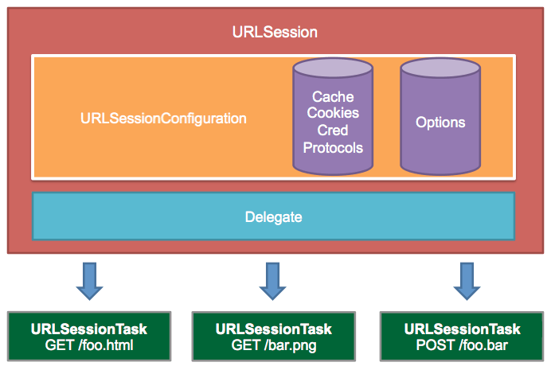
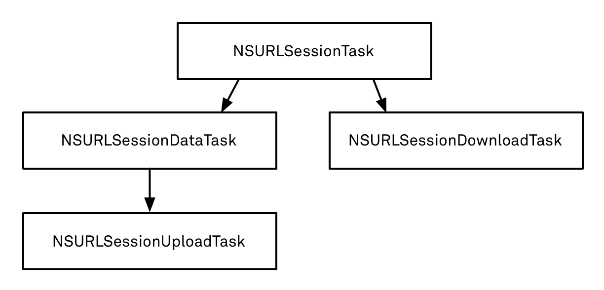

# NSURLSession

### 一、简介

NSURLConnection 作为 Core Foundation / CFNetwork 框架的 API 之上的一个抽象，在 2003 年，随着第一版的 Safari 的发布就发布了。NSURLConnection 这个名字，

iOS 7 和 Mac OS X 10.9 Mavericks 中一个显著的变化就是对 Foundation 的 [URL Loading System](https://developer.apple.com/documentation/foundation/url_loading_system?language=objc) 的彻底重构。

在 2013 的 WWDC 上，苹果推出了 NSURLConnection 的继任者：NSURLSession。NSURLSession 指的不仅是同名类 NSURLSession，实际上是指代的 Foundation 框架的 URL Loading System 系统中一系列有关联的组件：NSURLRequest、NSURLResponse、NSURLProtocol、 NSURLCache、 NSHTTPCookieStorage、NSURLCredentialStorage 以及同名类 NSURLSession、NSURLSessionConfiguration 以及 NSURLSessionTask 的 3 个子类：NSURLSessionDataTask，NSURLSessionUploadTask，NSURLSessionDownloadTask。

现在使用大多数主流第三方框架都已经从 NSURLConnection 迁移到了 NSURLSession，比如 AFNetworking、SDWebImage 等等如今使用的都是 NSURLSession。

### 二、NSURLSession 的使用
NSURLSession 主要是用来处理 App 和服务器之间的网络数据的传输。根据 NSURLSession 的创建方式，可以将 session 的行为分为四种：

- The singleton shared session
- Default sessions
- Ephemeral sessions
- Background sessions

#### 1. NSURLSessionTask

Task 是由 Session 创建的，Session 会保持对 Task 的一个强引用，直到 Task 完成或者出错才会释放。通过 NSURLSessionTask 可以获得一个 Task 的各种状态，以及对 Task 进行取消，挂起，继续等操作。

- Data tasks
- Upload tasks
- Download tasks

#### 2. NSURLSession 的 delegate 方法

- NSURLSessionDelegate：用来处理Session层次的事件
- NSURLSessionTaskDelegate：是使用代理的时候，任何种类task都要实现的代理
- NSURLSessionDataDelegate：特别用来处理dataTask的事件

#### 3. NSURLSessionConfiguration

#### 4. 其他相关类

- NSURL：封装 URL 信息的类。
- NSURLRequest：封装 URL 请求元数据的类，内容包括 URL、request method 等等.
- NSURLResponse：封装服务器返回的响应元数据的类，内容包括响应头、响应数据的 MIME type 和 length 等等.
- NSHTTPURLResponse：在 NSURLResponse 的基础上添加了 HTTP 请求所特有的响应信息，比如响应头。
- NSCachedURLResponse： 封装了一个 NSURLResponse 对象和服务器返回的实体 data，用于缓存。

### 四、NSURLSession 和 NSURLConnection 的对比，为什么 NSURLConnection 会被 NSURLSession 所替代？

NSURLSession 的优势：

- NSURLSession 支持 http2.0 协议
- 在处理下载任务的时候可以直接把数据下载到磁盘
- 支持后台下载、上传
- 同一个 session 发送多个请求，只需要建立一次连接（复用了TCP）
- 提供了全局的 session 并且可以统一配置，使用更加方便
- 下载的时候是多线程异步处理，效率更高

### 五、问题

1. 如何取消网络请求？

可以通过调用 `NSURLSessionDataTask` 的 `cancel` 方法来取消已经启动的 task。

调用 `NSURLSessionDataTask` 的 `cancel` 方法时，这个方法会立即返回，并且标记这个 task 已经被 cancell 掉了。一旦一个 task 被标记为 cancell 掉了，这个 task 的 delegate 就会收到 `URLSession:task:didCompleteWithError: ` 代理方法回调，其中的  `error` 参数中会有一个错误码 `NSURLErrorCancelled`。

在某些情况下，可能在被 cancel 的 task 确认被 cancel 前，其 delegate 就已收到代理消息了。

实际上，对于服务器来说，当客户端在请求一发出就取消了的时候，也就是说服务器还没有接收到，但是请求发出去了时，有些服务器会判断连接是否已断开。

> 参考：
> - [NSURLSessionTask - Apple Documentation](https://developer.apple.com/documentation/foundation/nsurlsessiontask/1411591-cancel)
> - [iOS取消网络请求的正确姿势](https://www.jianshu.com/p/96272c18150e)

2. 为什么 SDWebImage 早期版本中使用 NSURLConnection 异步下载时，需要手动启动 Runloop 来实现线程的保活，而现在版本中使用 NSURLSession 时，却不需要呢？

### 参考资料：
- [NSURLSession - Class Reference](https://developer.apple.com/documentation/foundation/nsurlsession?language=objc)
- [NSURLSession and NSDefaultRunLoopMode](https://stackoverflow.com/questions/20098106/nsurlsession-and-nsdefaultrunloopmode)
- [NSURLSession与NSURLConnection区别](http://www.guiyongdong.com/2016/11/18/NSURLSession与NSURLConnection区别/)
- [NSURLSession VS. NSURLConnection](https://stackoverflow.com/questions/33919862/nsurlconnection-vs-nsurlsession)
- [iOS网络基础——NSURLSession使用详解(一般访问、文件下载、上传)](https://www.jianshu.com/p/2bd9cb569fc2)
- [WWDC Session 705: "What’s New in Foundation Networking"](http://asciiwwdc.com/2013/sessions/705)
- [NSURLSessionDownloadTask的深度断点续传](http://www.cnblogs.com/itlover2013/p/5454179.html)
