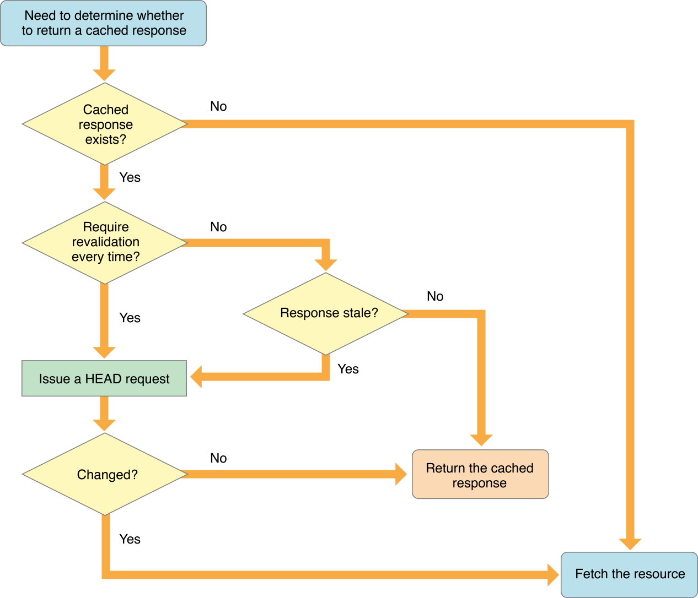

# URL Loading System 概览

### 一、简介

URL Loading System 是一系列的用来访问通过 URL 来定位的资源的类和协议。这项技术的核心在于基于 `NSURL` 这个类来访问资源，除了加载 URL 的类之外，我们把其他相关辅助类分为 5 类：

-  协议支持（protocol support）
-  认证和证书（authentication and credentials）
-  cookie 存储（cookie storage）
-  请求配置（configuration management）
-  缓存管理（cache management）

### 二、URL 加载

URL Loading System 最常用的类就是用来根据 URL 请求数据的类 `NSURLSession`。

`NSURLSession` 的 API 支持三种类型的 session：

- Default sessions：其行为跟 Foundation 中提供的其他 URL 加载方式类似，支持磁盘缓存，并且会把凭证（credentials）保存到 keychain 中。
- Ephemeral sessions：不会存储任何数据到磁盘上，所有的缓存、凭证都只会随着 session 保存在内存中，而且一旦这个 session 被清除了，这些缓存同时也会被清除。
- Background sessions：跟 *default sessions*  的行为基本类似，但是还支持后台驻留进程的数据传输，也就是说，当 app 被挂起时，还可以在后台继续传输数据。

基于 `NSURLSession`，我们可以创建 3 种类型的 URL 加载任务：

- 获取二进制数据到内存中（Data tasks）：发送和接收 `NSData` 形式的数据。Data tasks 主要用来发送短暂的、有交互性的请求。Data tasks 可以分次返回数据，也可以一次性返回所有的数据。
- 下载文件到本地（Download tasks）：获取文件形式的数据，支持后台下载。
- 上传数据到服务器（Upload tasks）：以文件的形式发送数据给服务器，也支持后台下载。

### 三、辅助类

1.URL 请求

`NSURLRequest` 将 URL 和请求协议相关的属性封装起来了。

比如，支持 HTTP 协议的 `NSURLRequest`/`NSMutableURLRequest ` 类的就包括读取/设置请求方式、请求体、请求头等属性的方法。

2.响应

服务器返回的数据一般包括两部分：

- 描述内容数据的元数据：描述内容数据的元数据往往是请求协议定义的，大部分协议的元数据包括 MIME type、 expected content length、text encoding (where applicable)以及这个响应对应的 URL。
- 内容数据本身：也就是要请求的数据

`NSURLResponse` 会将元数据和内容数据本身封装起来。

### 四、重定向（改变请求）

有些协议，比如 HTTP，提供了一种重定向机制：当你发起一个请求时，而你请求的资源的 URL 已经发生改变了，服务器就会告诉客户端你请求的资源已经被转移到了新的 URL。

我们可以通过实现相关的代理方法 `URLSession:task:willPerformHTTPRedirection:newRequest:completionHandler:`，来拦截重定向事件，并决定是否需要重定向到新的地址。

### 五、权限认证
有些服务器会对某些特定的内容限制访问权限，只对提供了信任证书通过认证的用户提供访问资格。对于 web 服务器来说，受限制的内容被聚集到一个需要凭证才能访问的区域。在客户端上，有时也需要根据凭证来确定是否信任要访问的服务器。

URL Loading System 提供了封装凭证（credentials）、封装保护区域（protected areas）和保存安全凭证（secure credential）的类：

- `NSURLCredential`：封装一个含有认证信息（比如用户名和密码等）和持久化存储行为的凭证（credential）。
- `NSURLProtectionSpace`：服务器上某个需要凭证才能访问的区域。
- `NSURLCredentialStorage`：管理凭证的存储以及 `NSURLCredential` 和相应的 `NSURLProtectionSpace` 之间的映射关系。
- `NSURLAuthenticationChallenge`：在客户端向有限制访问权限的服务器发起请求时，服务器会询问凭证信息，包括凭证、保护空间、认证错误信息、认证响应等。这个类会将这些信息封装起来。`NSURLAuthenticationChallenge` 实例通常被 `NSURLProtocol` 子类用来通知 URL Loading System 需要认证，以及在 `NSURLSession` 的代理方法中用来处理认证。

#### 六、缓存管理

URL Loading System 提供了 app 级别的 HTTP 响应缓存，在使用 `NSURLSession` 发起请求时，我们可以通过设置 `NSURLRequest` 和 `NSURLSessionConfiguration` 的缓存策略（cache policy）来决定如何处理缓存的相应数据。同时，我们还可以通过实现 `URLSession:dataTask:willCacheResponse:completionHandler:` 方法来针对特定的 URL 设置缓存策略。	

实际上，不是所有请求的响应都能被缓存起来，目前只支持 http 和 https 请求的响应缓存。

URL Loading System 中管理缓存的类有以下两个：

- `NSURLCache`：通过这个类可以设置缓存大小、和位置，以及读取和存储各个请求的 `NSCachedURLResponse`。
- `NSCachedURLResponse`：封装了请求元数据（一个  `NSURLResponse` 对象）和实际响应内容（一个 `NSData` 对象）。

`NSURLRequest` 默认的 cache policy 是 `NSURLRequestUseProtocolCachePolicy`，下图就是采用了 `NSURLRequestUseProtocolCachePolicy` 的 HTTP 响应缓存机制流程图（[来源](https://developer.apple.com/documentation/foundation/nsurlrequestcachepolicy?language=objc)）：

#### 七、cookie 存储
URL Loading System 提供了 app 级别的 cookie 存储机制。URL Loading System 中涉及到 cookie 操作的两个类分别是：

- `NSHTTPCookieStorage`：这个类提供了管理 cookie 存储的功能。
- `NSHTTPCookie`：用来封装 cookie 数据和属性的类。

`NSURLRequest` 提供了 `HTTPShouldHandleCookies` 属性来设置请求发起时，是否需要 cookie manager 自动处理 cookie。在 `UIWebView` 中，系统会通过 cookie manager 自动将 cookie 缓存起来。

### 八、协议支持
URL Loading System 本身只支持 http、https、file、ftp 和 data 协议。`NSURLProtocol` 是一个抽象类，提供了处理 URL 加载的基础设施。通过实现自定义的 `NSURLProtocol` 子类，可以让我们的 app 支持自定义的数据传输协议。

另外，对于 `NSURLProtocol` 核心功能，官方文档中并没有着重提到，但是却是最重要的一点：**用了它，你不必改动应用在网络调用上的其他部分，就可以改变 URL 加载行为的全部细节**。运用这一点，我们可以做很多事情，比如：

- [拦截图片加载请求，转为从本地文件加载](http://stackoverflow.com/questions/5572258/ios-webview-remote-html-with-local-image-files)
- [在 UIWebView 中加载 webp 图片](https://github.com/cysp/STWebPDecoder)
- [通过缓存静态资源实现 UIWebView 的预加载优化](https://github.com/ShannonChenCHN/iOSLevelingUp/issues/55#issuecomment-300365305)
- [UIWebView 离线缓存](https://github.com/rnapier/RNCachingURLProtocol)
- [为了测试对HTTP返回内容进行mock和stub](https://draveness.me/%5Bhttps://github.com/AliSoftware/OHHTTPStubs%5D)
- [实现一个 In-App 网络抓包工具](https://github.com/Flipboard/FLEX/tree/master/Classes/Network)

### 参考：
- [URL Session Programming Guide](https://developer.apple.com/library/content/documentation/Cocoa/Conceptual/URLLoadingSystem)
- [URL Loading System - API Reference](https://developer.apple.com/documentation/foundation/url_loading_system)
- [NSURLProtocol - NSHipster](http://nshipster.cn/nsurlprotocol/)
- [NSURLCache - NSHipster](http://nshipster.cn/nsurlcache/)
- [HTTPS接口加密和身份认证](https://www.jianshu.com/p/56fc18937d09?utm_campaign=maleskine&utm_content=note&utm_medium=seo_notes&utm_source=recommendation)
- [[iOS网络请求] - 身份认证](https://www.jianshu.com/p/5701aae1e3f3)