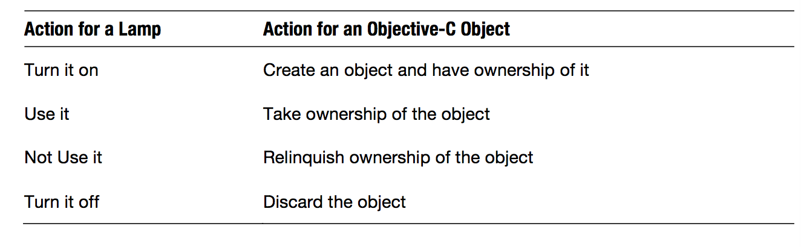
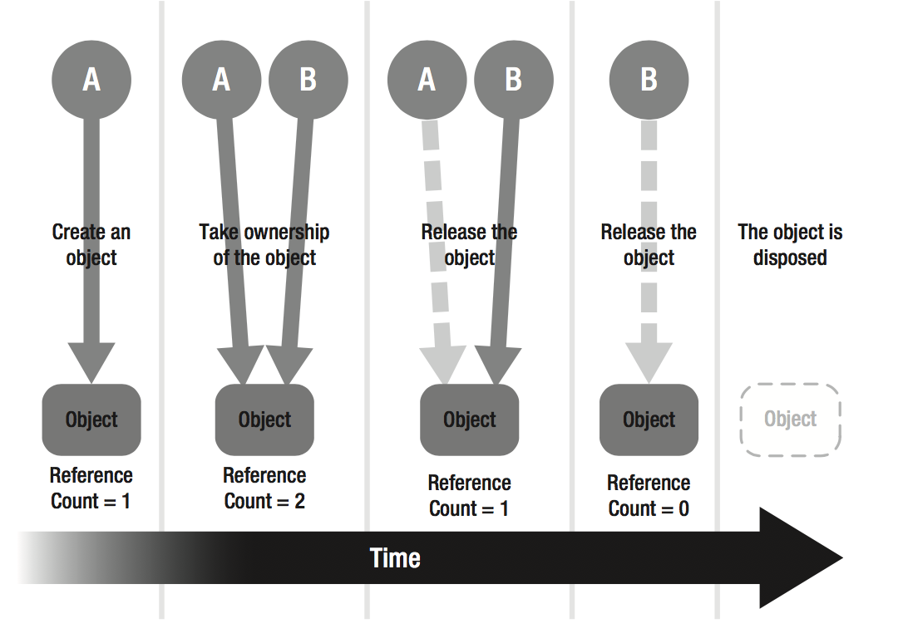
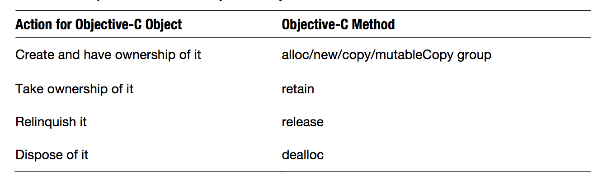

《Objective-C 高级编程》学习笔记
---

**学习目标**：全面地学习内存管理、block 和 GCD 这些基础知识，主要还是内存管理和 block ，然后针对自己在实践中遇到的问题，对某些知识点做针对性学习。   
**要求**：结合实际去学习，最好每个知识点都能举个实例来；带着问题学习，每个知识点可以解释什么问题；学完一个部分，做个小结，说说收获。自己尝试实践一下，方便理解，加深印象，然后把示例代码放到 Github 上，方便复习。

-----

###目录

1. 自动引用计数         
   1.1 什么是自动引用计数        
   1.2 内存管理/引用计数        
   1.3 ARC 规则        
   1.4 ARC 的实现        
2. Blocks        
   2.1 Blocks 概要        
   2.2 Blocks 模式        
   2.3 Blocks 的实现        
3. Grand Central Dispatch        
   3.1 Grand Central Dispatch（GCD）概要        
   3.2 GCD 中的 API        
   3.3 GCD 的实现        
   
-------------
###1. 自动引用计数 
- 介绍：自动引用计数（ARC，Automatic Reference Counting）是从 OS X Lion 和 iOS 5 中引入的新技术，主要是将大量的引用计数管理工作从程序员手中转移到了编译器上。
- 背景：
        
####1.1 什么是自动引用计数     
**(1) 什么是自动引用计数？**  （TODO） 

**(2) ARC 使用条件：**    

  - 使用 Xcode 4.2 或以上版本    
  - 使用 clang（LLVM 编译器） 3.0 或以上版本    
  - 编译器选项中设置 ARC 为有效——指定编译器属性为“-fobjc-arc”    

  > 说明：   
  > 1. 之前的 gcc 和早期的 clang 都不支持“自动管理内存”。       
  > 2. 通过在 Xcode 的 build phases 中设置指定文件属性为 “-fno-objc-arc”，可以指定该文件为非 ARC 模式。    
  > 3. 在 Xcode 的 build setting 中可以设置是否使用 ARC。 

####1.2 内存管理/引用计数    
**（1） 理解引用计数**    
用开关房间里的灯来比喻引用计数机制：只要有人在房间就要开灯，只有人都不在房间里了，才关灯；对于对象也是如此，一开始，有“人”创建一个对象，引用计数+1，相当于有人打开了灯，然后另外又有“人”持有了这个对象，引用计数再+1，有谁不用了的时候，就要释放一次，引用计数-1，当最后一个使用者释放时，引用计数减为0，也就没有“人”使用了，这个对象就被释放掉了，这个时候也就相当于最后走的人把房间里的灯关掉了。
（TODO：这里的“人”指的是谁）

  
  图1. 用开关房间里的灯来比喻引用计数机制
  
  
图2. 内存管理中的引用计数

  
图3. 内存管理对象图

**（2）内存管理法则**

  - 自己生成的对象，自己持有  
  - 非自己生成的对象，自己也能持有  
  - 不再需要自己持有的对象时释放   
  - 非自己持有的对象无法释放  


图4. 对象操作与 Objective-C 方法的对应

**（3）iOS 开发中的内存管理** 
    
实际上，上面提到的这些管理 Objective-C 对象内存的方法，跟 Objective-C 语言本身并没有多大关系。在 iOS、OS X应用开发中，Objective-C 对象的内存管理都是由 Cocoa 框架中 Foundation 框架类库的 NSObject 类来处理的，所以上面提到的 alloc、retain等内存管理的方法都是指 NSObject 类的实例方法。【TODO：alloc这些方法又干了些什么呢？】


图5. Cocoa 框架、Foundation 框架与 NSObject 类的关系

**（4） 内存管理法则之一：自己生成的对象，自己持有**   
使用以下名称开头的方法名意味着自己生成的对象只有自己持有：  

- alloc
- new
- copy
- mutableCopy  

> **注意**：   
1.这里的规则适用的条件是驼峰式命名（CamelCase）；  
2.这里提到的方法包括类方法和实例方法。

*示例代码*：

```
// 自己生成并持有对象
Book *book1 = [[Book alloc] init];
Book *book2 = [book2 copyAllContent];
```

**（5）内存管理法则之二：非自己生成的对象，自己也能持有**

使用规则一中所说的方法之外的方法创建对象，也就是 alloc/new/copy/mutableCopy （开头）以外的方法创建对象，就不是自己生成并持有对象了，所以自己就不是所获得对象的持有者，不需要使用后也无需 release。比如 NSMutableArray 的 + array 方法。、

但是虽然拿到的不是自己生成并持有的对象，但是自己还是可以 retain 所获对象来持有的。

*示例代码*：

```
// 虽然 array 自己不持有生成的对象，但是 - array 方法内部通过 autorelease 实现了持有和自动释放，所以这里 retainCount +1
NSMutableArray *array = [NSMutableArray array];
[array retain];  // 持有非自己生成的对象
[array release]; // 谁持有谁释放
```

**（6） 内存管理法则之三：不再需要自己持有的对象时释放**     

谁持有谁释放：自己持有的对象，一旦不再需要，持有者有义务释放（release）该对象。

自己持有的对象，也就是规则一和规则二中所说的 —— 用 alloc/new/copy/mutableCopy （开头）方法生成并持有的对象，或者用 retain 方法持有的对象.

> 疑问：通过调用 [NSMutableArray array] 方法获得对象，但调用方自己又不持有对象，这又是如何实现的呢？
 
> 其实，在 + array 方法内部使用了 autorelease 方法，使得自己不持有获得的对象。autorelease 方法使对象在超出指定生存范围时能够自动并正确地释放（调用 release 方法）。
 
 *示例代码*
 
 ```
 // 模拟 + [NSMutableArray array] 方法的实现
 + (instancetype)array {
	// 创建并持有对象
	NSMutableArray *array = [[NSMutableArray alloc] init];

	[array autorelease]; // array 不再持有对象，交由自动释放池管理，但是创建的对象现在还没有被废弃掉
	
	return array; // 返回不再持有的对象
 }
 ```


图 5. release 和 autorelease 的区别

**（7） 内存管理法则之四：非自己持有的对象无法释放**

- 释放非自己持有的对象会造成崩溃
- 释放一个已经被废弃的对象会造成崩溃
- 给一个已经被废弃的对象发消息也会造成崩溃

**（8）GNUstep 框架（文末有 GNUstep 源码下载地址）**

GNUstep 作为 GNU 开源项目的一部分，是一个适用于桌面应用和服务端应用的成熟框架，该框架基本遵循 Apple 的 Cocoa 框架的 API，因为 Cocoa 框架的前身正是 NeXT 公司（后被苹果公司收购）的 OpenStep 框架。所以说 GNUstep 源码多多少少有些 Apple 的 Cocoa 源码的影子，我们可以通过阅读 GNUstep 的源码来看看 NSObject 类的实现。

GNUstep 主要包括四个部分，统称为 GNUstep Core：

- GNUstep Make: Makefile Package.
- GNUstep Base: Foundation.
- GNUstep GUI: Graphical user interface class library.
- GNUstep Back: Generic back-end.

**（9）alloc/retain/release/dealloc 在 GNUstep 源码中的实现：**

- 通过 alloc 创建一个对象后，除了对象本身需要的内存空间外，在对象内存头部还有一块用于记录引用计数（retained）的内存区域。当调用 retain/release 时，程序都会访问对象内存头部的 retained 变量来获取引用计数。
- 调用 alloc 方法后，引用计数值 +1，但是调用 alloc 方法实际上并没有增加 retained 变量的值，此时 retained 为 0，只是 retainCount 方法中每次返回的都是 retained 的值加 1，所以只有调用 retain 或者 release 方法，才会对 retained 变量产生影响。
- 调用 retain 方法后，引用计数值 +1。
- 调用 release 方法后，引用计数值 -1。
- 引用计数为 0 时，release 方法内部会调用 dealloc 方法销毁对象。


伪代码：

```
- (id)alloc {

}
```

> 疑问：
> 1.alloc 方法中的 `new = (id)&((struct obj_layout *)new)[1]` 是什么意思？    
> 2.访问对象内存头部 retained 变量值时，为什么是这样写 `((struct obj_layout *)anObject)[-1].retained` ？


**（9）Apple 对 alloc/retain/release/dealloc 的实现**

伪代码：

```
- (id)alloc {

}
```

- GNUstep 与 Apple 的实现的不同点：GNUstep 将引用计数值保存在对象占用内存块头部的变量中，而 Apple 的实现，是将引用计数值保存在引用计数表的记录中。Apple 这样的实现方式更利于调试。

> 疑问：
> 1.作者是怎么通过 LLVM 断点调试查看到 NSObject 的方法调用顺序的呢？

**（10）autorelease**

- 自动变量：
- 什么是 autorelease：
- autorelease 的具体使用方法：
- Cocoa 框架中的 autorelease：
- autorelease 的典型应用场景：
- @autoreleasepool 的使用：（p48）


**（12）GNUstep 源码中 autorelease 的实现**

- 实现：
伪代码：

```
- (id)alloc {

}
```
- NSAutoreleasePool 的嵌套：


**（13）Apple 对 autorelease 的实现**

- 实现： 
伪代码：

```
- (id)alloc {

}
```
- 调试打印查看 autoreleasepool 中的对象
- 如果 autorelease NSAutorelease 对象会怎么样？

> 讨论：    
> 1. [既然设置了ARC，为什么还要使用@autoreleasepool](https://segmentfault.com/q/1010000002168217)       
2. [自动释放池的前世今生 ---- 深入解析 autoreleasepool](http://draveness.me/autoreleasepool/)     
3. [Objective-C Autorelease Pool 的实现原理](http://blog.leichunfeng.com/blog/2015/05/31/objective-c-autorelease-pool-implementation-principle/)     
4. [黑幕背后的Autorelease](http://blog.sunnyxx.com/2014/10/15/behind-autorelease/)      
 
####1.3 ARC 规则    
**（1）ARC 的本质**      
实际上，虽然我们在 ARC 下不用写 retain，release 这些代码了，但是引用计数管理内存的本质在 ARC 中并没有发生变化，就像 ARC（Automatic Reference Counting）和 MRR（manual retain-release）在名字上的差别一样，ARC 只不过把引用计数的操作变得自动化了——ARC在我们编译程序时自动在需要的地方加上了内存管理的代码（retain、release、autorelease）。

**（2）ARC 与非 ARC 的混编**          
ARC中ARC 只是在编译层做手脚，所以我们可以对整个项目设置 ARC 有效或者无效，也可以针对单个文件设置 ARC 有效或无效。      

> - 支持 ARC：-fobjc-arc
- 不支持 ARC：-fno-objc-arc

**（3）内存管理法则（与非 ARC 中一样，只不过在代码表现上不一样）** 

  - 自己生成的对象，自己持有  
  - 非自己生成的对象，自己也能持有  
  - 不再需要自己持有的对象时释放   
  - 非自己持有的对象无法释放
  
**（4）所有权修饰符**

- 对象类型：指向 Objective-C 对象的指针，比如，`NSString *`。
- id 类型：也是指向 Objective-C 对象的指针，但是不知道具体是什么类，相当于 C 语言中的 `void *`。
- ARC 中的所有权修饰符：ARC 有效时，id 类型和对象类型跟 C 语言中的其他数据类型不同，所以必须要在类型上加上所有权修饰符：
  - `__strong`
  - `__weak`
  - `__unsafe_unretained`
  - `__autoreleasing`

> 疑问：      
> 1. 所有权修饰符应该加在什么位置呢？是变量名前，还是类名前？     
> 2. ARC 下，为什么要添加所有权修饰符，根本目的是什么？上面所说的“跟 C 语言中的其他数据类型不同” 这里的其他类型是指基本数据类型吗？包括指针吗？ 
> 3. ARC 下如何查看对象的引用计数？ 

**（5）所有权修饰符之一：__strong**

- id 类型和对象类型在没有明确指定的所有权修饰符时，默认为 `__strong` 修饰符，因此使用 `__strong` 时一般忽略不写。
- `__strong`修饰符表示变量对对象的“强引用”，持有强引用的变量在超出其变量作用域时，也就是在该变量被销毁时，会释放（release）其强引用的对象，该变量的强引用也就失效了。
- 附有`__strong`修饰符的变量，不仅在变量作用域的方面影响其强引用的对象，还可以通过赋值来影响其强引用的对象。     
*实例代码*：

```
	id obj = [NSObject new];  // 强引用 NSObject 对象       
	obj = [NSArray new]; // 强引用 NSArray 对象，释放 NSObject 对象
```

- 在 Objective-C 类的成员变量上和方法参数中都可以使用附有`__strong`修饰符的变量。
- 带有`__strong` 和 `__weak` 、`__autoreleasing`修饰符的变量会被默认初始化为 `nil`。`id __strong obj;` 就相当于 `id __strong obj = nil;`（注：但是实际测试中发现 `__unsafe_unretained` 修饰的变量也适用该规则）。
- `__strong`是怎样遵循 Objective-C 内存管理法则的？
   - 只需通过对带 `__strong` 修饰符的变量赋值便可自动达成 `“自己生成的对象，自己持有”` 和 `“非自己生成的对象，自己也能持有”`。
   - 通过销毁带 `__strong` 修饰符的变量（变量作用域结束或者成员变量随着所属的对象被一起销毁），或者对变量赋值，都可以做到 `“不再需要自己持有的对象时，需要将其释放掉”` 。
   - 由于不再需要手动输入 release，所以也就没必要担心 `“非自己持有的对象无法释放”` 了。


> 疑问     
> 1. `id __strong array = [NSArray array];`这行代码执行后，array 所引用的对象的引用计数为多少？是 1 还是 2 ？

**（6）所有权修饰符之二：__weak**

- `__weak` 与 `__strong`相反，它表示变量对对象的“弱引用”，弱引用不能持有对象。
- `__weak`存在的意义：解决循环引用（容易引发内存泄漏）问题。
- 内存泄漏：应当销毁的对象在超出其生存周期后却还没有被销毁，仍然占用了内存。换句话说，就是这个对象我不再需要用了，它的使命已经结束了，但是却没有被销毁掉。
- 使用 `__weak` 的一般场景是：生命周期更长的对象 A 对生命周期更短的对象 B 直接或间接进行了强引用，对象 B 就只能对对象 A 进行弱引用，否则就会出现循环引用。
- 带有 `__weak` 的变量对一个对象进行弱引用时，若该对象被销毁，则该变量的弱引用就会自动失效，并且**会被赋值 nil**。
- 使用限制条件：`__weak`只能在 iOS5 以上和 OS X Lion 以上版本中使用，更低版本中只能用 `__unsafe_unretained ` 来代替 `__weak`。

**（7）所有权修饰符之三：__unsafe_unretained**

- `__unsafe_unretained` 修饰符作为 `__weak` 在低版本 iOS 和 OS X 上的替代品，其特点跟 `__weak` 一样，只产生弱引用。

- `__unsafe_unretained` 跟 `__weak` 的不同点在于，使用该修饰符的变量在变量所引用的对象销毁后，不会被赋值 nil，因为附有 `__unsafe_unretained` 修饰符的变量不属于编译器的内存管理对象。所以，我们在使用带有 `__unsafe_unretained` 的变量时，要确保被赋值的对象确实存在，否则会引起程序崩溃。

- 垂悬指针（dangling pointer）：指向曾经存在的对象，但该对象已经不再存在了，此类指针称为垂悬指针。结果未定义，往往导致程序错误，而且难以检测。（来源：[csdn 博客](http://blog.csdn.net/zhaojinjia/article/details/8770989)）

- 野指针（wild pointer）：野指针不是 NULL 指针，是指向 “垃圾” 内存（不可用内存）的指针。产生野指针的原因有三个，一是指针变量没有被初始化，它的缺省值是随机的，它会乱指一气，二是指针 p 被 free 或者 delete 之后，没有置为 NULL，让人误以为p是个合法的指针，三是指针操作超越了变量的作用范围。（来源：[csdn 博客](http://blog.csdn.net/zhaojinjia/article/details/8770989)）

**（8）所有权修饰符之四：__autoreleasing**

- `__autoreleasing`修饰符的使用相当于 MRR 中调用了 autorelease 方法。（如图所示）

- 显式使用 `__autoreleasing` 修饰符同显式使用 `__strong` 一样罕见，通常情况下，我们不需要显示声明 `__autoreleasing`。
- 非显式使用 `__autoreleasing` 情形一：编译器检查方法名是否
- 非显式使用 `__autoreleasing` 情形二：
- 非显式使用 `__autoreleasing` 情形三：

**（9）ARC 的使用法则**
**（10）ARC 中 property 声明的变化**   
 
####1.4 ARC 的实现   
**（1）ARC 真的只是“由编译器进行内存管理的”吗**    
**（2）__strong**
**（3）__weak**     
**（4）__autoreleasing**     
**（5）引用计数的数值**    
 
###2. Blocks        
- 介绍：Block 是 C 语言的扩充，是从 OS X Snow Leopard 和 iOS 4 开始引入的。
- 背景：

####2.1 Blocks 概要 
   
**（1）什么是 Blocks**  

- 回顾：C 语言中有哪几种变量？
	- 自动变量（局部变量）
	- 函数的参数
	- 静态变量（静态局部变量）
	- 静态全局变量
	- 全局变量
- 概念：Blocks 是 C 语言的扩展功能，是一种“带有”自动变量的匿名函数。 
- Block 与函数指针的对比
实例代码：
```
```   

####2.2 Blocks 模式        
**（1）Blocks 语法**   
 
- 完整的 block 语法：
- 完整的 block 语法与 C 语言函数的对比：
- block 语法的省略形式：

**（2）block 类型作为变量使用**  
 
- 语法：
- 与函数指针的对比：
- block 作为函数参数和返回值：
- 使用 typedef 给 block 类型设置别名

**（3）block 截获外面的自动变量的过程**  
“带有自动变量”在 block 中表现为 “截获自动变量值”，但这里的截获仅仅是备份了一份自动变量的瞬间值，即便后来该变量值发生改变，block 内部的计算也不会受到影响。
示例代码：
```
```
 
**（4）__block**   


**（5）被 block 截获的自动变量**     

- 截获 NSMutableArray 对象：
- 截获 C 语言数组：   

####2.3 Blocks 的实现 
**（1）block 的实质**

- clang（LLVM）编译器：
- block 的编译：block 在实际编译时，会被当做 C 语言源码来处理，通过支持 block 的编译器，含有 block 语法的代码会被转成一般 C 语言编译器能够处理的代码，并被当做极为普通的 C 语言来编译。
- 通过 clang 来查看 block 的真实面目：block 在实际编译时，无法转换成我们能够理解的源代码，但是我们可以借助 clang 将含有 block 语法的代码转成我们能看懂的底层代码 —— 通过 `clang -rewrite-objc yourfilename`命令可以含有 block 语法的代码转成 C++ 源代码。
- 下面是 block 被转换后的源码解读：
	1. 先看看几个关键的数据结构和函数：
		- `__main_block_func_0` 是 block 中要执行的内容所转成的函数。
		- `__main_block_impl_0` 是存有 block 信息的结构体，是最核心的角色，作为 block 实现的入口，其中包含两个主要的成员变量：`__block_impl` 类型的变量和 `__main_block_desc_0` 类型的变量，除了这两个成员变量，还有一个构造函数 `__main_block_impl_0`。
		- `__block_impl` 是 block 变量所指向的结构体，包含四个成员变量，其中两个是指针变量 `isa` 和函数指针变量 `FuncPtr` 。
		- `__main_block_desc_0` 是记录 block 描述信息的结构体。
		- 构造函数 `__main_block_impl_0 ` 的第一个参数是指向 `__main_block_func_0` 函数的指针（第一个参数前为什么是 `(void *)`，而不是 `& ` ？），第二个参数是作为静态全局变量初始化的结构体指针 `__main_block_desc_0_DATA` 。这个构造函数中会对 成员变量 `isa`、`Flags`、`FuncPtr` 和 `Desc` 进行赋值。
   
	2. block 的实质：
		- block 的“执行体”最终被转成了函数 `__main_block_func_0`，并且这个函数的指针被赋值给了 `__block_impl` （实际上也就是 `__main_block_impl_0 ` 的成员变量）的成员变量 `FuncPtr `函数指针。最后调用 block 时，也就是从结构体中取出这个函数来调用。
		- 将 block 赋给 block 类型的变量 myBlock，相当于将 `__main_block_impl_0 ` 结构体实例的指针（`(struct __block_impl *)`类型）赋给变量 myBlock。
		- block 就相当于一个 Objective-C 对象，其中有一个 `isa` 指针用来存储 block 的地址（示例代码中的 `&__NSConcreteStackBlock`）。

*示例代码：*

```
// 原代码
int main() {
     void (^block)(void) = ^void(void) {
         printf("Block\n");
     };
     block();
     return 0;
  }
```

```
// 转换后的代码

/// 存储 block 关键信息的结构体
struct __block_impl {
  void *isa; // 像 Objective-C 对象一样，存储对象地址的指针变量
  int Flags;
  int Reserved;
  void *FuncPtr; // 存储 block 执行函数的指针变量
};

/// 存储 block 描述信息的结构体
static struct __main_block_desc_0 {
    size_t reserved;
    size_t Block_size;
} __main_block_desc_0_DATA = { 0, sizeof(struct __main_block_impl_0)}; // 静态全局变量

/// block 转成的结构体
struct __main_block_impl_0 {
  struct __block_impl impl;
  struct __main_block_desc_0* Desc;
    
    /// 构造函数
  __main_block_impl_0(void *fp, struct __main_block_desc_0 *desc, int flags=0) {
    impl.isa = &_NSConcreteStackBlock;  // _NSConcreteStackBlock ？？？
    impl.Flags = flags;
    impl.FuncPtr = fp;
    Desc = desc;
  }
};

/// block 的执行内容转成的函数
static void __main_block_func_0(struct __main_block_impl_0 *__cself) {

        printf("Block\n");
    }


int main() {

    void (*block)(void) = ((void (*)())&__main_block_impl_0((void *)__main_block_func_0, &__main_block_desc_0_DATA));
    // 1.左边实际上就是一个函数指针变量
    // 2.右边拆开来看：
    //      2.1 调用 __main_block_impl_0 结构体的构造函数，生成一个 __main_block_impl_0 结构体（第一个参数前为什么是(void *)，而不是 & 符号？）：
    //       struct __main_block_impl_0 blockImpl = __main_block_impl_0((void *)__main_block_func_0, &__main_block_desc_0_DATA);
    //      2.2 获取 __main_block_impl_0 结构体的指针：（这里有疑问？？？）
    //       struct __main_block_impl_0 *structPtr = &blockImpl;
    //      2.3 转换成一个函数指针，传给左边的函数指针变量：
    //      void (*block)(void) = structPtr;
    
    ((void (*)(__block_impl *))((__block_impl *)block)->FuncPtr)((__block_impl *)block);
    // 1.首先取 block 变量： __block_impl *blockPtr = ((__block_impl *)block);
    // 2.然后取出 FuncPtr 指针：void *funcPtr = blockPtr->FuncPtr;
    // 3.再获取函数变量值：void blockFun() = (void (*)(__block_impl *))funcPtr; // 这里是模拟的，实际上不能直接这么转的
    // 4.最后调用函数，将函数指针变量（指向 block 值的指针）作为参数：blockFun((__block_impl *)block);

    return 0;
}
```

参考：

- [深入研究Block捕获外部变量和__block实现原理](http://www.jianshu.com/p/ee9756f3d5f6)
- [深入研究Block用weakSelf、strongSelf、@weakify、@strongify解决循环引用](http://www.jianshu.com/p/701da54bd78c)
- [谈Objective-C block的实现](http://blog.devtang.com/2013/07/28/a-look-inside-blocks/)
- [Objective-C中block的底层原理](http://www.cnblogs.com/dahe007/p/6067591.html)

**（2）block 是如何截获自动变量值的**

- block 截获自动变量的本质——将截获的自动变量值保存到 block 的结构体实例中：
	-  block 中截获的自动变量被作为参数传入 `__main_block_impl_0 ` 结构体的构造函数中， 然后被当做成员变量追加到了 `__main_block_impl_0 ` 结构体中了，`__main_block_impl_0 ` 结构体中追加的成员变量与截获的自动变量的类型完全相同，而且 block 对自动变量的截获只针对 block 中使用到的变量。
	-  在调用 block 时，也就是调用 `__main_block_func_0 ` 函数时，会将捕获的自动变量从 `__main_block_impl_0 ` 结构体中取出来使用。
	
- block 中为什么不能截获 C 语言数组类型的自动变量：C 语言中的数组与指针不同，数组不是变量，不能直接被整体赋值，所以在 block 捕获 C 语言数组时，虽然能追加到  `__main_block_impl_0 ` 结构体的成员变量中（**怎么做到的？**），但是在 block 的执行函数 `__main_block_func_0 ` 中，却不能将该成员变量直接赋给函数中数组类型的自动变量（**为什么不能声明为指针变量呢**）。

截获自动变量的示例代码：

```
// 转换前

int main () {
    
    int val1 = 256;
    int val2 = 10;
    const char *fmt = "val2 = %d\n";
    
    void (^myBlock)(void) = ^void(void) {
        printf(fmt, val2);
    };
    
    val2 = 2;
    fmt = "These values were changed. val2 = %d\n";
    
    myBlock();
    
    return 0;
}
```

```
// 转换后
struct __block_impl {
  void *isa;
  int Flags;
  int Reserved;
  void *FuncPtr;
};

static struct __main_block_desc_0 {
    size_t reserved;
    size_t Block_size;
} __main_block_desc_0_DATA = { 0, sizeof(struct __main_block_impl_0)};


// block 对应的结构体
struct __main_block_impl_0 {
  struct __block_impl impl;
  struct __main_block_desc_0* Desc;
    
    // block 中捕获的自动变量被声明成了成员变量
  const char *fmt;
  int val2;
    
    // 构造函数中也多了两个参数，用来传入捕获的自动变量（函数后面部分的 “ : fmt(_fmt), val2(_val2）” 是什么意思？）
  __main_block_impl_0(void *fp, struct __main_block_desc_0 *desc, const char *_fmt, int _val2, int flags=0) : fmt(_fmt), val2(_val2) {
    impl.isa = &_NSConcreteStackBlock;
    impl.Flags = flags;
    impl.FuncPtr = fp;
    Desc = desc;
  }
};


static void __main_block_func_0(struct __main_block_impl_0 *__cself) {
  const char *fmt = __cself->fmt; // bound by copy，获取捕获到的自动变量（保存在成员变量中）
  int val2 = __cself->val2; // bound by copy，获取捕获到的自动变量（保存在成员变量中）

        printf(fmt, val2);
    }


int main () {

    int val1 = 256;  // block 中没用到，也就不会截获
    int val2 = 10;
    const char *fmt = "val2 = %d\n";

    // 捕获到的自动变量传入构造函数的参数
    void (*myBlock)(void) = ((void (*)())&__main_block_impl_0((void *)__main_block_func_0, &__main_block_desc_0_DATA, fmt, val2));

    val2 = 2;
    fmt = "These values were changed. val2 = %d\n";

    ((void (*)(__block_impl *))((__block_impl *)myBlock)->FuncPtr)((__block_impl *)myBlock);

    return 0;
}

```

截获数组变量的示例代码：

```

```

**（3）`__block` 的本质**   

- block 是如何访问全局变量、全局静态变量和局部静态变量的？
	- block 中可以直接访问全局变量和全局自动变量，跟其他函数一样可以修改全局变量和全局自动变量的值。
	- 当 block 捕获局部静态变量时，局部静态变量的地址会被传入到 block 结构体的构造函数中，block 回调时，其内部的函数会通过访问局部静态变量的地址来改变局部静态变量值。
- `__block` 变量是如何被 block 截获的呢？
	- 当 block 捕获 `__block` 变量时，`__block` 变量会被转成一个 `__Block_byref` 结构体变量，该结构体中有一个存储`__Block_byref` 结构体指针的成员变量 `__forwarding`，还有一个存储 `__block` 变量值的成员变量 `val`。
	- `__Block_byref` 结构体变量的地址会被传入 block 结构体的构造函数中，保存到 block 结构体的成员变量 `__Block_byref_val_0 *val` 中。
	- 给 `__block` 变量赋值的过程：在 block 执行内容转换后的函数 `__main_block_func_0` 中，首先通过访问 block 结构体实例 `__main_block_impl_0` 的成员变量 `__Block_byref_val_0 *val` 获取到指向 `__block` 变量的结构体指针 `val`，然后再通过 `__Block_byref_val_0` 的成员变量  `__forwarding` 来获取/改变 `__block` 变量的值。
 
- `__Block_byref_val_0 ` 结构体中为什么会有成员变量 `__forwarding ` 呢？这样做是为了在多个 block 中使用同一个 `__block` 变量。
- `->` 运算符代表什么意思？访问结构体指针的成员时可以使用 `->` 。比如，假设 `student`是一个结构体指针，那么 `student->name` 就相当于 `(* student).name`。

示例代码

```

```
 遗留问题：
 
 1. block 超出变量作用域仍然存在的原因
 2. `__block` 变量结构体的成员变量 ` __forwarding` 存在的原因

**（4）block 变量的存储域** 

- block 变量和 `__block` 变量的本质
- block “类”
	- _NSConcreteStackBlock
	- _NSConcreteGlobalBlock
	- _NSConcreteMallocBlock
- 全局的 block
	- 作为全局变量的 block
	- 不使用/截获自动变量的 block
- 栈上的 block
- 堆上的 block
	- 从栈上复制到堆上的 block 与 `__block` 变量 
	- 使用堆上的 block 的目的？
	- 何时使用堆上的 block 呢？应用场景？
	- block 的自动 copy 和手动 copy
		- 大多数情况下，编译器会恰当地进行判断，自动生成将 block 从栈上复制到堆上的代码。比如，当 block 作为函数返回值的时候，系统会自动将 block 从栈上 copy 到堆上。
		- 个别情况下，我们需要手动将 block 从栈上复制到堆上，也就是使用 copy 方法。比如，向方法或者函数的参数中传递 block 时，我们就需要手动调用 copy 方法，将 block 从栈上 copy 到堆上。
		- 但是如果在方法或者函数中适当地复制了传递过来的参数，那么就不必在调用该方法或者函数前手动复制了。比如，Cocoa 框架中方法名带有 usingBlock 的方法，GCD 的 API。
	- 对不同类别的 block 的复制产生的效果？

**（5）`__block` 变量的存储域** 

- block 从栈复制到堆时对 ` __block` 变量产生的影响
- 多个 block 同时使用同一个 `__block` 变量的情况
- 复制到堆上的 block 被释放了，对 `__block` 变量有什么影响吗？
- 使用 `__block` 变量结构体的成员变量 `__forwarding` 的原因是什么？`__forwarding` 指针在 block 被复制前和复制后有什么不一样吗？

示例代码

```

```


**（6）block 截获 Objective-C 对象** 

- 使用 `__strong` 的 Objective-C 对象自动变量被堆上 block 截获后，会被该 block 所持有，因此可以超出其变量作用域而存在。
- 捕获`__strong` 的 Objective-C 对象自动变量的 block 结构体中有一个 `_main_block_copy_0` 函数，其内部调用了 `_Block_object_assign` 函数，相当于 Objective-C 中的 retain 方法，将捕获的对象赋值给 block 结构体的成员变量，并持有该对象。
- 相对应地，捕获`__strong` 的 Objective-C 对象自动变量的 block 结构体中有一个 `_main_block_dispose_0` 函数，其内部调用了 `_Block_object_dispose` 函数，相当于 Objective-C 中的 release 方法，释放存储在 block 结构体的成员变量。
- copy 函数（即 `_Block_object_assign` 函数）和 dispose 函数（即`_Block_object_dispose `函数）的调用时机：
	- 当栈上的 block 被复制到堆上时，copy 函数会被调用
	- 当堆上的 block 被销毁时，dispose 函数会被调用
- 什么时候栈上的 block 会被复制到堆上呢？
	- 调用 block 的 copy 方法
	- block 作为函数返回值
	- 将 block 赋值给附有 `__strong` 修饰符 id 类型的类或者 block 类型成员变量时（这句话是什么意思？？？难道是指将 block 赋值给一个 `__strong` 修饰的变量？）
	- 在方法名中含有 usingBlock 的 Cocoa 框架方法或者 GCD 的 API 中传入 block 时
- block 截获 Objective-C 对象和 `__block` 变量的不同（问题：如果是带有 `__block` 修饰符的 Objective-C 对象呢 ？从转换后的源代码来看，跟 `__block` 变量一样的处理方式）

示例代码：

```

```

**（7）带有 `__block` 和所有权修饰符修饰的 Objective-C 对象** 

- 同时带有 `__block` 和 `__strong` 的 Objective-C 对象被 block 捕获后，该对象转换成的 `__block` 结构体的成员变量也是 `__strong` 修饰的，所以在 block 被复制到堆上时，会被 block 持有。当 block 从栈复制到堆时，使用 `_Block_object_assign` 函数，持有截获的对象，当堆上的 block 被销毁时，使用 `_Block_object_dispose` 函数，释放 block 持有的对象。
- 带有 `__weak` 的 Objective-C 对象被 block 捕获后，该对象转换成的 block 结构体中的成员变量也是 `__weak` 修饰的，所以不管 block 是否被复制到堆上时，都不会被 block 持有。（猜想）
- 同时带有 `__block` 和 `__weak` 的 Objective-C 对象被 block 捕获后，该对象转换成的 `__block` 结构体的成员变量也是 `__weak` 修饰的，所以同样不会被 block 持有。
- 带有 `__unsafe_unretained` 的 Objective-C 对象被 block 捕获后，跟 C 语言指针相似，所以不管是直接被 block 捕获，还是跟 `__block` 一起使用，都不会像 `__strong` 和 `__weak` 修饰的变量那样处理。
- block 中不能使用带有 `__autoreleasing` 的 Objective-C 对象，它与 `__block` 也不能同时使用，这两种情况都不会编译成功。

示例代码：

```

```

**（8）block 中的循环引用**    

- 什么情况下使用 block 会出现循环引用？     

 > 如果在 block 中使用附有 `__strong` 修饰符的 Objective-C 对象类型的自动变量，那么当 block 从栈复制到堆上时，该对象被 block 所持有。此时，如果该对象本身就已经直接或间接持有了该 block，那么就会造成循环引用。比如说，该 block 本身就已经是该对象的一个属性（持有 block），然后 block 中又用到了该对象或者该对象的成员变量（强引用）。
 
- 如何避免？
	- 使用 `__weak`
	- 使用 `__unsafe_unretained`
	- 使用 `__block`

示例代码：

```

```

**（9）非 ARC 中对 block 的 copy 和 release**   

- ARC 未开启时，对 block 的内存管理：
	- ARC 未开启时，一般需要手动调用 copy 将 block 从栈复制到堆上。
	- ARC 未开启时，只要 block 有一次复制并配置在堆上，就可以通过调用 `retain` 方法持有 block。但是对于配置在栈上的 block 调用 retain 方法是无效的。
	- ARC 未开启时，我们可以调用 release 来释放堆上的 block。
- C 语言中使用 block：
	- 使用 Block_copy 函数代替 Objective-C 中的 copy 方法，进行持有。
	- 使用 Block_release 函数代替 Objective-C 中的 release 方法，进行释放。
       
###3. Grand Central Dispatch 
- 介绍：GCD（Grand Central Dispatch）是从 OS X Snow Leopard 和 iOS 4 开始引入的多线程编程技术。
- 背景：
       
####3.1 Grand Central Dispatch（GCD）概要       
**（1）什么是 GCD**     
**（2）多线程编程**    


####3.2 GCD 中的 API        
**（1）Dispatch Queue**   
**（2）dispatch_queue_create**     
**（3）Main Dispatch Queue/Global Dispatch Queue**     
**（4）dispatch_set_target_queue**      
**（5）dispatch_after**      
**（6）Dispatch Group**      
**（7）dispatch_barrier_async**      
**（8）dispatch_sync**      
**（9）dispatch_apply**      
**（10）dispatch_suspend/dispatch_resume**
**（11）Dispatch Semaphore**      
**（12）dispatch_once**      
**（13）Dispatch I/O**      

####3.3 GCD 的实现  
**（1）Dispatch Queue**    
**（2）Dispatch Source**    


------
**延伸阅读**：  
1.(Apple Documentation)[Transitioning to ARC Release Notes](https://developer.apple.com/library/content/releasenotes/ObjectiveC/RN-TransitioningToARC/Introduction/Introduction.html)  
2.(Clang 5 documentation)[Objective-C Automatic Reference Counting (ARC)](http://clang.llvm.org/docs/AutomaticReferenceCounting.html)   
3.(Apple Documentation)[Advanced Memory Management Programming Guide](https://developer.apple.com/library/content/documentation/Cocoa/Conceptual/MemoryMgmt/Articles/MemoryMgmt.html#//apple_ref/doc/uid/10000011-SW1)    
4.[GNUstep 源码下载地址](http://wwwmain.gnustep.org/resources/downloads.php?site=ftp%3A%2F%2Fftp.gnustep.org%2Fpub%2Fgnustep%2F)

5.(Apple Documentation)[Blocks Programming Topics](https://developer.apple.com/library/content/documentation/Cocoa/Conceptual/Blocks/Articles/00_Introduction.html#//apple_ref/doc/uid/TP40007502-CH1-SW1)        
6. 《Effective Objective-C 2.0》       
6.《Mac OS X 背后的故事》    

-------
**问题**：  

1. 读技术书的正确姿势是什么？怎么读英文技术书？  
2. 开发中，什么时候要用 weakSelf 和 strongSelf，为什么？  
3. 野指针是怎么产生的？  
4. `@property(nonatomic, copy) NSString *newPrice;`这段代码有什么问题吗？    
5. 解释一下：我在 viewController 的 viewDidLoad 方法中新建了一个对象 manager，然后调用了这个 manager 的一个实例方法，这个实例方法带有一个会异步回调的 block， 当 viewDidLoad 方法执行完毕后，这个 manager 也就被释放了，但是过了一段时间后， block 却正常回调了。 （详见示例代码）

6. 类方法中 block 的调用问题：跟 4. 中一样的场景，只不过不再是创建一个对象再调用了，而是直接调用 Manager 类的一个带有 block 的类方法 + processImageWithCompletion:，内部实现和实例方法一样，也是依然回调了。（详见示例代码）

7. 如何在 5.0.0 以上版本 Xcode 中关闭 ARC 功能，以及使用非 ARC 文件？
http://www.xuebuyuan.com/1529708.html
8. 一个 Objective-C 对象本质上是什么？一个 block 变量本质上是什么？Objective-C 类的类方法和实例方法本质上是什么？
9. Objective-C 中为什么有 .h 和 .m 文件？Objective-C 的 @interface 和 @implementation 是什么？
10. `[[NSObject alloc] init]` 这一行代码是在干什么？我们在重载 init 方法时，为什么要判断 `self` 是否为空？
11. `[NSMutableArray array]` 生成的对象是如何被系统的 autorelease 释放的呢？何时被释放呢？

*第5题和第6题的示例代码*： 

```
@interface Manager: NSObject 

+ (void)downloadImageWithCompletion:(void(^)(UIImage *image))completion;

- (void)downloadImageWithCompletion:(void(^)(UIImage *image))completion;

@end

@implement Manager 

+ (void)processImageWithCompletion:(void(^)(UIImage *image))completion {
	dispatch_async(dispatch_get_global_queue(DISPATCH_QUEUE_PRIORITY_DEFAULT, 0), ^{
        // 模拟异步处理图片的过程
        dispatch_after(dispatch_time(DISPATCH_TIME_NOW, (int64_t)(3 * NSEC_PER_SEC)), dispatch_get_main_queue(), ^{
            dispatch_async(dispatch_get_main_queue(), ^{
                if (completion) {
                    completion(image);
                }
            });
            
        });
    });

}

- (void)processImageWithCompletion:(void(^)(UIImage *image))completion {
	dispatch_async(dispatch_get_global_queue(DISPATCH_QUEUE_PRIORITY_DEFAULT, 0), ^{
        // 模拟异步处理图片的过程
        dispatch_after(dispatch_time(DISPATCH_TIME_NOW, (int64_t)(3 * NSEC_PER_SEC)), dispatch_get_main_queue(), ^{
            dispatch_async(dispatch_get_main_queue(), ^{
                if (completion) {
                    completion(image);
                }
            });
            
        });
    });

}


@end

```
   
```
- (void)viewDidLoad {
	[super viewDidLoad];
	
	// 调用实例方法
	Manager *manager = [[Manager alloc] init];
    [manager processImageWithCompletion:^(UIImage *image) {
        
    }];
    
    // 调用类方法
    [Manager processImageWithCompletion:^(UIImage *image) {
        
    }];
}

```
